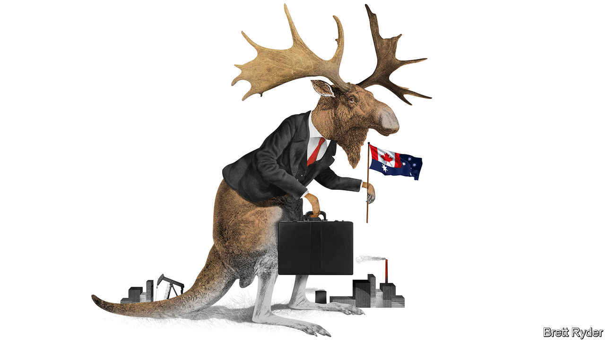

###### Schumpeter

# Australia and Canada are one economy—with one set of flaws 

##### Welcome to Ozanada. Beware its business weakness 

 

> Jun 1st 2023 

IF AUSTRALIA AND Canada were one economy, this “Ozanada” would be the world’s fifth-largest, bigger than India and just behind Germany. Considering the two in tandem is not as nutty as it seems. Weather aside, they have a remarkable amount in common. Both are vast land masses populated by comparatively few people and dangerous wildlife. Both are (mostly) English-speaking realms of King Charles III. Both export their rich natural resources around the planet. And both are magnets for immigration.

Their worlds of business, too, are near-identical. Macquarie, an Australian financial group, is the world’s largest infrastructure-investment manager. Brookfield, a Canadian peer, is the runner-up. Fittingly, Australia has produced a number of top surf-clothing labels, just as Canada has developed a niche in parkas and other winterwear. And, of course, both are home to commodities giants. But the main thread that connects Ozanada Inc is less fetching. As Rod Sims, former head of Australia’s competition watchdog puts it, his country’s firms have “forgotten how to compete”. So have their Canadian counterparts.

Many hands have been wrung in recent years over oligopolies in America. Yet next to Ozanada, the world’s largest economy looks like a paragon of perfect competition. Coles and Woolworths, Australia’s biggest supermarkets, sell 59% of its groceries, according to GlobalData, a research firm. Loblaws and Sobeys peddle 34% of Canada’s—more than the combined share of the top four grocers in America. In both Australia and Canada the four biggest banks hold three-quarters of domestic deposits, compared with less than half in America. In both countries domestic aviation is a duopoly and telecoms a triopoly. The list goes on.

Part of the explanation for Ozanada’s oligopolistic tendencies is benign. If companies need to be of a certain scale to be economically viable—to afford the necessary investments in computer systems, for example—then a small economy may be unable to support more than a few players in many industries. Ozanadian national champions, notably its grocers and lenders, are, however, meaningfully more profitable than their American counterparts. That points to other, less innocent causes. 

Toothless antitrust regimes in both countries set a high bar for blocking mergers, permitting consolidation. A lack of openness to foreign investment doesn’t help. Of the 38 members of the OECD, only three—Iceland, Mexico and New Zealand—are less open to foreign investment. Stringent screening, ownership caps and various other hurdles make setting up shop in Ozanada a hassle for foreigners. In 2013 Naguib Sawiris, an Egyptian telecoms tycoon, swore he would never again invest in Canada after his bid to acquire the fibre-optic network of Manitoba Telecom Services (MTS), a Canadian carrier, was rejected by the government with little explanation. Four years later MTS was purchased in its entirety by Bell Canada, a local rival.

All this may reflect a unique Ozanadian spin on the “resource curse” that has brought political instability and underdevelopment to commodity-rich countries in Africa and South America. Ozanada’s natural bounty has weakened its incentive to build globally competitive industries in other areas. That may explain why, beyond commodities and outdoor apparel, the list of successful Ozanadian multinationals is so short. Canada’s banks have dipped a toe in America, but remain small fry. Its life insurers have fared only a bit better south of the border, mostly thanks to big acquisitions. Vegemite, a divisive Australian spread, has yet to win over foreign sandwich-eaters.

Ozanada Inc’s limitations are particularly acute at the cutting edge of technology. Products deemed “high-tech” by the World Bank, such as computers and drugs, represent more than 7% of the combined exports of OECD members, but only 4% for Canada and less than 2% for Australia. Patents granted per 10,000 people are a mere 5.9 in Canada and 6.7 in Australia, compared with 9.9 in America and 28.2 in South Korea. 

This is not for want of well-nourished brains; Ozanada is home to world-class universities and boasts some of the highest rates of tertiary education in the OECD. Rather, the problem is an underfed innovation system. Spending on research and development comes to just 1.7% and 1.8% of GDP in Canada and Australia, respectively, against an OECD average of 2.7%. Total venture-capital investment in Ozanada was a mere $16bn in 2022, roughly half the level in Britain. Atlassian and Canva, two Australian technology successes, and Shopify, a Canadian one, have not prompted a lot of fresh prospecting for the next generation of tech winners.

Dormant animal spirits

To Ozanadians, this may all seem academic. After all, among citizens of countries with at least 20m inhabitants, only America’s are richer. But they used to be better off than Americans: after soaring in the first decade of the 2000s thanks to rising commodity prices, their GDP per person briefly surpassed America’s in the early 2010s in dollar terms. And a fate tethered to demand for commodities may prove particularly volatile in the decades to come. 

Canada, with its reliance on oil and gas exports, could be dragged down by decarbonisation. Australia will be somewhat insulated by its vast deposits of copper and other minerals needed for the green transition. But it could suffer from its dependence on shipping commodities to China. In 2020 China began introducing restrictions on Australian coal, timber and other products, seemingly in retaliation for calls by Australia’s then government for an inquiry into the origins of covid-19. Australia weathered those restrictions, which have since been loosened, surprisingly well. A long-term slowdown in China’s economic growth, though, which many economists now expect, would weigh heavily on the country. Ozanada’s economic model is not about to collapse. In time, though, its corporate weaknesses may come back to bite it. ■


