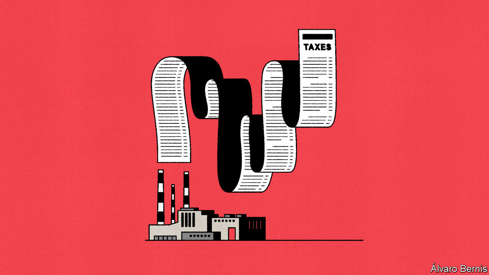

###### Free exchange

# What does the perfect carbon price look like? 

##### Making the best method of tackling climate change even better 

 

> Jun 1st 2023 

To most economists, putting a price on greenhouse-gas emissions is the best way to tackle climate change. It is efficient, allowing society to identify the cheapest unit of carbon-dioxide equivalent to forgo. It is fair: polluters pay; the proceeds can be redistributed. And it aids other forms of decarbonisation: complying with a carbon price forces companies to track their emissions and investors to work out which of their assets are the dirtiest. 

According to the World Bank, there are now 73 carbon-pricing schemes across the world, covering 23% of global emissions. That is up from just 7% a decade ago. The bank’s tally includes both emissions-trading schemes, where polluters can trade permits in a market, and carbon taxes, where a government sets a price directly. The largest scheme is in China and was launched in 2021. It covers the country’s energy industry, and therefore 9% of global emissions. Even in America, which is immune to the charms of carbon pricing at a federal level, an increasing number of states are setting their own prices. Washington state, the latest convert, launched its emissions-trading scheme in January. 

Yet a growing number of centre-left economists, who might be expected to be vociferous supporters of carbon prices, have soured on the policy. These critics focus on two points. The first is that carbon prices are not aggressive enough. The eu’s emissions-trading scheme, one of the most comprehensive, nevertheless excludes buildings and transport. Allowances are given to airlines and heavy industry in the name of competitiveness. Prices are relatively high in Europe, reaching a record €100 ($107) a tonne of carbon-dioxide equivalent in February, but too low elsewhere. The World Bank reckons less than 5% of emissions are priced at or above the level that would be required, by 2030, in order for temperature increases to be limited to 2°C above pre-industrial levels.

This tentative action reflects the critics’ second worry: equity. They argue that rather than ensuring polluters pay, the cost of carbon prices falls too heavily on the poor. Such initiatives raise energy prices—usually the only area of the economy that is entirely subject to them—and push industrial jobs overseas, beyond the reach of emissions-trading schemes. Anticipating pushback on these grounds, politicians water down the schemes. Therefore the promised emissions cuts never materialise. 

These are the arguments. How does the evidence stack up? Measuring the impact of carbon prices is challenging. Carbon prices, like interest rates, both affect and are affected by the economy. All else being equal, a higher carbon price will lower economic activity and raise consumer prices. But a stronger economy will also raise the price of a carbon permit. Politicians may also be more comfortable raising carbon taxes when the economy is booming. They might take steps to cut them in bad times. For instance, in May last year the European Commission announced an auction of surplus permits during the energy crisis that followed Russia’s invasion of Ukraine, in order to bring down prices 

Thankfully, there are ways to disentangle cause and effect. Marion Leroutier of the Stockholm School of Economics uses a “synthetic control” method to examine a top-up tax on the eu’s emission-trading scheme that was introduced by Britain in 2013. To see the effect of this higher carbon price, Ms Leroutier employs data from other eu countries to fashion a hypothetical version of Britain that did not introduce the tax—akin to a control group in an experiment. In reality, interconnectors allow Britain to import electricity from neighbours, potentially making the control group also subject to the treatment. But having included an estimate of such “spillovers”, Ms Leroutier estimates that the tax led to a 20-26% reduction in emissions from the energy industry.

In a forthcoming paper Gilbert Metcalf of Tufts University and James Stock of Harvard University attempt to account for the broader economic context. They look at 31 European countries, controlling for past emissions and economic growth, in order to isolate variation in carbon prices that is unexplained by the state of the economy. The authors find that carbon taxes reduce greenhouse-gas emissions much as economists have previously predicted. Significantly, they also find virtually no effect, either positive or negative, on economic growth and employment, perhaps because there was more innovation than anticipated.

A final method of disentangling cause and effect is to employ an “event study”. These are often used to assess the impact of monetary-policy decisions. By looking at the near-instantaneous reaction of carbon prices to a policy announcement, it is possible to remove the effects of background economic conditions, which do not change at the same speed. The impact of the change in price can then be tracked through the economy. In a recent working paper Diego Känzig of Northwestern University did just this, finding that higher carbon prices lower emissions and encourage green innovation. Yet these gains come at a cost. The higher prices raise energy costs and thus reduce the incomes of the poor.

Get the green right

Carbon prices have successfully cut emissions when used. They could be more palatable, however. In another paper, Mr Känzig compares the eu’s emissions-trading scheme and national carbon prices. Although national taxes are more likely to lead to leakage, where polluting activity shifts across borders, they are less of a drag on the economy, helping neutralise criticism from centre-left critics. This is because revenues are often recycled using tax cuts, which can be aimed at the poor.

The World Bank estimates that carbon taxes and emissions-trading schemes will raise $100bn for governments this year. As carbon-pricing schemes expand, the amount will only grow. By itself, this will help tackle one criticism: that the measures are insufficiently aggressive. To tackle the other—that they harm the poor—policymakers must embrace the importance of recycling. ■


