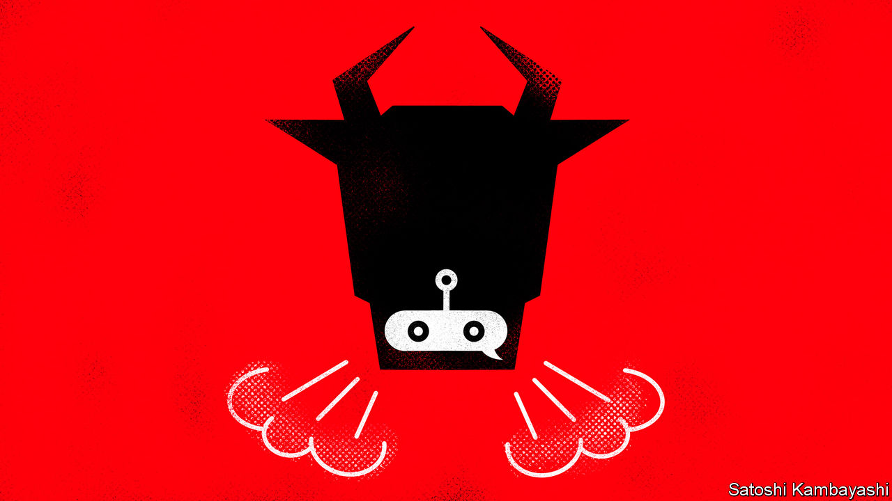

###### Buttonwood

# Surging stockmarkets are powered by artificial intelligence 

##### We calculate the extent to which the recent rally depends on tech optimism 

 

> Jun 7th 2023 

Do you buy the hype? The release of Chatgpt, a tool designed by OpenAI, has kicked off a wave of enthusiasm about artificial intelligence (ai). Everyone from spy agencies to  is trying to make use of the technology. And investors are working out how they might be able to take advantage by buying ai-exposed firms.

In the stockmarket this has manifested itself as an almighty boom in the valuation of tech companies. Openai might be private, but the s&amp;p 500 index of leading American shares contains more than a dozen firms that design ai software, have invented or build the computing chips that make ai possible, or run the data centres that the tech relies on. The latest firm to experience an ai-induced rally is Nvidia. The Californian company’s share price has risen by almost 23% since it reported unexpectedly strong earnings on May 24th, and has more than doubled in the year to date. Nvidia is now the fifth most valuable listed corporate entity in America. 

Yet it is not just tech firms that are . The ai boom has coincided with a broader recovery in stockmarkets, which were battered last year by a combination of high inflation and rising rates. The s&amp;p 500 is up by 8% since Chatgpt was launched, and has risen almost 20% from its October low. This prompts a question. Just how much of the rally is explained by ai enthusiasm?

To answer such a question, it is necessary first to rule out the usual culprits for major market moves: namely, shifting interest-rate or growth expectations. After all, owning a share is ultimately a claim on the future earnings of a firm. One way of working out the value of a share today is by estimating future earnings, and potential growth, before applying a discount or interest rate to calculate its value. This time around a shifting macro outlook cannot illuminate market movements. In November investors thought the federal-funds rate would rise to around 5-5.5% by the end of 2023. Although sentiment has oscillated, it has settled at about the same place. An average of earnings expectations for the year is also where it was six months ago. 

The next step is more straightforward: it involves quantifying the size of the ai bounce. Analysts reckon that the s&amp;p 500 has 14 firms with significant exposure to the tech. These include well-known giants, such as Google and Microsoft, and lesser-known providers of underlying infrastructure, like Arista and NetApp, two data-centre companies. On its own, the price of Nvidia is responsible for an enormous slice of the stockmarket recovery. Since the end of November the firm’s market capitalisation has soared from under $400bn to $925bn—accounting for a fifth of the rally. Add Nvidia’s surge to the growing market capitalisations of the 13 other firms with ai exposure and a remarkable 73% of the broader rally is explained. The boom in ai stocks has comfortably outstripped the wider tech rebound. The nasdaq is up by a fifth since November, compared with a third for the most ai-exposed firms. 

That ai optimism is the driver of the recent rally becomes even clearer when looking at share price “multiples”, which divide current prices by current or future earnings. These multiples are affected by earnings and economic factors like interest rates, but also by more nebulous things under the broad label of “animal spirits”. In November the average price to current earnings multiple of an s&amp;p 500 firm, excluding the 14 most exposed to ai, was around 27. As we went to press, the multiple had dipped to 26. Meanwhile, the average multiple of firms in our ai bucket had leapt from 43 to 77.

These multiples might be justified. Excitement about Nvidia’s prospects has been prompted by orders for the company’s chips. During the firm’s earnings call representatives suggested that booming growth in income from data-centre chips would lift total revenues in the second quarter to $11bn, double their level in the previous year.

On the other hand, investors have been known to get overexcited about novel technologies. The internet made a new generation of companies (and their bumper profits) possible. It set off a wave of productivity improvements for economies around the world. The problem is that much of this happened after a stockmarket bubble, which caused speculators to lose their shirts. It is obvious that investors making bets on ai must assess whether the hype is justified this time around. But such is the importance of ai to the broader stockmarket, so must everyone else, too. ■


