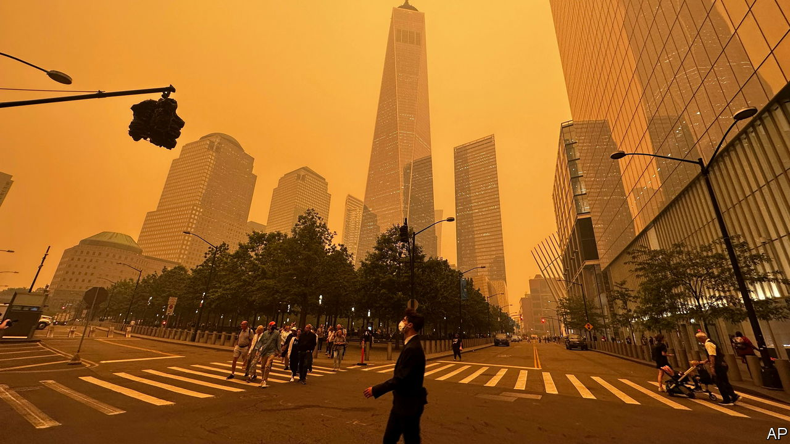

###### Lavender haze

# Smoke blackens the air in America’s north-east 

##### New York’s current air quality is the worst of any big city in the world 

> Jun 7th 2023 


June 6th and 7th were literally dark days in New York. Smoke filled the air, shrouding the skyline in an eerie blur. Airports delayed incoming flights, and baseball games were postponed. Health officials told residents to stay indoors. Measured by Air Quality Index (aqi), which records overall pollution, New York, which normally lands in the middle of the global pack, ranked as the worst of any big city in the world. Conditions were nearly as bad throughout the eastern United States, with smoke lingering from Boston to Washington and as far west as St Louis.

The plumes emanated from wildfires raging across America’s border. This May was the hottest in Canadian history, with average temperatures almost a full Celsius degree warmer than the previous record set in 1998, and the seventh-driest as well. Such conditions dry out vegetation and help fires start and spread. Sure enough, by early June the area burnt by wildfires in Canada was 13 times greater than normal, and far above the total for all of 2022.


The current fires are centred in Quebec, a region where smoke is less likely to threaten American air quality than in the west, because its winds generally blow east towards the Atlantic. However, a “heat dome”, in which high atmospheric pressure traps hot air below, has formed over central Canada. This sends air, now laden with unusually large volumes of smoke, rotating clockwise towards a low-pressure area above New England, and from there down along America’s eastern seaboard.

Such smoke clouds have become common in America’s western and Plains states, and the aqi in cities like Portland, Oregon has reached levels similar to New York’s recent maximum of 484. However, toxic plumes in the West mostly hover over rural areas. In contrast, smoke from the current fires in Quebec has settled over America’s most densely populated region.

 


As a result, although the average aqi across American airspace is merely far worse than normal, the aqi now experienced by the average American resident is a modern record. Based on ’s analysis of data available as we went to press, the average aqi of 80 on June 6th for all Americans—including those not exposed to smoke—ranks as the worst in the past decade, surpassing the 79 on June 18th 2021, when numerous cities suffered high ozone levels. Sadly, this record may not stand for long, because global warming is making wildfires more common.

The cost to public health will depend in part on how much people remain indoors. One academic study found that total visits to hospitals actually decline following extremely high smoke levels, because people stay at home and are less likely to suffer car accidents, sports injuries and the like. However, without proper filtration, pollutants still make their way indoors, and cases of respiratory ailments surge. Using the paper’s estimates, at the recent level of pollutants in New York’s air, hospital visits for asthma should roughly double.■

Chart sources: NOAA; EPA; AirNow; US Census Bureau; Canadian Wildland Fire Information System

