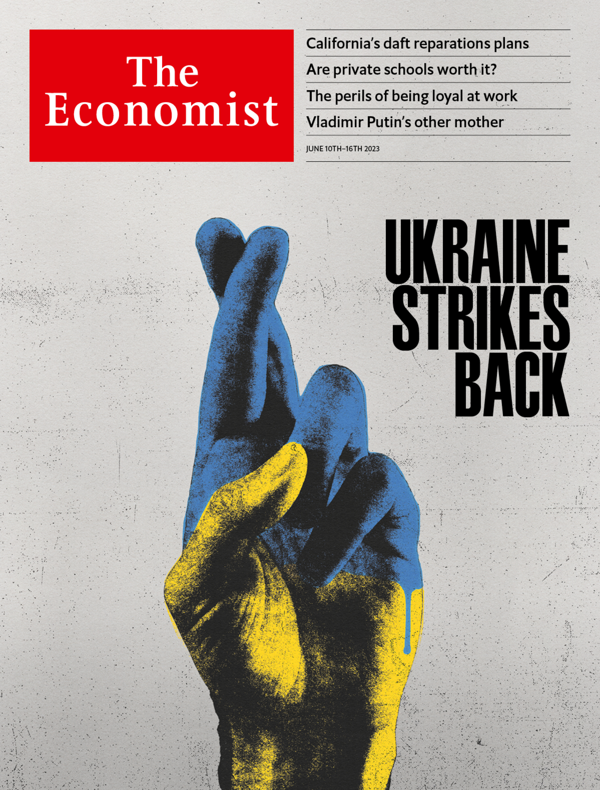

###### The Economist

# This week’s cover 

##### How we saw the world 

> Jun 8th 2023 

Vladimir Putin’s behaviour never ceases to shock. This week a dam collapsed in Ukraine. Intelligence sources (and common sense) suggest Russian sabotage. Mr Putin appears to have borrowed an idea from Stalin, unleashing a flood to impede his enemies’ advance, never mind the tens of thousands of homes engulfed by raging waters. In a normal world this would be the headline of the year; yet it was not even the headline of the week.

The big news was that Ukraine’s counter-offensive has begun. We put other plans on hold and rushed out a cover story analysing what is happening on the front lines, what might happen next, and the likely geopolitical consequences. 

With some early ideas our designers got ahead of themselves. We had a Ukrainian tank blasting the first in a line of dominoes, causing the rest of the Russian army to topple over. Steady on; nothing like this has happened yet. We had a picture of a Russian tank doing a U-turn and trundling away in terror. This, too, was prematurely optimistic. 

Another image was prematurely pessimistic. After hearing talk of the possibility of the conflict becoming frozen at some point in the future, one of our creative types produced a bomb in ice. It’s a great picture, but not for a conflict that is heating up. An image of a hand punching the Russian flag was not quite right, either. It suggested a full-blown Ukrainian attack on Russia, rather than a push to expel Russian invaders from Ukraine.

A picture of an armoured personnel-carrier near Bakhmut was better. Its combination of a yellow field and blue sky evoked the Ukrainian flag, and we worked this up into a collage with more soldiers, advancing purposefully. They have a long slog ahead.

Both sides have been pumping out propaganda videos, some more believable than others. We liked a still from a Ukrainian one, which showed a soldier putting his finger to his lips to remind people not to spill secrets. The world—and, more importantly, the Russians—have been kept guessing as to where exactly the Ukrainians will push hardest. Any given manoeuvre could turn out to be a feint. We looked for straight news photographs, too. A picture of a helicopter captured a sense of drama and peril.

In the end, though, none of these images conveyed strongly enough the idea that this is the start of a massive and essential undertaking with a highly uncertain outcome. We hope the Ukrainians will hand Mr Putin a defeat so stinging that he and Russia are deterred from future aggression. But much could go wrong. Crossed fingers in Ukrainian colours wish luck to a people trying to reclaim what is theirs.


Finally, we had to get the headline right. “U-day”, a play on D-day, was snappy, but reminded too many of us of Saddam Hussein’s murderous son Uday. So we went with “Ukraine strikes back”.■

 


: 

: 

: 

