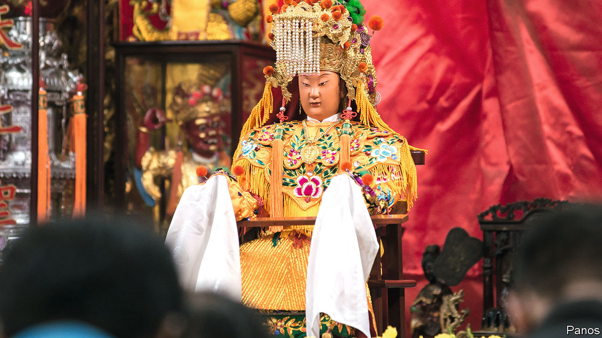

###### Mazu and the motherland

# China hopes Mazu, a sea goddess, can help it win over Taiwan 

##### She is said to have cured people of disease, so unification should be easy 

 

> Jun 15th 2023 

The sleepy town of Yuanlin in central Taiwan is transformed when Mazu passes through. The maiden-turned-goddess lived in southern China during the tenth century—and, according to legend, used her mystical powers to save relatives from a shipwreck. Despite her roots in the mainland, she is widely worshipped in Taiwan. Each year her statue is carried across the island on a multi-day tour. In Yuanlin she was greeted by firecrackers and prostrate devotees. One woman burst into tears. Mazu healed her from cancer and protected her from covid-19, she says. 

Officials in Beijing hope Mazu will help them in a different way. The United Front Work Department, the Communist Party branch with the job of boosting China’s influence abroad, views the goddess as a tool to win Taiwanese hearts and minds. 

Mazu—or Lin Moniang, as she was known before becoming a goddess—hailed from a small fishing village on the island of Meizhou in the province of Fujian. Today worshippers make pilgrimages to her ancestral temple there. That is useful to China, which has been supporting Mazu-related cultural exchanges with Taiwan since the late 1990s. Local offices of the United Front talk openly of using Mazu to “strengthen Taiwan’s patriotic unification force”. If they can turn Taiwan’s love of Mazu into love of the motherland, that would make it easier to peacefully bring Taiwan back under the mainland’s rule.

In recent years China has taken a hardline approach to Taiwan, buzzing its airspace with military jets and performing drills around the island. But with covid restrictions lifted and a Taiwanese presidential election scheduled for next year, China’s influence operations are increasing. In February the head of the Taiwan Mazu Fellowship, a large network of temples, met Song Tao, the head of China’s Taiwan Affairs Office in Beijing. They discussed how Mazu could play a role in promoting “one family” on both sides of the Taiwan Strait, according to Chinese state media.

At Tai’an Gong, a small temple in Taipei that belongs to the Taiwan Mazu Fellowship, two elders proudly point to a gilded plaque that they received from the Meizhou temple. Every time representatives of Tai’an Gong visit, they are feted with banquets, says one of the elders. The leaders of each temple are “like brothers”, he says. In some cases they are also business partners.

The head of the temple in Meizhou is a member of China’s People’s Political Consultative Conference, a government advisory body. But the cultural exchanges are “not political”, insists Ah Sen, a director at Tai’an Gong. He points to calendars on the wall from different temple associations in Taiwan, some of which favour unification, whereas others back independence. Those who take part in the trips to Meizhou already lean a certain way, so they will not change their minds, he says. And at Tai’an Gong it does not matter which party worshippers support; everyone comes for Mazu. The two elders agree, sharing stories of how the goddess saved them from car accidents and stockmarket crashes.

It is difficult to assess the impact of China’s Mazu-related efforts. Many factors influence how a Taiwanese person votes and what they think about China. The views of temple leaders are not that important, says Ku Ming-chun, a sociologist at Taiwan’s National Tsing Hua University. Worshippers do not feel a need to be politically aligned with them. But China uses the cultural exchanges to sow disinformation. Delegations of Taiwanese pilgrims often form chat groups that become platforms for Chinese propaganda, says Ms Ku.

Chang Kuei-min of National Taiwan University says China has created a narrative in which the Communist Party is a champion of folk religion, while Taiwan’s government opposes it. Before Ms Chang went on a religious exchange to China in 2019, a temple elder warned her that she might be questioned by Taiwan’s security services on her return. She saw this as a regurgitation of Chinese propaganda. In Beijing, she says, officials spoke of how Taiwan’s government was politicising religion. “Surely Mazu is not an agent of the Communist Party?” they would say, according to Ms Chang. Of course, that is exactly what the party wants Mazu to be. ■


