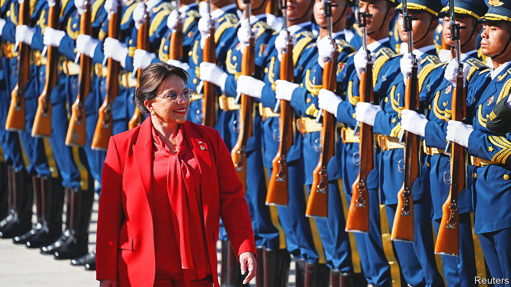

###### Dress to impress

# Why foreign dignitaries wear red when meeting Xi Jinping 

##### Does a little red look help improve relations? 

 

> Jun 22nd 2023 

Xiomara Castro, the president of Honduras, had laid the groundwork for a successful visit to Beijing this month. In March her country ditched ties with Taiwan in favour of China. Honduras is also in the process of joining the Shanghai-based New Development Bank, a World Bank knock-off co-founded by China. But perhaps Ms Castro felt something extra was needed. When she met her counterpart, Xi Jinping, she wore a red trouser suit and shirt with a flowing red neck tie (pictured).

The Honduran president is hardly the first foreign dignitary to pay sartorial homage to China by wearing the national colour. Past and present leaders, from Robert Mugabe to Vladimir Putin, have donned red ties for talks with Mr Xi. On at least two occasions Narendra Modi, India’s prime minister, has slotted a red handkerchief in the pocket of his Nehru jacket when greeting China’s president.

First ladies have often gone further. Richard Nixon’s wife, Pat, set the tone by wearing a red overcoat when she and the president made their historic trip to China in 1972. Michelle Obama (along with her daughter) wore a crimson dress to a meeting with Mr Xi in Beijing in 2014. Melania Trump did the same when he visited Florida in 2017. On a trip to China in 2018, Brigitte Macron, France’s first lady, wore a bold red coat during one outing, and a long red dress for an art-gallery tour in Beijing.

To the Chinese red represents prosperity and good fortune. In the 14th century Zhu Yuanzhang, the first emperor of the Ming dynasty (and leader of the Red Turban rebellion), declared it “the most distinguished colour”. Over time red became associated with popular customs. Chinese people give red envelopes stuffed with cash as holiday gifts. New parents often receive red eggs to celebrate the birth of a child.

Chinese mythology tells of a beast called Nian who terrorised children at the start of the lunar new year, until villagers discovered that the monster was scared off by a small child wearing red. That, according to the tale, is why Chinese began hanging red lanterns to mark the new year and other holidays.

Crimson-clad foreign officials are probably hoping to be favoured by, rather than shielded from, Mr Xi. Red has been a symbol of left-wing politics since the French revolution and was adopted by the Communist Party. Chinese children were long taught that their national flag—five golden stars on a red field—represented the “fresh blood of martyrs”.

For some foreign dignitaries, red has indeed brought luck. Nixon’s visit was a success, marking a new era in Sino-American relations. Ms Castro left Beijing with agreements that, she hopes, will bring Chinese investment to Honduras. But just as often foreign leaders sporting a little red look go home disappointed. Ties with China tend to turn on more than just ties.■


