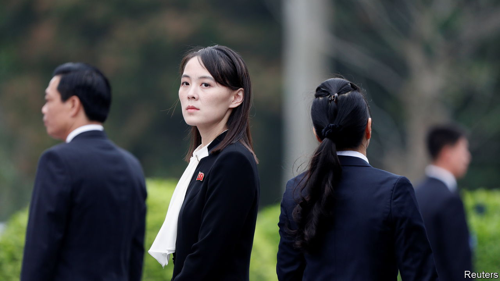

###### A dynasty of tyrants

# Is North Korea’s propagandist-in-chief also its dictator-in-waiting? 

##### As Sung-Yoon Lee explains in “The Sister”, Kim Yo Jong is not merely Kim Jong Un’s sibling 

 

> Jun 22nd 2023 

 By Sung-Yoon Lee. 

Communists are fond of vitriol.  called Jeremy Bentham, the father of utilitarianism, the “insipid, pedantic, leather-tongued oracle of the ordinary bourgeois intelligence of the 19th century”.  said that Georgi Plekhanov, a Russian philosopher, had “set a new record in the noble sport of substituting sophistry for dialectics”, a brutal put-down in the lexicon of Marxist jargon.

Now there is a new champion of unhinged execration. Whether reviling the “stinky breath emanating from [the] bawling traps” of South Korean missile experts, or telling their president, Yoon Suk-yeol, to “shut his mouth, rather than talking nonsense”, Kim Yo Jong has a barbed tongue befitting the sister of Kim Jong Un, dictator of nominally socialist North Korea. Yet as Sung-Yoon Lee argues in “The Sister”, behind the snark is a woman of immense power: an influence over her  brother and, possibly, his successor.

Ms Kim came to the world’s attention in 2018 during the  in Pyeongchang, South Korea, when she became the first member of North Korea’s ruling family to visit the South since the Korean war. Now she is almost as prominent a symbol of North Korean despotism as the brother she often accompanies. As  operation, her sardonic wit has animated North Korea’s invective for a decade. Her willingness to say vile things to wind up America and South Korea positions her, in Mr Lee’s words, as “Even Worse Cop” to Mr Kim’s “Bad Cop”.

The opacity of North Korea means that Mr Lee’s claims are often plausible rather than proven. Advanced in an exuberant prose style, they sometimes outstrip the evidence. Forensic scrutiny of greetings and handwriting in guestbooks smacks of over-interpretation, though readers fond of sartorial analysis may enjoy the detailed record of Ms Kim’s fashion choices.

As for his speculation on whether she might succeed her brother: though a fun parlour game for North Korea-watchers, such predictions should not be taken too seriously. As the author recalls, Fujimoto Kenji—the Kim family’s sushi chef until he fled in 2001—may have been the only person outside North Korea to be on the record as having foreseen Kim Jong Un’s ascent.

Still, marshalling what is known about Ms Kim—a woman of such mystery that the North Korean state has never confirmed that she actually is Mr Kim’s sister—is worthwhile. Mr Lee’s book is not just a profile of a central figure in what is arguably the world’s most brutal dictatorship, but also of her clan. By showing how the family operates, “The Sister” offers insights into the workings of the only  to style itself as communist; a regime willing to let millions starve while it spends billions on weapons.

Above all, it shows how Ms Kim and her brother learned the art of diplomacy from their father, Kim Jong Il. The book chronicles the senior Kim’s use of kidnapping and  as overtures to negotiations with America and South Korea. His children dutifully copied these tactics at the summits that followed the Olympics. For now, the younger Mr Kim is fixated on military development, but history suggests he will one day want to talk. Those across the table would do well to have studied the family’s approach to bargaining and be adept at decoding its propaganda. ■


