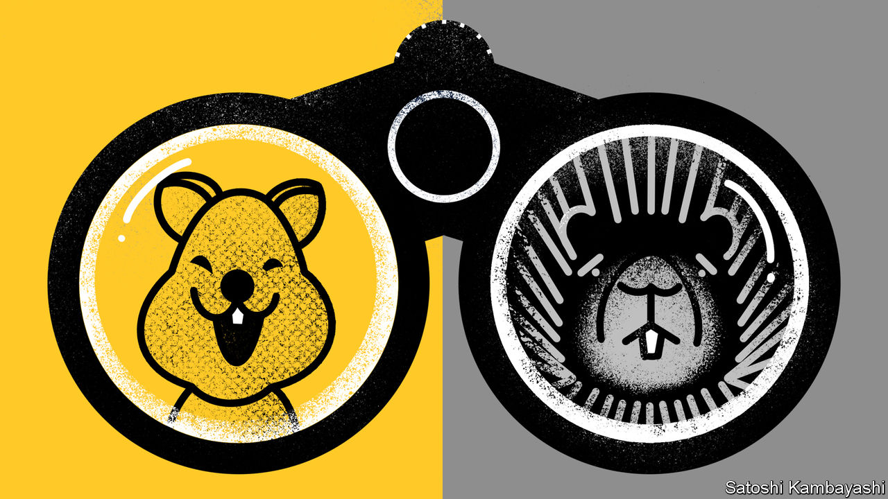

###### Buttonwood

# Why investors can’t agree on the financial outlook 

##### Welcome to a stock safari 

 

> Jun 22nd 2023 

The quokka, an Australian marsupial about the size of a domestic cat, has full cheeks and a curved mouth that convey the impression—often to delighted tourists—that the critter is smiling. It has been dubbed the happiest animal on Earth. Yet these days it has competition from another species: the American stock investor. The s&amp;p 500 has already risen by 14% this year. An increase of another 10% would take the index back to its all-time high, set in January last year. Excitement about artificial intelligence has lit a fire under companies seen as potential beneficiaries. 

Although climbing stock prices represent an impressive turnaround, they are not the most astonishing market shift. That award goes to the collapse in volatility. In the past 12 months the vix, an index that measures expected volatility in stock prices, using the cost of insuring against extreme moves, has declined by more than half, falling from around 30 to 13. The last time it was so depressed was in early 2020, before the disruption of covid-19, when concerns about stagnation were more common than worries about inflation. Considering that the vix is sometimes referred to as the “fear gauge”, its low level suggests a quokka-like placidity in the stockmarket.

This outlook is all the more astonishing given the surfeit of things about which an investor could worry. There is, for instance, considerable uncertainty about the Federal Reserve’s next move, which would be a good reason for investors to want a little more protection. When the s&amp;p 500 touched an earlier peak in 2021—a period of higher volatility—the federal funds rate sat at zero (it is now 5%) and ten-year Treasury yields at 1.5% (now 3.7%). Moreover, high rates may prompt something else to break. Recent ructions in American banking were hardly on the radar-screens of investors until days before Silicon Valley Bank and Signature Bank went bust. The failure of another lender, First Republic, came at the beginning of May. Today’s optimism makes it hard to remember that those troubles were so recent. 

Yet there is another species that looks rather less placid. If stock investors are the quokkas of the financial kingdom, bond investors are the porcupines: wary and naturally defensive. The decline of the vix stands in stark contrast to its equivalent in the Treasury market. Although the move index, which tracks the price of insuring against bond-market volatility, has declined from a 13-year high in March, it is still twice as high as it was pre-covid. Bond investors remain far from convinced that the good times have returned. 

The divergence in sentiment between the quokkas and porcupines is very different from the early stages of the pandemic, when stocks were extremely volatile and government bonds far less so. Back then, investors were preoccupied with covid’s economic fallout, the development and deployment of vaccines, and the pace of economic reopening. Then inflation picked up and the Fed’s actions became the overwhelming focus. 

It might be tempting to observe the difference and judge that either the bond or stockmarket must be wrong. But that would not be quite right. If artificial intelligence emerges as a transformative force for the bottom line of major technology companies, but not for economywide growth, it would be a tremendous boon for investors in shares and mean little for government bonds.

The problem is that such an outcome is far from assured—and investors are beginning to price stocks based on earnings that are unlikely to materialise any time soon. The price-to-earnings ratio of the s&amp;p 500, based on expected earnings over the next 12 months, has climbed from below 16 late last year to 19 now. This is still below the highs set during the pandemic, when earnings expectations were smothered by lockdowns and restrictions, but is higher than at any other point in the past two decades.

What the divergence in animal spirits does say is that investors in the stockmarket—mistakenly or not—have left behind concerns that preoccupied them just a couple of months ago. They have traded their manifold worries for an optimistic narrative about artificial intelligence. The rosy outlook suggested by the lack of volatility is ultimately a judgment not just that the new technology will become a revolutionary moneymaker for America’s listed companies, but that the Fed’s decisions will not shake the financial system again and that the economy will withstand the impact of interest-rate rises. As things stand, it looks like a bold bet. ■


