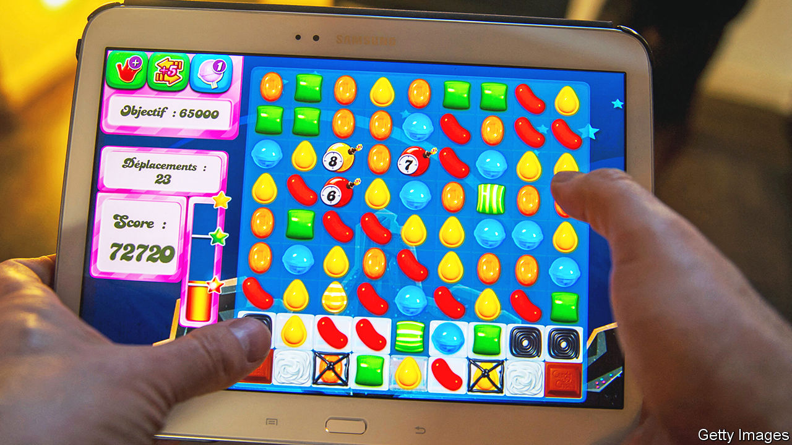

###### Merger crush saga

# Blocking the Microsoft-Activision deal would harm consumers 

##### The tie-up promises new kinds of competition in gaming 

 

> Jun 22nd 2023 

There are more than 14,000 levels in “Candy Crush Saga”, a maddeningly addictive mobile puzzle game. Microsoft’s attempt to buy its publisher, Activision Blizzard, is encountering almost as many obstacles. The $69bn deal—Microsoft’s largest ever—sailed through the easier stages of the merger game, winning approval from jurisdictions like Japan and the European Union. But in April it was , with only limited scope for appeal. As we published this, on June 22nd, Microsoft was preparing for a court battle with , who are in an activist mood and seem determined to stop the transaction. 

The regulators have two main objections, both misguided. The most talked-about and least concerning is that Microsoft may remove popular Activision games from rival platforms, principally Sony’s PlayStation. True, Microsoft has form in this, having previously bought developers such as Bethesda only to keep their games for itself. But the gaming market is diverse enough for such “exclusives” not to harm competition. By one estimate, a combined Microsoft-Activision would account for only 14% of global gaming revenue among the biggest listed gaming companies. In any case, Microsoft has offered to make Activision’s titles available for at least a decade on other platforms—including Nintendo’s Switch, which currently lacks Activision hits such as “Call of Duty”.

The second, more serious worry is that the deal would allow Microsoft to dominate the next phase of gaming. The firm trails Sony and Nintendo in console sales. But it has been gaining in subscriptions (whereby consumers pay a monthly fee for access to a library of titles) and in cloud gaming (in which the action is streamed to the screen, much as Netflix streams movies). Last year Microsoft had 57% of the market for subscription libraries. Adding games like “Call of Duty” to its catalogue would make it stronger still. Subscriptions and streaming have turned the music and television industries upside down in the past couple of decades. If the same thing happened in gaming, regulators fear, Microsoft could become unassailable.

That is possible—but the bigger risk is that blocking the deal would chill such innovations, and the competition they may bring. Subscription and streaming represent alternative ways to bring high-quality games to consumers, including those who would rather pay monthly for online access than shell out hundreds of dollars for a console. They are not new markets, but new forms of competition in an existing one. 

What is more, these new models are unlikely to become dominant overnight. Most gamers play only one or two titles at a time, making subscription libraries less appealing than they are in music, say, where consumers tend to listen to hundreds of songs. Cloud gaming, meanwhile, accounts for less than 1% of spending. That share will surely grow. But games’ interactivity means that streaming, with its unavoidable time lags, is unlikely ever to replace the console in the way that it has killed the DVD player.

You can see why trustbusters are trigger-happy. They took flak for letting Facebook gobble up social-media competitors like Instagram and WhatsApp. Other tech markets remain concentrated (regulators may want to look at Apple’s app store). But the pursuit of unnecessary cases threatens to chill dealmaking: the value of acquisitions in America so far this year is about 40% lower than the average for the previous five years. In opposing Microsoft’s acquisition of Activision, regulators are throttling an emerging business model that promises more competition, not less. There must be better targets to crush. ■

