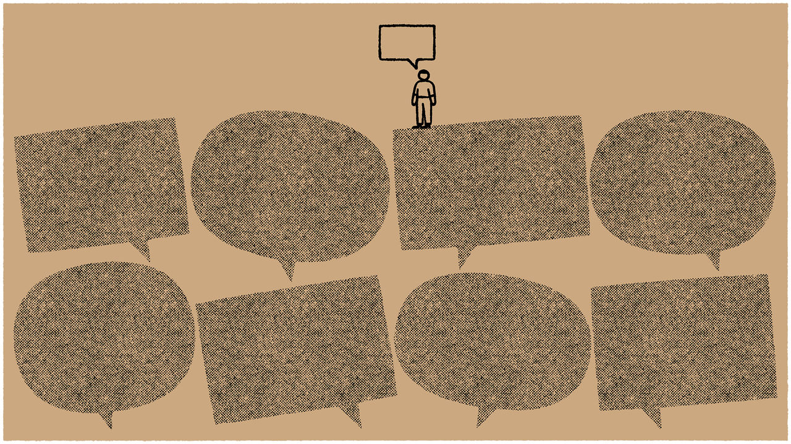

###### Banyan

# Aboriginal Australians may at last be given a say in their own affairs 

##### But the constitutional change needed is, shamefully, far from assured 

 

> Jun 29th 2023 

Beginning in 2016 thousands of Aboriginal and Torres Strait Islanders from hundreds of communities across Australia came together in regional dialogues culminating in a constitutional convention. The consultations were impressively inclusive—far more so, for instance, than for white Australians when the country’s constitution was agreed on in 1901. Out of the convention came an “Uluru Statement from the Heart”. It identified structural failings ruining indigenous lives. It called for an advisory body, a “Voice to Parliament” to be enshrined in the constitution. Its aim is to improve outcomes by giving indigenous Australians a greater say over laws and policies that are foisted on them.

On June 19th a law introduced by the government of Anthony Albanese, the Labor prime minister, passed, enabling a national referendum on the matter. It will be held later this year. At stake is not just how modern Australia reckons with a past blighted by the treatment of its indigenous people. Approving the Voice would represent a collective desire to bring the continent’s first inhabitants into the national fold and to redress the vast disparities that exist between them and everyone else. Here is a chance to remake Australia’s future. But the bar for constitutional change is high, requiring a majority of votes and support in a majority of states. On current polling, Australians may vote against it.

Aboriginal Australians represent the longest continuous cultures on Earth—tens of thousands of years. Yet it is hard to understate the grim hand dealt them since white settlers first arrived. They brought disease and chased Aboriginal people into reserves or forced them into servitude. Frontier massacres—inoffensively called “dispersals”—continued into the 20th century. The constitution of 1901 marked the start of Australian nationhood. Yet it decreed that Aboriginals not be counted. Up until the early 1970s, “stolen generations” of mixed-race children were taken from their families and put in church-run missions. Meanwhile, full-blooded Aboriginals were assumed to be headed for extinction; the whites’ job was to “smooth the dying man’s pillow”.

Only in 1967 was the constitution amended to count indigenous Australians in the census and to make the federal government, for the first time, responsible for Aboriginal policy. Recognition of native title to land came only in 1992.

For a sense of the hardships, drive out of Alice Springs to one of the indigenous “camps” around its fringes. The rest of Australia is a world away. Broken cars and torn mattresses litter the streets. Overcrowded homes go without electricity when owners cannot pay. Unemployment, alcoholism, domestic violence and broken homes are legion. As Banyan visited, a posse of police burst into one house. 

Aboriginal Australians die, on average, eight years younger than others. Just over 3% of Australia’s 26m people, they fill more than a quarter of its prison cells. A higher proportion of their population is incarcerated than any other in the world. Two-fifths of children in care are Aboriginal, taken from troubled parents. Aboriginal people are more than twice as likely as other Australians to kill themselves. “This is the torment of our powerlessness,” the convention declared at Uluru, the sacred rock that rears up outside Alice Springs.

Billions of dollars go each year on well-intentioned policies to improve indigenous welfare. They have failed, as Thomas Mayo and Kerry O’Brien argue in a booklet about the Voice, because decisions made in faraway Canberra with too little indigenous input always face the risk of lurches in government direction. 

The Voice is intended to rectify that. Some critics warn it will have overweening powers. That is unfair. The Voice will not be in Parliament, but have the constitutional right to make representations to it. That is something, even if Parliament may still reject them. 

Some arguments against the Voice, says Hannah McGlade, an academic at Curtin University, smack of racism, even when it is being decried. Peter Dutton, leader of the right-wing opposition, claims the Voice “will permanently divide us by race”, having an “Orwellian effect where… some Australians are more equal than others”.

Yet the Voice would give Aboriginal people a say where they still have little. A leg up for them does not mean a leg down for others. What better way, indeed, for a nation to come together than to deal with its greatest unfinished business. And what a blunder it would be to deny indigenous Australians a fair go.■


