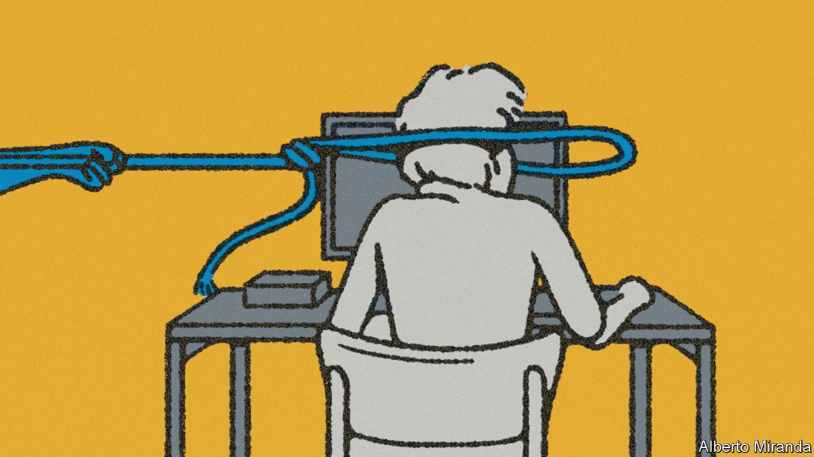

###### Free exchange

# The working-from-home illusion fades 

##### It is not more productive than being in an office, after all 

 

> Jun 28th 2023 

A gradual reverse migration is under way, from Zoom to the conference room. Wall Street firms have been among the most forceful in summoning workers to their offices, but in recent months even many tech titans—Apple, Google, Meta and more—have demanded staff show up to the office at least three days a week. For work-from-home believers, it looks like the revenge of corporate curmudgeons. Didn’t a spate of studies during the covid-19 pandemic demonstrate that remote work was than toiling in the office? 

Unfortunately for the believers, new research mostly runs counter to this, showing that offices, for all their flaws, remain essential. A good starting point is a  that received much attention when it was published in 2020 by Natalia Emanuel and Emma Harrington, then both doctoral students at Harvard University. They found an 8% increase in the number of calls handled per hour by employees of an online retailer that had shifted from offices to homes. Far less noticed was a revised version of their paper, published in May by the Federal Reserve Bank of New York. The boost to efficiency had instead become a 4% decline.

The researchers had not made a mistake. Rather, they received more precise data, including detailed work schedules. Not only did employees answer fewer calls when remote, the quality of their interactions suffered. They put customers on hold for longer. More also phoned back, an indication of unresolved problems.

The revision comes hot on the tails of other studies that have reached similar conclusions. David Atkin and Antoinette Schoar, both of the Massachusetts Institute of Technology, and Sumit Shinde of the University of California, Los Angeles, randomly assigned data-entry workers in India to labour either from home or the office. Those working at home were 18% less productive than their peers in the office. Michael Gibbs of the University of Chicago and Friederike Mengel and Christoph Siemroth, both of the University of Essex, found a productivity shortfall, relative to prior in-office performance, of as much as 19% for the remote employees of a large Asian it firm. Another study determined that even chess professionals play less well in online matches than face-to-face tilts. Yet another used a laboratory experiment to show that video conferences inhibit creative thinking.

The reasons for the findings will probably not surprise anyone who has spent much of the past few years working from a dining-room table. It is harder for people to collaborate from home. Workers in the Fed study spoke of missing their “neighbours to turn to for assistance”. Other researchers who looked at the communication records of nearly 62,000 employees at Microsoft observed that professional networks within the company become more static and isolated. Teleconferencing is a pale imitation of in-the-flesh meetings: researchers at Harvard Business School, for example, concluded that “virtual water coolers”—rolled out by many companies during the pandemic—often encroached on crowded schedules with limited benefits. To use the terminology of , an economist who focused on the structure of companies, all these problems represent an increase in co-ordination costs, making collective enterprise more unwieldy.

Some of the co-ordination costs of remote work might reasonably be expected to fall as people get used to it. Since 2020, many will have become adept at using Zoom, Webex, Teams or Slack. But another cost may rise over time: the underdevelopment of human capital. In a study of software engineers published in April, Drs Emanuel and Harrington, along with Amanda Pallais, also of Harvard, found that feedback exchanged between colleagues dropped sharply after the move to remote work. Drs Atkin, Schoar and Shinde documented a relative decline in learning for workers at home. Those in offices picked up skills more quickly.

The origins of the view that, contrary to the above, remote working boosts productivity can be traced to an experiment nearly a decade before the pandemic, which was reported by Nicholas Bloom of Stanford and others in 2013. Call-centre workers for a Chinese online travel agency now known as Trip.com increased their performance by 13% when remote—a figure that continues to appear in media coverage today. But two big wrinkles are often neglected: first, more than two-thirds of the improved performance came from employees working longer hours, not more efficiently; second, the Chinese firm eventually halted remote work because off-site employees struggled to get promoted. In 2022 Dr Bloom visited Trip.com again, this time to investigate the effects of a hybrid-working trial. The outcomes of this experiment were less striking: it had a negligible impact on productivity, though workers put in longer days and wrote more code when in the office.

The price of happiness

There is more to work (and life) than productivity. Perhaps the greatest virtue of remote work is that it leads to . People spend less time commuting, which from their vantage-point might feel like an increase in productivity, even if conventional measures fail to detect it. They can more easily fit in school pickups and doctor appointments, not to mention the occasional lie-in or midmorning jog. And some tasks—notably, those requiring unbroken concentration for long periods—can often be done more smoothly from home than in open-plan offices. All this explains why so many workers have become so office-shy.

Indeed, several surveys have found employees are willing to accept pay cuts for the option of working from home. Having satisfied employees on slightly lower pay, in turn, might be a good deal for corporate managers. For many people, then, the  will remain hybrid. Nevertheless, the balance of the work week is likely to tilt back to the office and away from home—not because bosses are sadomasochists with a kink for rush-hour traffic, but because better productivity lies in that direction. ■


