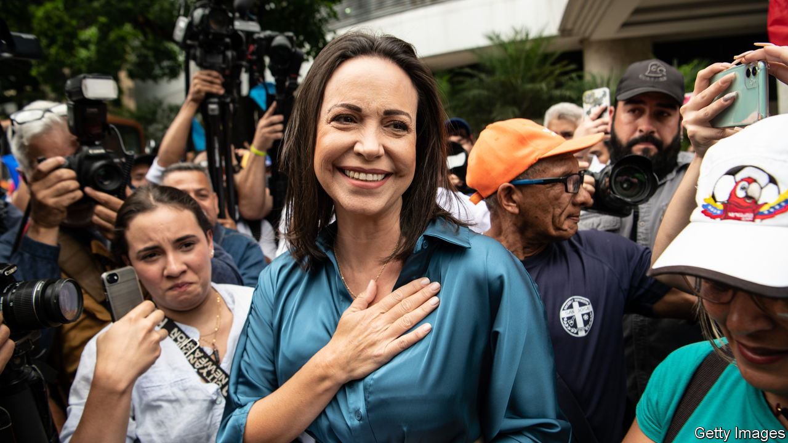

###### Maggie in the making

# If Venezuela’s elections were fair, this would be the front-runner 

##### An interview with María Corina Machado 

 

> Jun 29th 2023 

SHE PROMISES a “total transformation” of Venezuela. The mammoth, decrepit state oil company, , will be privatised, as will all utility companies. “We will have open markets. We will have rule of law…This country will become the energy hub of the Americas,” she pledges.

These are the ambitions of María Corina Machado, a 55-year-old former congresswoman who on June 23rd launched her bid to become the opposition’s candidate to unseat Nicolás Maduro, the country’s authoritarian president, in an election due next year. She is the favourite among the 14 contenders to win a primary vote among supporters of opposition parties. That is scheduled for October 22nd; 57% of likely voters back her, according to Poder y Estrategia, a polling company. 

Beating Mr Maduro in the general election ought to be easy. Since he took office in 2013 the economy has shrunk by 75%, pushing millions into poverty. Nearly a quarter of the population—some 7m people—have left Venezuela. But the vote is likely to be dodgy. Venezuela last held a national election with a legitimate result in 2015, when the opposition won control of the National Assembly. The Maduro regime stripped the legislature of its powers. 

Ms Machado, who is renowned for her firebrand style, is on the rightward end of the opposition’s political spectrum. In an interview with  in Caracas she named Margaret Thatcher as the politician she most admires. Despite the odds against her, she insists that the battle for democracy is not yet lost. Although she has strong reservations about taking part in any election overseen by the regime, the primary “could be the catalyst” for change, she says. It will be a chance for voters to shout “no” to Mr Maduro, rattling his government and reminding other countries that Venezuelans still want democracy. 

Ms Machado comes to the fight with advantages. She once personally confronted Hugo Chávez, who initiated Venezuela’s economic and democratic decline and named Mr Maduro his successor as president. In 2012, while Chávez was in the midst of a nine-hour speech to the legislature, she interrupted to denounce as “theft” his expropriation of businesses (among them, a steel mill owned by her family). Irritated, Chávez tried to put the young congresswoman in her place. “Eagles don’t hunt flies,” he boomed, backed by a chorus of jeers from his lackeys. 

Ms Machado played no formal part in the failed “interim government” of Juan Guaidó. That should help her now. In 2019 the United States, the European Union and dozens of other nations recognised Mr Guaidó, who was head of the legislature, as Venezuela’s legitimate president, but he never came close to achieving power. The project ended in January this year, when the opposition voted to dissolve his non-government. Mr Guaidó is now in the United States. Ms Machado, who backed  on the Maduro regime, “now has a monopoly of the more radical sector of the opposition”, says Luis Vicente León, a pollster based in Caracas. 

Sell ’em off

Privatising PDVSA is the heart of Ms Machado’s policy, and marks her out from her rivals. Once the most profitable major oil company in the world, it has been brought low by corruption and mismanagement under Chávez and Mr Maduro. But her declared rivals in the primaries doubt that privatisation is the answer. “Oil belongs to the people,” declares Henrique Capriles, a former state governor who has twice run for the presidency and, like Ms Machado, hopes to be the opposition’s nominee this time. Venezuelans should not assume that “everything public is bad and everything private is good”. Ms Machado disagrees. Venezuela “has only known statism and socialism in different colours and manners…We must dismantle this.” 

Ms Machado, though the daughter of an industrialist, insists that she has plenty in common with all Venezuelans. “There are thousands of us that have been robbed by the regime,” she says in the flawless English she learned at a boarding school in Massachusetts. Her three children live abroad, but the regime has barred her since 2014 from leaving the country. Many other families have been divided by the exodus of recent years. “We all just want to have our families back together,” she says. 

The 14 opposition candidates have yet to agree on how the primary will work. On June 16th the main parties decided to organise the logistics themselves rather than rely on the electoral council, which is controlled by the regime. That means that the opposition will have to pay for holding the vote and setting up polling stations across the country. 

In a normal election, Ms Machado would be the early front-runner to defeat a president who has brought disaster to his country. But Mr Maduro, described by one Caracas-based diplomat who saw him recently as “definitely jovial”, has given no sign that he will allow himself to be dislodged. If Ms Machado is his opponent, his reluctance will deepen. She has repeatedly called for the dictator and his entourage to be put on trial. Once, she says, she told him to his face that she does not want him to die because it would be better for him “to live and face justice”.

Mr Maduro will probably remain in power for another decade, thinks Mr Vicente León. That could change if he allows a fair election in the belief that he is more popular than he really is. But there is small chance of that. ■

