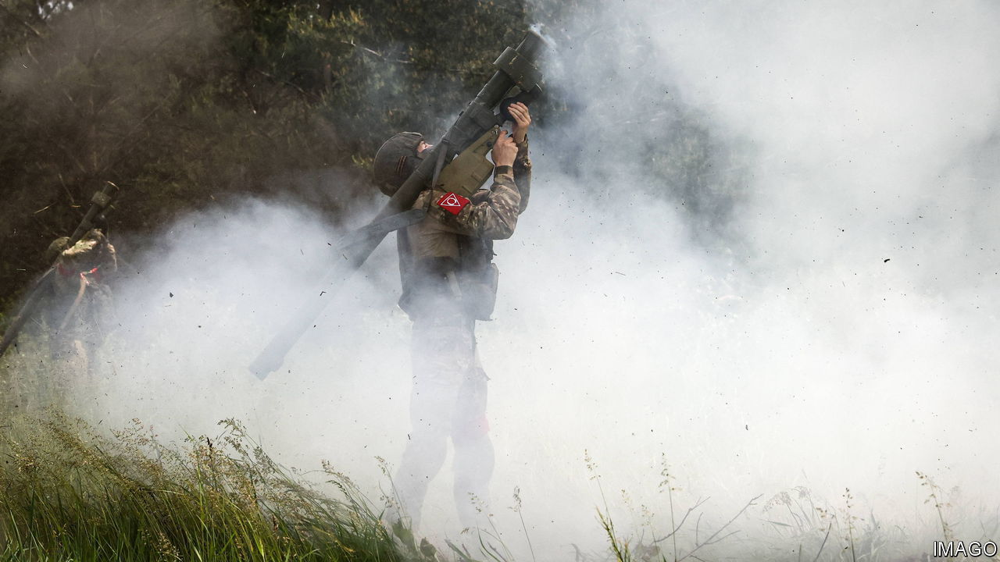

###### Russian adaptation

# How Ukraine’s enemy is also learning lessons, albeit slowly 

##### Russia is also absorbing lessons from the war 

 

> Jul 3rd 2023 

EveRYONE IS learning from the war, including Russia. A paper by Jack Watling and Nick Reynolds of RUSI shows how its tactics have improved. The authors have published detailed studies of the war that are read avidly by the West’s armed forces and defence ministries. Their report draws on interviews with Ukraine’s general staff and its brigades. 

Consider infantry tactics. Russia now sends small packets of “disposable” infantry, a handful of men at a time, often under the influence of amphetamines, to “skirmish…until killed”, exposing Ukrainian positions. Larger groups of better-trained assault infantry then move in, backed by armour, mortars and artillery. If a position is taken, it is fortified within 12 hours. “The…speed with which Russian infantry dig, and the scale at which they improve their fighting positions, is noteworthy,” say Mr Watling and Mr Reynolds. Russian engineers have built fortifications and bridges and laid minefields.

Russian gunnery is improving. Drones can be connected to artillery batteries via the Strelets computer system, letting Ukrainian targets be struck within minutes of detection. One tactic, say the authors, “is for the Russians to withdraw from a position that is being assaulted and then saturate it with fire once Ukrainian troops attempt to occupy it.” Such “fire pockets” are one of the biggest risks to Ukraine’s counter-offensive. Russian tanks also make better use of camouflage. They fight at dusk and dawn when their temperature signature is less obvious. Russia’s reactive armour, which explodes outward, has “proven highly effective”, with some tanks surviving multiple hits. 

Russian air defences, much derided on social media, are increasingly connected, allowing them to share data on incoming threats. They are shooting down a significant proportion of strikes by GMLRS—the GPS-guided rockets, fired from American HIMARS launchers—that played havoc with Russian headquarters last year. Russia has been pulling command-and-control centres farther back, dispersing and hardening them and wiring physical cables to brigades closer to the front. Meanwhile Russia’s air force, an irrelevance for much of the war, is making more use of glide bombs, in which a guidance kit is fitted to older “dumb” munitions. That poses a growing threat to Ukrainian troops moving south. 

Early in the war one masked Ukrainian soldier gained fame when he said: “We’re lucky they’re so fucking stupid.” Russia’s army is beset by problems, including poor recruitment and a lack of modern equipment. Its elite units have been decimated. It is unlikely to have serious offensive capability for the rest of this year. The recent short-lived mutiny of Yevgeny Prigozhin’s Wagner mercenaries will not have boosted morale. Yet the army remains a formidable obstacle. “There is evidence of a centralised process for identifying shortcomings in employment and the development of mitigations,” conclude the RUSI authors. Major-General Viktor Nikolyuk, in charge of army training for Ukraine, says: “It is impossible to say that the enemy does not know how to fight. We learned a lot from them, too, [on] tactics.”■

