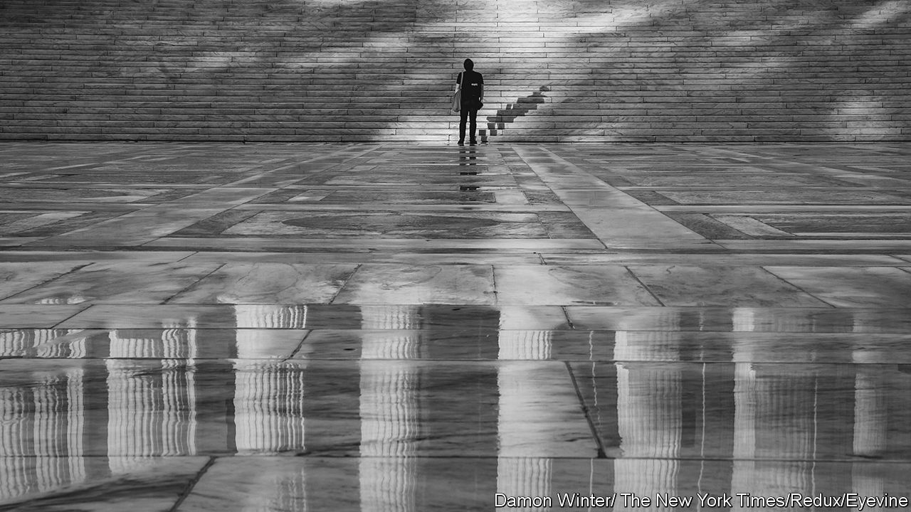

###### Right at the end

# What to make of the Supreme Court’s tumultuous term 

##### Landmark 6-3 decisions overshadow a smattering of liberal wins 

 

> Jul 2nd 2023 

IN MAY, AT the cusp of the Supreme Court’s busy season, Justice Elena Kagan heaped praise on John Roberts, the chief justice, as he received an award. Her “great, good friend” is “incapable of writing a bad sentence”, she said. “His writing has deep intelligence, crystal clarity, grace, humour, an understated style.” Five weeks later, dissenting from the court’s decision to  to relieve borrowers of a chunk of , she sang a different song. The chief justice’s majority opinion “from the first page to the last…departs from the demands of judicial restraint”. It fails, she wrote on the final day of the term, to represent “a court acting like a court”. Far from understated, Chief Justice Roberts’s opinion “overreached”.

The critique was not “personal”, Justice Kagan emphasised. Yet the heavy charge that her colleague had used judicial power illegitimately captured the atmosphere of a year that was only marginally less dramatic than the previous one—when the Supreme Court  and 

By the numbers, the term that ended on June 30th looked more moderate than the one that ended a year before. There were only five ideological splits with all six Republican-appointed justices on one side and all three Democratic appointees on the other. Last year, there were 14. 

The most liberal justices—Ketanji Brown Jackson and Sonia Sotomayor—were in the majority more often than Samuel Alito and , their most conservative brethren (both of whom have faced accusations of  for accepting gifts from billionaires). In June the liberal justices found two or more conservative justices to join them in stemming an erosion of voting rights, averting a challenge to the Indian Child Welfare Act, shooting down a red-state attack on Mr Biden’s immigration policies and rejecting a fringe democracy-bending idea called the .

But none of these wins—as those verbs suggest—advanced a progressive goal. Each amounted to a successful defence against lawsuits aiming to roll back civil-rights protections or hobble a Democratic president. So, though significant (and in a surprise, holding that Alabama legislators had drawn a ), these rulings were not celebrated by liberals, who have come to see the Court as a conservative instrument, as victories. 

By contrast, a flurry of 6-3 rulings that were cheered by conservatives came in the final days of June. In  the six-justice supermajority ended race-based  in university admissions that had stood for 45 years. In  it scrapped Mr Biden’s plan to bring debt relief to 43m student borrowers. And in it gave a Christian web designer the green light to make wedding websites for straight couples only—and to flag on her own site that she shuns same-sex weddings. 

Written by Justice Neil Gorsuch,  demonstrates the court’s rightward shift since 2018, when it last encountered a dispute over the First Amendment and LGBT rights. In the court sided with a Christian baker who had declined to create a wedding cake for two men. But Justice Anthony Kennedy’s majority opinion struggled with the competing principles at play even as it found that the baker had been treated disrespectfully. He rued the idea (now a constitutional right) that businesses could “put up signs saying ‘no goods or services will be sold if they will be used for gay marriages’.” Such a declaration of intolerance, he warned—in contrast to Justice Gorsuch’s apparent empathy for the designer—“would impose a serious stigma on gay persons”. 

Weighing outcomes of argued cases goes only part of the way toward grasping the extent of the court’s ideological divide. Every year, thousands of votes are placed behind the scenes responding to emergency requests and deciding which cases the justices will hear. Since the death of  in 2020, the liberal justices’ agenda-setting power has waned along with their sway in the big cases. 

In the latest term the three Democratic appointees publicly dissented five times from their colleagues’ vote not to take up a case. In October they wanted to reverse a decision against a black man sentenced to death by jurors for killing his estranged wife (who was white), his son and her daughter from another relationship. Three members of the all-white jury “expressed firm opposition to interracial marriage and procreation” (by failing to strike them, Justice Sonia Sotomayor wrote, his lawyer may have violated his Sixth Amendment right to effective counsel). In April the troika dissented from the decision not to consider the case of a death-row inmate whose guilt was in question because another person confessed to the crime. It takes four votes to bring a case onto the court’s docket; the three liberals fell one vote short in these and three other instances.

More fraught quarrels await when the next term begins in October. At least four cases exploring the power and the contours of administrative agencies are on the docket, including questions about the future of the Consumer Financial Protection Bureau, and whether  a ruling from 1984 instructing judges to defer to most government-agency decisions, should be overruled. Controversies also loom over whether the First Amendment prevents public officials from blocking people on social media and whether employers transferring workers for discriminatory reasons violate Title VII of the Civil Rights Act. A big gun-rights case is up for review, too, asking whether a federal ban on firearms for domestic abusers squares with the court’s recently bolstered view of the Second Amendment.■


