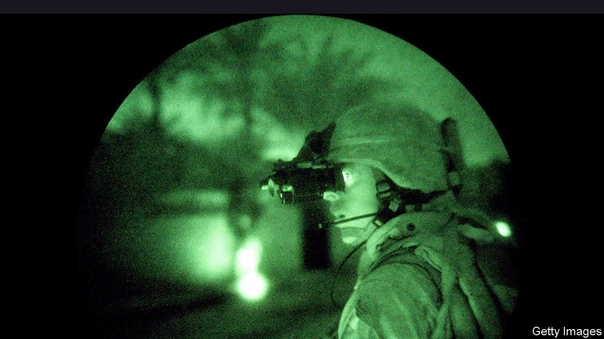

###### Mission-critical

# China controls the supply of crucial war minerals 

##### Recent moves to restrict their flow highlight a danger to the West 

 

> Jul 13th 2023 

In 2014 tom price, a commodities strategist, visited a “funny little building” in China’s south-west. It was a warehouse where Fanya, a local trading firm, stored metals including gallium, germanium and indium. The company’s “stockpiles” simply sat in boxes on shelves. Yet for some of the minerals, these meagre supplies represented the majority of global stocks. A year later Fanya was closed by China’s government, which kept the stash—as well as the reserves and plants to produce more. 

Today Western countries wish they, too, could produce some more. On July 4th China announced that it would restrict exports of gallium and germanium, of which it supplied 98% and 60% of global output, respectively, in 2022. Produced in tiny quantities, the metals have little commercial value. They are nevertheless crucial for some military equipment, including lasers, radars and spy satellites. The decision highlights that “critical” minerals are not limited to those which underpin economic growth, such as nickel or lithium. A dozen obscure cousins are also vital for a more basic need: maintaining armies. 

The eclectic family of war minerals spans generations. Antimony, known in biblical times as a medicine and cosmetic, is a flame retardant used in cable sheathing and ammunition. Vanadium, recognised for its resistance to fatigue since the 1900s, is blended with aluminium in airframes. Indium, a soft, malleable metal, has been used to coat bearings in aircraft engines since the second world war. 

The family grew rapidly in the cold war. Long before cobalt emerged as a battery material, nuclear tests in the 1950s showed that it was resistant to high temperatures. The blue metal was soon added to the alloys that make armour-penetrating munitions. Titanium—as strong as steel but 45% lighter—also emerged as an ideal weapons material. So did tungsten, which has the highest melting point of any metal and is vital for warheads. Tiny amounts of beryllium, blended with copper, produce a brilliant conductor of electricity and heat that resists deformation over time. 

The superpowers of other minerals became known decades later, as military technology made further leaps. Gallium goes into the chipsets of communication systems, fibre-optic networks and avionic sensors. Germanium, which is transparent to infrared radiation, is used in night-vision goggles. Rare earths go into high-performance magnets. Very small additions of niobium—as little as 200 grams a tonne—make steel much tougher. The metal is a frequent flyer in modern jet engines. 

Beyond their varied properties, this group of mighty minerals share certain family traits. The first is that they are rarely, if ever, found in pure form naturally. Rather, they are often a by-product of the refining of other metals. Gallium and germanium compounds, for example, are found in trace amounts in zinc ores. Vanadium occurs in more than 60 different minerals. Producing them is therefore costly, technical, energy-intensive and polluting. And because the global market is small, countries that invested in production early can keep costs low, giving them an impregnable advantage. 

 


This explains why the production of war minerals is extremely concentrated (see chart 1). For each of our 13 war materials, the top three exporters account for more than 60% of global supply. China is the biggest producer, by far, for eight of these minerals; Congo, a troubled mining country, tops the ranking for another two; Brazil, a more reliable trading partner, produces nine-tenths of the world’s niobium, though most of it is sent to China. Many minerals are impossible to replace in the near term, especially for cutting-edge military uses. When substitution is possible, performance usually suffers. 

The combination of concentrated production, complex refining and critical uses means trading happens under the radar. The volumes are too small, and transacting parties too few, for them to be sold on an exchange. Because there are no spot transactions, prices are not reported. Would-be buyers have to rely on estimates. These vary widely. Vanadium is relatively cheap: around $25 per kilogram. Hafnium might cost you $1,200 for the same amount. 

All this makes building new supply chains much more difficult. America is investing in a purification facility for rare-earth metals in Texas, which is scheduled to come online in 2025. It is nudging Australia and Canada, the only two Western countries with decent reserves, to produce and export more rare metals. It is also doing its best to forge ties with emerging markets in the Indo-Pacific, where there are deposits waiting to be tapped.

 


Even so, America’s army will remain vulnerable to a supply squeeze until at least 2030, reckons Scott Young of Eurasia Group, a consultancy. Its cold-war stockpiles, once sizeable, were liquidated after the fall of the Berlin Wall (see chart 2). Its strategic stash now mostly comprises energy commodities such as oil and gas. 

Weaning themselves off China might take decades longer for Europe, Japan and South Korea, which are devoid of deposits and lack America’s diplomatic clout. That does not mean their armies will run short of high-tech metals, but they will probably have to buy them from America—at a price already buoyed by their ally’s scramble to rebuild stockpiles. Last year’s gas drama, prompted by Russia’s invasion of Ukraine, amplified Europe’s dependence on American fuel. The metals squeeze threatens to make Uncle Sam a still bigger magnet for panicked procurement officials. ■


