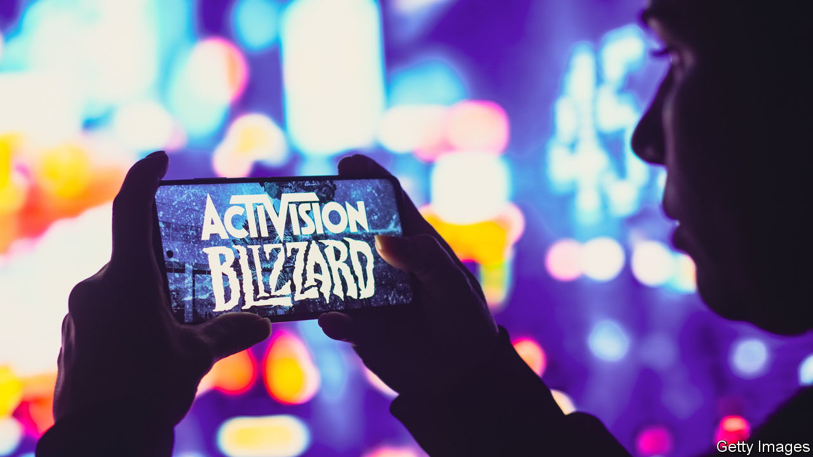

###### The world this week

# Business 

#####  

 

> Jul 13th 2023 

A federal judge in America found that the Federal Trade Commission had failed to show how proposed takeover of , an online-games developer, would hurt competition and denied the regulator’s request for an injunction to block the deal. The FTC argues that Microsoft will make Activision’s bestselling games, such as the Call of Duty series, exclusive to its Xbox platform. Both companies hailed the judge’s decision, which the FTC is appealing against. Britain’s Competition and Markets Authority, which also objects to the merger, said it would  to considering a restructured deal. 

, which makes chips for artificial-intelligence applications and has seen its share price soar this year, is reportedly in talks to become an anchor investor in , a chip designer, ahead of Arm’s blockbuster IPO later this year. Nvidia’s takeover proposal for Arm was struck down by regulators last year. 

 filed a legal challenge against its inclusion on a list of 19 companies that the European Union says are subject to new rules governing online content under the Digital Services Act. Facebook, TikTok and Twitter are also included on the list, but Amazon says that retailing is its business, and not advertising or the dissemination of information. 

America’s annual rate of  cooled to 3% in June, the smallest 12-month increase since March 2021 and far below the 9.1% recorded a year ago. Core inflation, stripping out food and energy prices, remained higher than the overall rate, at 4.8%. The Federal Reserve’s next announcement on interest rates is on July 26th. 

 faces a different problem to other countries. It is on the cusp of deflation, as demonstrated by the latest official data. Annual inflation in June was recorded as zero; consumer prices actually fell by 0.2% compared with May. The value of China’s exports fell by 12.4% in June, year on year, the biggest drop since the start of the pandemic. Imports were down by 6.8%. 

A liquidity problem

 said it had raised £750m ($970m) from shareholders in emergency funding. It had sought £1bn. The company, which provides water and sewage services to London and the surrounding region, is drowning in debt. The government is said to be thinking about nationalising the utility if it collapses. 

Jeremy Hunt, Britain’s chancellor of the exchequer, announced a number of reforms that will allow the country’s big  to invest in unlisted high-growth firms and private equity. The pension firms have committed to allocate 5% of assets in their default funds to unlisted equities by 2030, which the government reckons will increase savers’ pension pots on average by up to 12%. It also estimates that the plan will increase investment in British firms by £50bn ($65bn). 

In a setback to  ambition to become a global hub of chipmaking, , best known for assembling the iPhone, pulled out of a $19.5bn joint venture to develop semiconductors at a factory in Gujarat. The deal had been announced with much fanfare last year. Press reports suggested the project had been held up by the government’s dithering on state support. 

China’s financial and securities regulators fined , the fintech arm of Alibaba, 7.1bn yuan ($994m) for breaking rules on consumer affairs and corporate governance. They also said that the tech industry would return to “normal supervision” as most regulatory concerns had been resolved. Investors took that to mean that the crackdown on the sector is over. After the fine, Ant launched a $6bn share buy-back, which values the firm at $78.5bn, far below its worth in 2020.

 officially launched his latest venture, a startup working in artificial intelligence, named xAI. Mr Musk has recruited staff from OpenAI, DeepMind, Microsoft and other leaders in the field. In March Mr Musk co-signed a letter calling for a six-month moratorium on developing AI. 

Meta continued its PR battle with  over, Meta’s new microblogging site, which is a direct challenge to the long-established rival. Mark Zuckerberg, Meta’s boss, claimed that Threads had signed up 100m users in less than a week. That prompted Linda Yaccarino, Twitter’s chief executive, to declare that Twitter has just had its “largest usage day since February”. 

Need any cleaning done?

The OECD published a report into the adoption of  in the workplace. It said that although the impact of AI on jobs had been limited so far, there remained a significant potential for disruption. It thinks that the roles most exposed to AI are managers, chief executives and engineers. The least exposed jobs are rubbish collectors, labourers and cleaners. 

