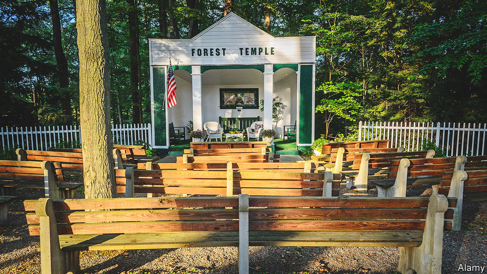

###### Clairvoyant cartel

# A pilgrimage to the mecca of mediumship 

##### Mediums engage in anti-competitive behaviour, too 

 

> Jul 13th 2023 

The gathering is like an auction crossed with a game of Mad Libs. Up steps a medium, mic in hand. Visions appear to her: the first, she says, is an old woman with a spinal deformity who liked caring for kids. The medium asks whether anyone recognises the spirit; a hand shoots up. “Know that she’s proud of you and wants you to treat yourself more!” Applause, then a second apparition, whom someone else recognises. 

Such demonstrations of public mediumship are a staple of summers at Lily Dale, a hamlet in western New York founded in 1879. About 250 residents live in gingerbread-trimmed houses in the gated community. All are adherents of spiritualism, a 19th-century movement that got its start 200km away, in Hydesville, New York. Spiritualists believe that the living can contact and glean insights from the dead; mediums are the conduit. At its peak spiritualism had somewhere between 4m and 11m followers in America, including Abraham Lincoln’s wife, who hosted séances at the White House.

Each year more than 20,000 people visit Lily Dale, the oldest and largest spiritualist centre in America. Others are Cassadaga, in Florida, and Camp Chesterfield, in Indiana. Only 34 certified mediums, having passed a test, are allowed to charge for their services on the grounds. Private “readings” cost up to $140 for half an hour. 

The mediums operate a guild of sorts. To get inducted one must perform well in trial readings. “We’re like the Harvard of mediumship,” says Sharon Klingler, who earned her credentials a decade ago. Candidates are scored on how many spirits they conjure and the accuracy of the evidence—mannerisms, symptoms, jobs, hometowns—that they give. “People who come here expect someone who’s been vetted,” says Kris Seastedt, vice-president of the Mediums League.

There are dos and don’ts of the trade. Don’t diagnose or prescribe: that could bring legal trouble. Brenda Reading, a newly certified medium, won’t inform women if she thinks that they have breast cancer, though she will ask if they have put off their mammogram. (Nothing stops her from telling your correspondent that he seems a bit low-energy. She recommends vitamin supplements.) 

Clients want assurances that their loved ones are at peace. Best to keep the message uplifting; no one likes to relive tragedy. And the more specific the evidence, the better. It’s not enough to say that dead grandma baked. Everyone had a grandma who baked. Helpfully, most visitors to Lily Dale want to believe. The occasional sceptic can be a spoiler. So can people who get too dependent and expect to be told exactly what to do by their dearly departed. Ms Klingler sometimes asks needy clients to stop calling. She reminds them that they have free will, and suggests meditation. 

Some encounters are disorienting. Your correspondent sat for a reading with a medium who immediately suffered a coughing fit—a sign, she insisted, that one of his grandparents had had a tracheotomy. Assured otherwise, she replied that he was misinformed and should trust the spirit.■


