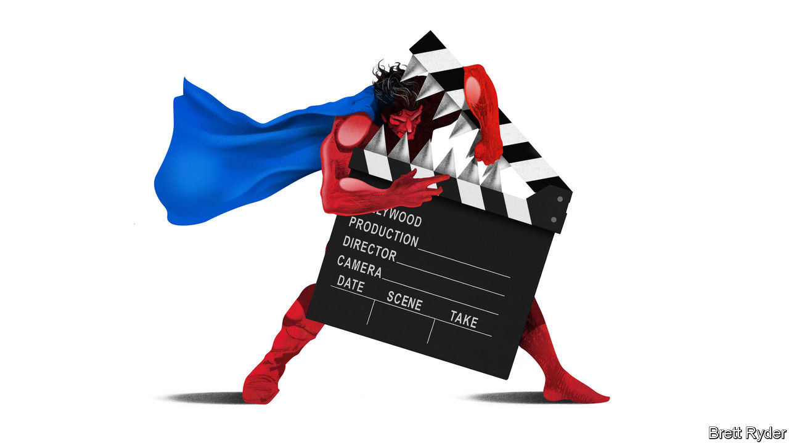

###### Schumpeter

# Hollywood’s blockbuster strike may become a flop 

##### Stars v suits 

 

> Jul 19th 2023 

Munching popcorn, a crowd of glamorous movie people and somewhat less glamorous journalists gathered in a London cinema on July 13th for the premiere of , a new film from Universal Pictures. As the audience waited for the entrance of the movie’s stars—Cillian Murphy, Emily Blunt, Matt Damon and others—they were greeted instead by an apologetic Christopher Nolan, the film’s director. His cast had just gone home, he announced. “They’re off writing their signs, to join the picket lines.”

The strike called moments earlier by America’s Screen Actors Guild, which coincides with one by  that began in May, has detonated a bomb under America’s entertainment industry. The reverberations will travel much farther: nine of the ten biggest box-office hits worldwide last year were American-made, and American streaming services now reach into living rooms everywhere. As the stars face off against the studios, the world’s great entertainment machine has ground to a halt.

The last time writers and actors went on strike together Ronald Reagan was president—not yet of the United States, but of its actors’ union. The argument then, in 1960, was about television, and how big-screen actors should be compensated when their work was replayed on the small screen. Today’s confrontation is also about new technology.

One concern is artificial intelligence. Writers and actors want guarantees that it won’t be used to churn out scripts or clone performers. The bigger argument is over streaming. The “streaming wars” have seen a surge in content spending, as century-old studios compete for subscribers with deep-pocketed new rivals like Apple and Amazon. Worldwide, TV and film companies spent more than $230bn on programming last year, nearly double their expenditure a decade earlier, estimates Ampere Analysis, a research firm. Jobs in American show business are growing about twice as fast as employment overall. 

Some “talent” still feel short-changed. Streamers make generous upfront payments, but they offer a smaller share in their projects’ future success. So whereas an appearance in a flop is much better paid than it was a decade ago, being part of a smash hit no longer means being set up for life. And although the streamers’ output tends to be creatively fulfilling, with more potential for awards than broadcast TV, their shorter seasons make work precarious. Actors and writers want higher minimum wages and a success-based payment when shows are released.

On the face of it they are in a strong position. Without writers, the creative pipeline is empty. Without actors, works-in-progress like Ridley Scott’s “Gladiator” sequel have been shut down. Even completed films will struggle without stars to promote them. Disney had to rustle up entertainers in Mickey and Minnie costumes to walk the red carpet at the premiere of “Haunted Mansion” on July 15th. The Venice film festival next month will be a lonely affair. The Emmy awards, in September, could be derailed; some wonder if the strike might even last until the Oscars, next March. Unsurprisingly, the striking stars are also proving better at communicating their concerns than the suits in the studios. Fran Drescher, current president of the actors’ union, drew on her years starring as “The Nanny” to scold “disgusting” studio chiefs for their fat salaries. Bob Iger, Disney’s boss, responded with an interview from a Sun Valley getaway known as “billionaires’ summer camp”; around the same time news leaked that he recently commissioned a new yacht.

Yet the stars will struggle more than they did when Reagan was in charge. Strikes are less disruptive to TV schedules now that there is no longer a schedule to disrupt. The on-demand era means viewers face a sea of choice on opening their apps; any gaps are less obvious. Streaming has also made Hollywood less reliant on America, both in terms of its audience and in terms of production. Netflix is the most extreme example: more than two-thirds of its 238m subscribers live overseas, and nearly two-thirds of the shows it commissioned in the past 12 months are being made abroad, according to Ampere Analysis. (It may even be happy to shift its viewers’ consumption away from expensive American productions and towards to these lower-cost shows, speculates one sometime rival.)

In a world dominated by franchises, actors also wield less economic clout than they used to. Last month Warner Bros replaced its Superman; Sony has fielded multiple Spider-Men (the most recent is animated). As Anthony Mackie, who plays Captain America, has put it: “The evolution of the superhero has meant the death of the movie star.” And as audiences tire of superheroes, studios are finding new franchises. This year’s highest-earning movie so far is Universal’s animated reboot of “Super Mario Bros”.

Cut! Cut costs!

Above all, the distressed state of the entertainment business means studios are in no shape to increase their outgoings. Big titles like “Indiana Jones” continue to fizzle at the box office, which this year is expected still to be a quarter lower than before the pandemic. The broadcast and cable-TV businesses are in terminal decline. In his Sun Valley interview Mr Iger was frank about their future: “The business model that forms the underpinning of that business, and that has delivered great profits over the years, is definitely broken,” he said. Wall Street has begun to demand that streamers deliver not just growth but profit, causing an almighty rush to trim costs. Even before the strike, projects were being cancelled. Last year Warner Bros canned a completed “Batgirl” film. The industrial action provides helpful cover for more cost-slashing: “A lot of shareholders and executives are happy to clean up their balance-sheets,” says one former streaming executive. The actors are delivering Oscar-worthy performances at the picket lines. This time, they face a tough crowd. ■


