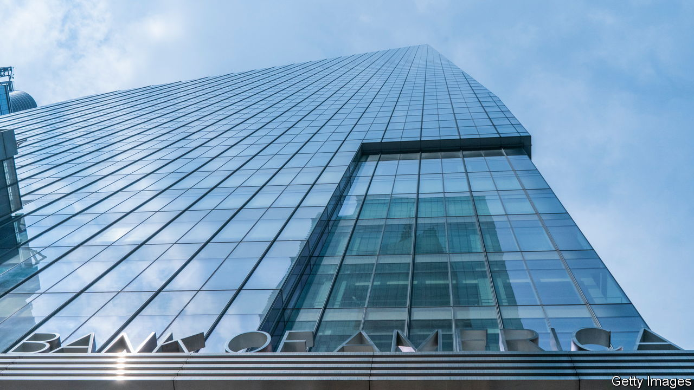

###### What crisis?

# America’s big banks are in rude health—with one exception 

##### Results highlight difficulties at the country’s most famous financial institution 

 

> Jul 19th 2023 

From one perspective, it seems like a torrid time to be a banker. A handful of financial institutions failed in the first quarter of the year after their depositors fled, spooked by the impact of higher interest rates. After these failures, smaller banks struggled to keep hold of deposits, pushing up their interest costs. At the same time, the economy is cooling, owing to higher rates, raising the prospect of job losses and defaults. Higher rates have almost entirely shut down activity in capital markets, too. The climbing cost of debt has put off would-be acquirers in the business world, prompted firms to delay issuing bonds and encouraged startups to postpone initial public offerings. 

The misery is particularly obvious at the most famous of all Wall Street institutions: Goldman Sachs. The firm is also the most exposed to ups and downs in dealmaking and most reliant on trading revenues, meaning it has struggled over the past year or so. Goldman hit another low on July 19th, when it reported its worst quarterly profits in three years. Cyclical woes have been compounded by an ill-fated push into consumer lending, which now looks like a serious error. In the second quarter the firm wrote off $500m of its investment in GreenSky, an online lender acquired by David Solomon, Goldman’s boss, in 2021. The poor results will only add to the pressure Mr Solomon is under. 

 


Things are much sunnier for the rest of America’s big lenders, however. Despite the recent turmoil, between July 14th and July 18th they reported strong quarterly results. Their seemingly perverse success is explained by the fundamentals of banking. When a financier provides a loan he must consider two things above all else. The first is the interest he can expect to receive. By handing over $100 he might hope to earn, say, $5 a year for the life of the loan, before the $100 is paid back. The other is the risk that the borrower will default, failing to repay the principal. These risks and rewards must be balanced such that, even if some borrowers default, the income is sufficient to compensate. In other words, the juice must be worth the squeeze. 

For most institutions, the juice has never been more worth it. Thanks to the highest interest rates in 15 years, net interest income at Bank of America, Citigroup, JPMorgan Chase and Wells Fargo hit a record $63bn in the second quarter (see chart). All that extra juice does not seem to have come with much additional squeeze. Provisions for loan losses—the money banks must set aside to protect against defaults, based on their assessments of the economic outlook—have risen only modestly, to around $7.5bn. True, that level is higher than in recent quarters. But it is hardly alarming. Aggregate provisions were far higher in 2020 and, indeed, in almost every quarter from 2007 to 2012. 

All told, quarterly net interest income, minus provisions for loan losses, has hovered at around 1.4% of the banks’ total loan books a quarter, or about 6% annualised, throughout 2023. This is higher than at any time since 2005. Forget the turmoil: so long as you do not work at Goldman, there has rarely been a better time to be a commercial banker. JPMorgan even posted its best ever quarterly profits. 

There are flickers of life in capital markets, too. Debt and equity-issuance numbers surpassed expectations. Bank bosses sound increasingly optimistic. “We’re seeing less anxiety around funding, as most large corps are biting the bullet and paying higher rates to take advantage of issuance windows,” reported Jane Fraser of Citi.

These results support the conclusion, which is gradually becoming the consensus on Wall Street, that the American economy has taken the most extreme dose of monetary tightening in 40 years on the chin. The housing market appears to have bottomed out, as does the stockmarket. Meanwhile, the labour market remains robust. The hope is that financial markets really have adjusted to sky-high rates more smoothly than expected. For once, bankers will not be the only ones celebrating their bumper profits. ■


