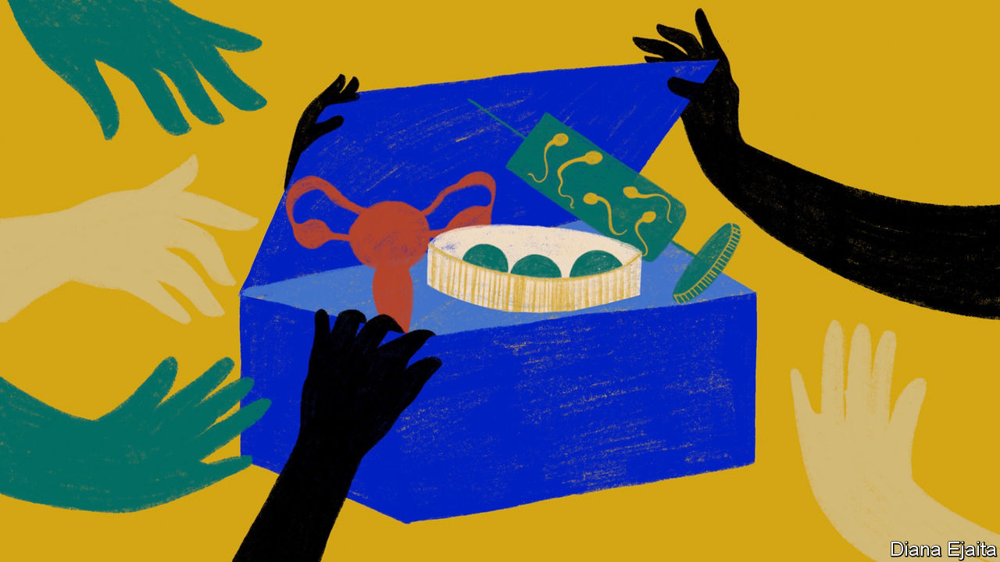

###### Our bodies, ourselves

# Not all types of families can access IVF 

##### Some governments are very clear who they want to help 

 

> Jul 17th 2023 

The characteristics that can disqualify people from being allowed to access IVF are, for the most part, relationship status, sexuality and age. 

Restrictions on the use of assisted reproduction by same-sex couples and single women have been loosened across much of the West. But the liberalising trend is far from universal. A number of European countries, including the Czech Republic and Italy, still allow access only to heterosexual couples. A recent survey of changes to regulations concerning sexuality and IVF in 18 countries by the International Federation of Fertility Societies (IFFS) found that in 2018-21 five increased access for same-sex couples and six decreased it. 

In Japan, where subsidies for IVF are being enacted as a response to demographic change, parliament is discussing a law that would determine who is eligible for treatment. The outcome could limit treatment to married couples, which would exclude gay couples: an interest in more children does not necessarily trump concerns about what sort of families there should be. 

Such concerns are clearly seen when it comes to freezing eggs, something 35% of countries surveyed by the IFfS forbid. In China, which is one of them, eggs are to be used now, in existing relationships. Ruling for a hospital that refused to freeze a single woman’s eggs in a case last year, a Beijing judge cited the “psychological and societal problems” a large age gap between mother and child would bring.

The freezing of Chinese women’s eggs is a growing business for many clinics elsewhere. Erika Wang, a 33-year-old from Zhejiang province, recently had her eggs frozen in California at her Singapore-based employer’s expense. She has posted about her decision on social media. “Fertility technology is a great invention for feminism, especially Asian feminism,” she says. “I wanted to show my friends and peers that this is possible.”

Some countries allow only women with a medical reason for freezing their eggs to do so; others require that frozen eggs, like fresh eggs, be used only in the context of a heterosexual marriage, or only in the wombs of women below a certain age. Malaysia has banned freezing for single Muslim women while exempting those of other faiths or none, thus preserving the business of clinics serving patients from China.

Other areas of disagreement include donation and genetic testing. Two European countries allow neither egg donation nor sperm donation; three more allow sperm donation but not egg donation. Embryo donation is banned in 14. Eleven European countries do not allow pre-implantation genetic testing for any “non-medical” reasons; most of Europe strictly forbids its use for sex selection. In places where such selection is tolerated, which include America, Mexico, Northern Cyprus and Ukraine, this ability to choose constitutes something of a selling-point.■

