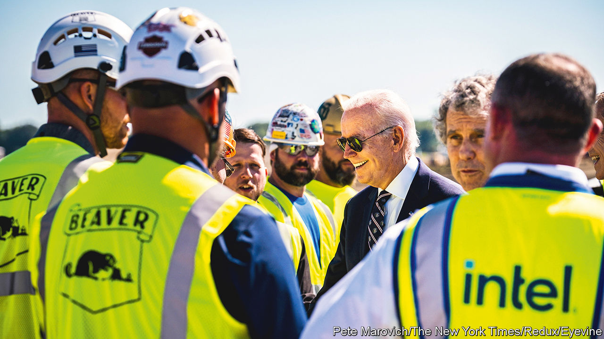

###### $ marks the spot

# The Biden administration embraces place-based industrial policy 

##### But building whole industries from scratch is easier promised than done 

 

> Jul 27th 2023 

FOR SEVERAL days in late June, Ro Khanna, who represents part of Silicon Valley in Congress, travelled through some of the most un-Silicon-Valley-like places in America—eastern Ohio and western Pennsylvania. These were once thriving manufacturing hubs and are now shells of their former selves. He was there to hear people talk about how job losses at factories had affected their communities. There were stories of broken pension and health-care promises, suicide, shattered families and itinerant job-seeking.

Tim Tuinstra, a union representative, reported that one school district in southern Pennsylvania has less than half as many children entering kindergarten as graduating high school, and ruefully noted that cities across America have bars catering to fans of the Pittsburgh Steelers, an American-football team. “It’s not because people there just decided they liked the Steelers,” he explained. Like the cratering school population, it’s because so many people have left.

America was founded by people who left, and ever since those first ships reached the New World, Americans have been happy to up sticks and chase a brighter future. But what about those who would prefer to stay home, but feel they can’t because of a lack of opportunity? Joe Biden wants to put an end to that dilemma. “I believe that every American willing to work hard should be able to get a good job no matter where they live,” he explained in a speech earlier this month, “and keep their roots where they grew up.”

To that end, the Biden administration has embraced “place-based” industrial policy, and has directed tens of billions of dollars to boost manufacturing capacity in struggling regions. Its bet is that this money will incentivise private-sector investment, leaving thriving factories, supply chains and grateful blue-collar Democrats in its wake. That is a tall order.

In recent decades richer areas have far outpaced the rest. Ranking counties by income levels in 1980 and 2021 shows growth of 172% at the 99th percentile by 2021 and 101% at the 90th, but just 55% at the 10th percentile. Big cities have done well while rural areas have lagged. The average income, adjusted for local cost of living, is around $68,000 in cities with more than 1m people, but just $55,000 in rural areas. Mr Khanna calls this divergence “the biggest challenge for the country”.

The Biden administration thinks it can shrink this disparity through  industrial policy. So far Congress has authorised at least $80bn in place-based spending (according to the Brookings Institution, a think-tank), disbursed through a range of competitive grants. The biggest-ticket items include funding authorised in the CHIPS Act, passed last year to spur American semiconductor manufacturing.

That law contains $10bn to help create 20 regional “Tech Hubs” outside currently dominant areas such as Silicon Valley and Boston, as well as $9.6bn for “regional innovation engines” and “collaborative innovation resource centres”, designed respectively to boost research and development, and to help early-stage tech firms. Other pieces of legislation authorise billions of dollars for “regional clean-hydrogen hubs” and “direct air-capture hubs”. 

Although large majorities of Republicans voted against the CHIPS Act and the Infrastructure Investment and Jobs Act—the second-largest source of place-based funding—the bills passed with some votes from both parties. Framing this funding not just as largesse, or a spur to private investment, but also as a response to the national-security challenges posed by China, helped broaden its support. Mark Muro of Brookings, who is a longtime champion of place-based policy, argues that this is the beginning of a lasting shift, that “place-based growth strategy is here to stay”. 

That may well be true. But evidence that place-based policy actually works is mixed. Boosters point to successes such as the Tennessee Valley Authority (TVA), created in the midst of the Great Depression to help develop an area spanning seven states that was then among America’s poorest regions. More recently, federal research investments and local government support helped develop North Carolina’s Research Triangle. 

But not every recipient of the Biden administration’s funding will have three top universities, as the Research Triangle area does. And there is a difference between providing electricity to a region that had none and building entire industries from scratch. New York tried that with solar panels, spending nearly $1bn on a Tesla factory that has fallen short of expectations.

As for the people who actually work in the places these policies are intended to help, they are hopeful but wary. “People in this area are tired of people making promises, and then just forgetting about those promises, and then guess what: four years later they’re back here asking for our vote,” says Jim Grant, a retired auto worker from Warren, Ohio. “Show me something.”

Unfortunately, Mr Grant may have good cause for concern. Setting aside place-based policy’s mixed results, Congress-watchers know there is a difference between authorising and appropriating funds. The most recent budget request from the White House appropriated 20% less than the CHIPS Act authorised. And even if all the funding comes through as promised, manufacturing jobs are not what they were when Mr Grant and his colleagues were in their prime. Industry is more mechanised, has fewer low- and mid-skill jobs and across the rich world pays less of a wage premium than it once did. The administration’s desire to help places like Warren and Johnstown seems real enough. So is the risk of failure. ■


