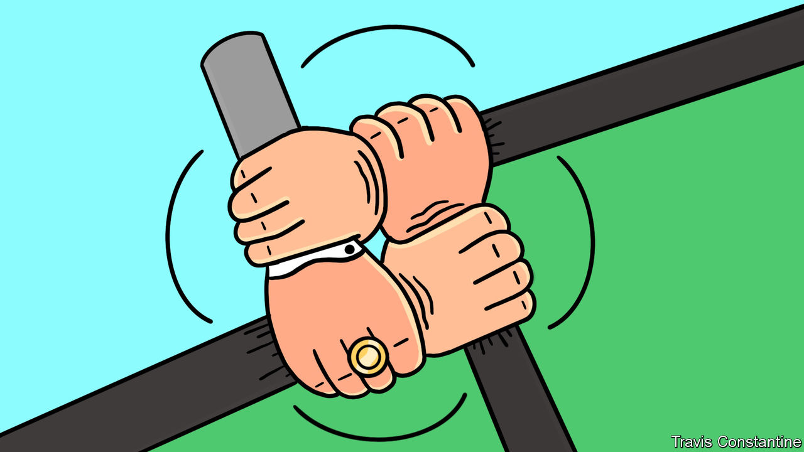

###### Value judgments

# Authoritarians are on the march 

##### They argue that universal values are the new imperialism, imposed on people who want security and stability instead. Here is why they are wrong 

 

> Aug 10th 2023 

THE FALL of the Berlin Wall in 1989 held out the promise that growing prosperity would foster freedom and tolerance, which in turn would create more prosperity. Unfortunately, that hope disappointed. , based on the definitive global survey of social attitudes, shows just how naive it turned out to be. 

Prosperity certainly rose. In the three decades to 2019, global output increased more than fourfold. Roughly 70% of the 2bn people living in extreme poverty escaped it. But individual freedom and tolerance evolved differently. Many people around the world continue to swear fealty to traditional beliefs, sometimes intolerant ones. And although they are much wealthier these days, they often have an us-and-them contempt for others.

The World Values Survey takes place every five years. The latest results, which go up to 2022, canvassed almost 130,000 people in 90 countries. Some places, such as Russia and Georgia, are not becoming more tolerant as they grow, but more tightly bound to traditional religious values instead. At the same time, young people in Islamic and Orthodox countries are barely more individualistic or secular than their elders. By contrast, the young in northern Europe and America are racing ahead. Countries where burning the Koran is tolerated and those where it is a crime look on each other with growing incomprehension.

On the face of it, all this supports the campaign by China’s Communist Party to dismiss universal values as racist neo-imperialism. It argues that white Western elites are imposing their own version of freedom and democracy on people who want security and stability instead. 

In fact, the survey suggests something more subtle. Contrary to the Chinese argument, universal values are more valuable than ever. Start with the subtlety. China is right that people want security. The survey shows that a sense of threat drives people to seek refuge in family and racial or national groups, while tradition and organised religion offer solace.

This is one way to see America’s doomed attempts to establish democracy in Iraq and Afghanistan, as well as the failure of the Arab spring. Amid lawlessness and upheaval, some people sought safety in their tribe or their sect. Hoping that order would be restored, some welcomed the return of dictators. 

The subtlety the Chinese argument misses is the fact that cynical politicians sometimes set out to engineer insecurity because they know that frightened people yearn for strongman rule. That is what Bashar al-Assad did in Syria when he released murderous jihadists from his country’s jails at the start of the Arab spring. He bet that the threat of Sunni violence would cause Syrians from other sects to rally round him.

Something similar happened in Russia. After economic collapse and jarring reforms in the 1990s, Russians thrived in the 2000s. Between 1999 and 2013, GDP per head increased 12-fold in dollar terms. Yet that did not dispel their accumulated dread. President Vladimir Putin consistently played on their ethno-nationalist insecurities, especially when growth later faltered. That has culminated in his disastrous invasion of Ukraine. 

Even in established democracies, polarising politicians like Donald Trump and Jair Bolsonaro, former presidents of America and Brazil, saw that they could exploit left-behind voters’ anxieties to mobilise support. So they set about warning that their political opponents wanted to destroy their supporters’ way of life and threatened the very survival of their countries. That has, in turn, spread alarm and hostility on the other side. 

Even allowing for this, the Chinese claim that universal values are an imposition is upside down. From Chile to Japan, the World Values Survey provides examples where growing security really does seem to lead to tolerance and greater individual expression. Nothing suggests that Western countries are unique in that. The real question is how to help people feel more secure. 

China’s answer is based on creating order for a loyal, deferential majority that stays out of politics and avoids defying their rulers. However, within that model lurks deep insecurity. It is a majoritarian system in which lines move, sometimes arbitrarily or without warning—especially when power passes unpredictably from one party chief to another. 

A better answer comes from prosperity built on the rule of law. Wealthy countries have more resources to spend on dealing with disasters, such as pandemic disease. Likewise, confident in their savings and the social safety-net, the citizens of rich countries know that they are less vulnerable to the chance events that wreck lives elsewhere. 

Universal and valuable

However, the deepest solution to insecurity lies in how countries cope with change, whether from global warming, artificial intelligence or the growing tensions between China and America. The countries that manage change well will be better at making society feel confident in the future. And that is where universal values come into their own. Tolerance, free expression and individual inquiry help harness change through consensus forged by reasoned debate and reform. There is no better way to bring about progress. 

Universal values are much more than a Western piety. They are a mechanism that fortifies societies against insecurity. What the World Values Survey shows is that they are also hard-won. ■

