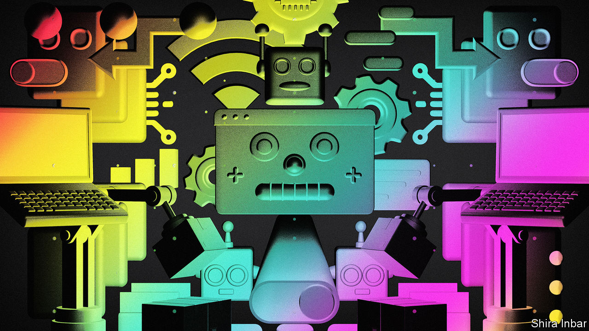
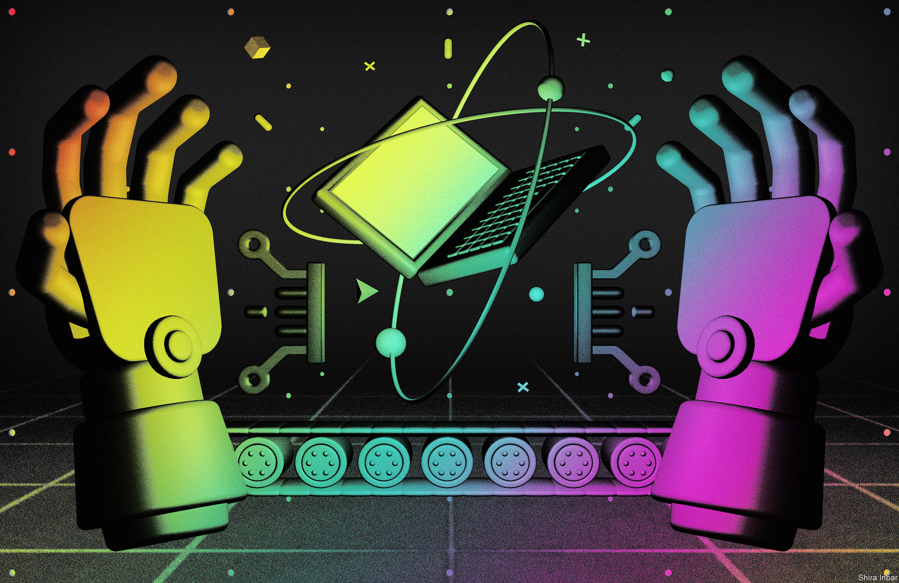

###### Advanced manufacturing

# If it can be designed on a computer, it can be built by robots 

##### Powerful new software rewrites the rule of mass production 

 

> Aug 9th 2023 

IN A FACTORY on the Carolinas’ border, Stanley Black &amp; Decker is assembling cordless electric drills. As part-finished drills travel in boxes along a conveyor belt, a robotic arm photographs and scans them for defects. Another robot nestles electric motors into the drills’ casings. A third one places and tightens screws. A single piece of software oversees the entire production line, which is capable of pumping out 130 cordless power tools every hour under the supervision of just seven humans. The assembly line it replaced in China needed up to 40 workers and rarely produced more than 100 an hour.

“Thirty years from now we will laugh at our generation of humans, putting products together by hand,” predicts Lior Susan, the boss of Bright Machines, a San Francisco-based company that installed the plant’s software. It is not that the design of the electric drills or the various steps involved in making them have changed. Rather, it is the way the automated machines doing the work are being driven by instructions that have been encoded into software having been in effect copied from the brains of Chinese factory workers, who mostly did the job manually. 

Making things this way resembles a model used by the semiconductor industry, where chips are designed using software that directly links to the automated hardware which fabricates them. For the Fort Mill plant, and other firms starting to employ such software-defined manufacturing systems, it promises to transform the factory of the future by allowing more-sophisticated products to be designed and put into production more quickly. All of which promises big cost savings. 

Make this please

To understand why, consider a simplified version of how a new power tool is made. A team of designers come up with a fresh feature, say a longer-lasting battery. They map out every element of the new product, from the battery compartment to the circuitry, that needs to be changed as a result. It is complex work, not least because a small change to one component can have a big impact on another, and so on. 

The design is then “thrown over the wall” to the people responsible for making it. Sometimes that is a third-party factory, often in China. Engineers, designers and production staff exchange information and meet up, constantly tweaking the design in response to the various successes or failures involved in making a series of prototypes. Little things, such as a screw than cannot be tightened correctly because it is hard to reach with an electric screwdriver, might result in a return to the drawing board—which nowadays is mostly a computer-aided-design (CAD) program. 

Eventually, all the kinks are ironed out (hopefully) and the new product is ready for production. The finer details of how all this was achieved, however, are likely to remain locked up in the minds of the workers assembling the prototypes. Humans are, after all, incredibly flexible and often come up with workarounds.

This process has been employed for decades, yet is inherently uncertain and messy. Designers cannot predict with any confidence what things the factory can or cannot easily accommodate. As a consequence, the design team may purposely leave some features a bit vague, and be put off innovative ideas for fear of being told it cannot be made or is impossibly costly.

When the hardware is controlled by software, rather than by humans, all this changes. Designers can dream up new products with a far greater certainty that they are manufacturable. This is because the constraints of the production line—even fiddly details like the positioning of screws—are encoded in their CAD programs. Those programs, in turn, are directly connected to the software which controls the machines in the factory. So, if a design works in a digital simulation, there is a good chance it will also “run” on the production line. 

 


This tight integration of manufacturing hardware and CAD software has been a boon in semiconductor manufacturing, where vast machines etch circuits into silicon just a few nanometres (billionths of a metre) wide. Chip designers with firms such as Apple, Nvidia or Qualcomm use specialised programs, largely produced by two companies, Cadence and Synopsys, to sketch out circuits. The design files are then sent directly to silicon foundries, such as TSMC, in Taiwan, for production. 

“Until the advent of those tools, people were laying out integrated circuits by hand,” says Willy Shih of Harvard Business School. Mr Shih imagines the impossibility of attempting to do that today with, for instance, Apple’s M1 chip, which contains 114bn transistors. Producing such complexity is only possible in a system where software allows humans to ignore the detail and focus on function. 

Stanley Black &amp; Decker has not yet turned its CAD tools loose on Bright Machines’ system to design new products. But the idea is that they soon will. “What Cadence and Synopsys did to semiconductors is what we will do to product design,” says Bright Machines’ Mr Susan.

Layer by layer

Some companies have already started designing products this way. VulcanForms is a foundry, but one that makes metal components rather than chips. It operates out of a former aircraft hangar in northern Massachusetts, where its vast computer-controlled machines focus 100,000 watts of invisible laser light onto a bed of powdered metal. The powder melts and fuses into intricate patterns, layer by layer, until a component with dimensions specified to within a hundredth of a centimetre emerges. It could be part of the engine in a military drone, or a perfectly formed hip-replacement joint. This is a type of additive manufacturing, more popularly known as 3D-printing. VulcanForms’ machines are driven by CAD software and can produce any metal component with a diameter up to about half a metre.

“When I became familiar with what VulcanForms was doing, I could see predictable patterns that mirrored some of the learning with semiconductors,” says Ray Stata, the founder of Analog Devices, an American chipmaker, and a member of the foundry’s board. In chipmaking, he says, the software linking designer and manufacturer has produced huge gains in efficiency and economies of scale.

VulcanForms uses software made by nTopology. This lets people without the skills required to operate lasers, to design objects for production by the foundry. It can result in components with previously unmatched levels of performance, because they can be produced as complex geometric structures which are impossible to manufacture any other way, says John Hart, chief technology officer of VulcanForms. Objects can be created at high volumes, such as forging 1,000 spinal implants from a single powder bed. With additive manufacturing, products can also be produced in one go, as single components, rather than being assembled from individual parts. This reduces the amount of material required as the parts tend to be lighter. It also cuts down on assembly costs. 

Software-defined manufacturing has an impact on some of the big trade and political challenges faced by companies. For firms that are increasingly uncomfortable with relying on Chinese manufacturers, it can make reshoring production a more viable option. Mr Susan puts it in martial terms: “Manufacturing is a weapon. When we give design files to China, we give the source code of that weapon to our enemy.”

There will be implications for manufacturing jobs. Although automation usually means a reduction in the number of people assembling things on the shop floor, it also creates some jobs. Technicians are required to program and maintain production systems, and in offices successful companies are likely to boost the numbers working in design, marketing and sales. These jobs, though, require different skills so retraining will be necessary.

Mr Shih also notes that factories themselves, not just the machine tools and processes within them, are coming under the thrall of software. He cites Tecnomatix, a subsidiary of Siemens, a German industrial giant, whose software lets designers lay out an entire factory so that the making of new products can be simulated in a virtual environment, known as a digital twin, before manufacture begins in its physical counterpart.

If the future of manufacturing is following semiconductors, then there is still some way to go. Producing mechanical objects is not the same as etching elaborate circuits that have no moving parts. For a start, things are far less standardised, with components having all sorts of end uses. “We’re just at the beginning with mechanical structures,” says Mr Stata. “The whole process of putting materials together in an additive method is in its very early stages. The flexibility and possibility that opens up is mind-boggling.”

Yet some of the implications are becoming apparent. Products could reach a level of performance and precision which is simply unachievable when their production is limited by human hands. Laying out a factory floor in two dimensions to accommodate human workers will become a thing of the past. Factories designed by software will be denser, much more complex three-dimensional places, full of clusters of highly productive, highly automated machinery. 

These factories of the future may be almost deserted places, attended to by a handful of technicians. But with software also taking care of the intricacies of production, they will be easier to use by people developing and designing new products. That should free their imaginations to soar to new levels. ■


