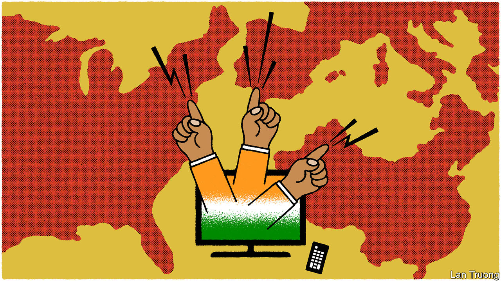

###### Banyan

# What India’s foreign-news coverage says about its worldview 

##### Indians are growing more interested in the outside world, but not more expert 

 

> Aug 16th 2023 

When Narendra Modi  in June, Indian cable news channels spent days discussing their country’s foreign-policy priorities and influence. This represents a significant change. The most popular shows, which consist of a studio host and supporters of the Hindu-nationalist prime minister jointly browbeating his critics, used to be devoted to domestic issues. Yet in recent years they have made room for foreign-policy discussion, too.

Much of the credit for expanding Indian media’s horizons goes to Mr Modi and his foreign minister, , who have skilfully linked foreign and domestic interests. What happens in the world outside, they explain, affects India’s future as a rising power. Mr Modi has also given the channels a lot to discuss; a visit to France and the United Arab Emirates in July was his 72nd foreign outing. India’s presidency of the G20 has brought the world even closer. Meetings have been scheduled in over 30 cities, all of which are now festooned with G20 paraphernalia. 

Yet it is hard to detect much deep interest in, or knowledge of, the world in these developments. There are probably fewer Indian foreign correspondents today than two decades ago, notes Sanjaya Baru, a former editor of the , a broadsheet. The new media focus on India’s role in the world tends to be hyperpartisan, nationalistic and often stunningly ill-informed. 

This represents a business opportunity that Subhash Chandra, a media magnate, has seized on. In 2016 he launched WION, or “World Is One News”, to cover the world from an Indian perspective. It was such a hit that its prime-time host, Palki Sharma, was poached by a rival network to start a similar show. 

What is the Indian perspective? Watch Ms Sharma and a message emerges: everywhere else is terrible. Both on WION and at her new home, Network18, Ms Sharma relentlessly bashes China and Pakistan. Given India’s history of conflict with the two countries, that is hardly surprising. Yet she also castigates the West, with which India has cordial relations. Europe is taunted as weak, irrelevant, dependent on America and suffering from a “colonial mindset”. America is a violent, racist, dysfunctional place, an ageing and irresponsible imperial power. 

This is not an expression of the confident new India Mr Modi claims to represent. Mindful of the criticism India often draws, especially for Mr Modi’s Muslim-bashing and creeping authoritarianism, Ms Sharma and other pro-Modi pundits insist that India’s behaviour and its problems are no worse than any other country’s. A report on the recent riots in France on Ms Sharma’s show included a claim that the French interior ministry was intending to suspend the internet in an attempt to curb violence. “And thank God it’s in Europe! If it was elsewhere it would have been a human-rights violation,” she sneered. In fact, India leads the world in shutting down the internet for security and other reasons. The French interior ministry had anyway denied the claim a day before the show aired.

Bridling at lectures by hypocritical foreign powers is a longstanding feature of Indian diplomacy. Yet the new foreign news coverage’s hyper-defensive championing of Mr Modi, and its contrast with the self-confident new India the prime minister describes, are novel and striking. Such coverage has two aims, says Manisha Pande of Newslaundry, a media-watching website: to position Mr Modi as a global leader who has put India on the map, and to promote the theory that there is a global conspiracy to keep India down. “Coverage is driven by the fact that most TV news anchors are propagandists for the current government.” 

This may be fuelling suspicion of the outside world, especially the West. In a recent survey by Morning Consult, Indians identified China as their country’s biggest military threat. America was next on the list. A survey by the Pew Research Centre found confidence in the American president at its highest level since the Obama years. But negative views were also at their highest since Pew started asking the question. 

That is at odds with Mr Modi’s aim to deepen ties with the West. And nationalists are seldom able to control the forces they unleash. China has recently sought to tamp down its aggressive “wolf-warrior diplomacy” rhetoric. But its social media remain mired in nationalism. Mr Modi, a vigorous champion for India abroad, should take note. By letting his propagandists drum up hostility to the world, he is laying a trap for himself. ■


