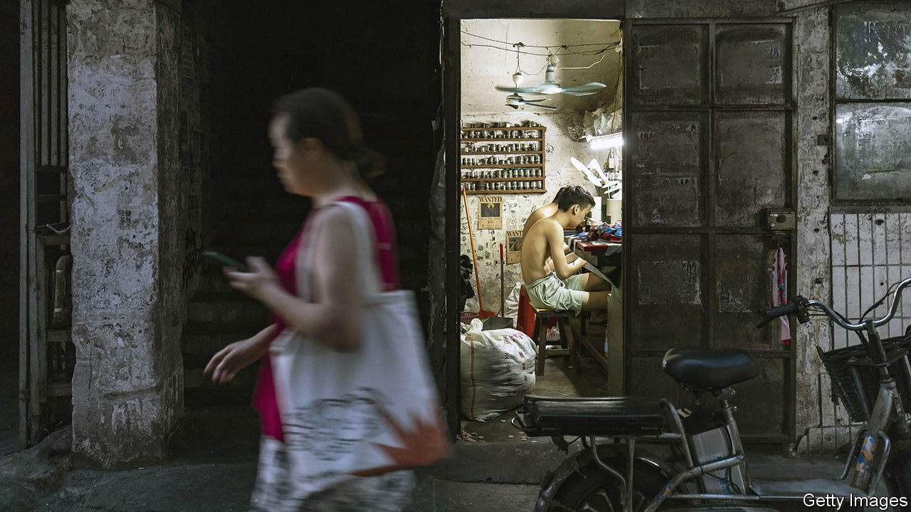

###### Unemployed and uncounted

# China’s consumers, officials and statisticians all lack confidence 

##### Strange solutions to a barrage of bad economic news 

 

> Aug 17th 2023 

China’s economic problems are distinctive. Inflation is too low, not too high. Many cities have too much housing, not too little. The country’s unmatched saving rate suggests it is, if anything, making excessive provision for its future.

China’s response to economic difficulties is also—how to put this politely?—idiosyncratic. Consider the way it handled a barrage of bad news this week from the National Bureau of Statistics (nbs). The bureau reported retail sales and industrial production were both worse than expected in July. Property sales slumped again. Urban unemployment rose. And this data followed earlier releases showing declining consumer prices, a precipitous drop in exports, vanishing foreign-direct investment and weak demand for credit. 

To soften the blow, the People’s Bank of China (pboc) duly lowered interest rates, as other central banks would do. But it reduced its medium-term rate by only 0.15 percentage points and its one-week rate by even less—not so much a cut as a nick. 

What explains its restraint? The pboc used to rely on loan quotas, money-supply targets and jawboning to make its monetary policy work; the bank’s former governor would say his benchmark for policy rates was the economy’s underlying “potential” growth rate. That might contribute to its inertia, as potential growth is a slow-moving variable, governed by fundamentals like productivity and demography. Other central bankers would say their job is to change interest rates as much as necessary to keep an economy’s actual growth close to its potential. Although the pboc is making the transition to a new set of levers and dials, it still seems to lack confidence in interest rates as a stabilisation tool. 

The idiosyncrasies of China’s policymaking do not end there. Indeed, the official response to bad news includes failing to report it. Since China’s economy reopened, the unemployment rate among urban youth (aged 16 to 24) has been rising conspicuously, leading to uncomfortable headlines. In June the rate reached 21.3%. Analysts expected it to rise again in July. Rather than face embarrassing figures, the nbs decided to stop publishing them.

This decision invited ridicule. One online commentator feigned gratitude that the bureau buried the figures, rather than fiddled them. Another offered an analogy: “A tv advert said to quit smoking, so I quit tv.” A third invoked a line from “Creation of the Gods”, a recent film: “What a horse sees is decided by the man who rides it.”

In explaining its decision, the bureau said it needed to review its methods. Measuring youth unemployment is undeniably difficult, because youngsters juggle studies, work and job-hunting. To count as unemployed, a person has to be looking for work. Many jobless youngsters are not, because they are concentrating on their education. In the first quarter of the year, for example, two-thirds of China’s 96m urban youths were neither in work nor looking for it. Of the remaining third, a little over 6m were both searching for a job and failing to find one. It is this subgroup of 6m who count as unemployed. 

There are other subtleties. In most big economies, such as America and the euro area, a person can count as unemployed only if they have taken steps to find a job in the past four weeks. China casts a wider net. Its unemployment figures include those who looked for work in the past three months. If China adopted the four-week standard, its youth unemployment rate could drop by seven percentage points, according to calculations using 2020 data by Zeng Xiangquan of Renmin University.

The right response to such difficulties is, of course, to air them. China has hidden other data, too. Its publication of the Gini coefficient, a measure of income inequality, has been stop-start. There is still no figure for 2022. It released a measure of consumer confidence every month for more than 30 years, until confidence fell sharply in April. None of these responses to China’s problems will help solve them. The country’s statisticians lack confidence in their methods, its central bank lacks confidence in its tools and the country’s consumers lack confidence in the future. ■


