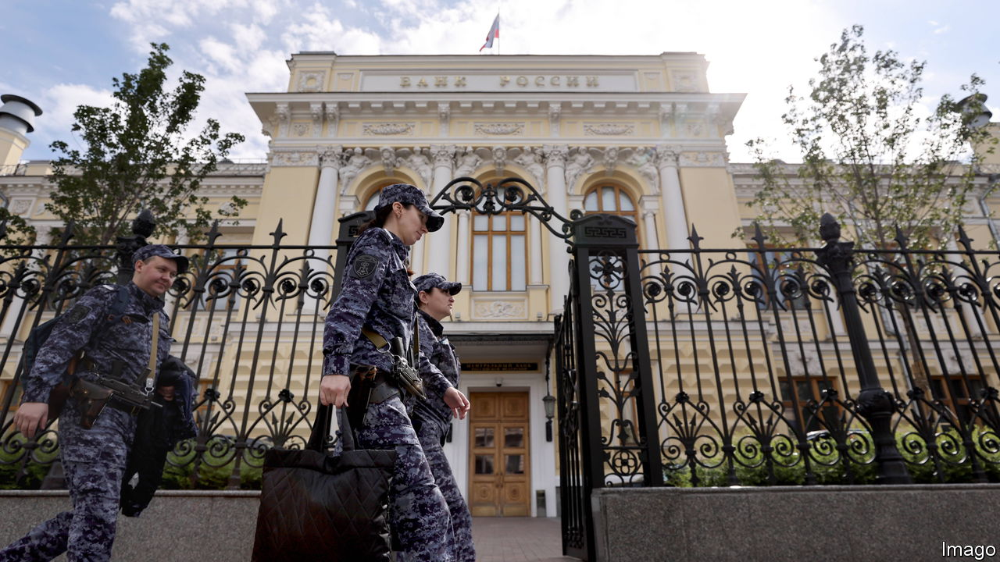

###### Seeing cents

# Russia will struggle to cope with a sinking rouble 

##### What does the currency’s collapse mean for Vladimir Putin’s ability to wage war? 

 

> Aug 14th 2023 


On August 14th Russia’s rouble slipped past the value of 100 to the American dollar, meaning it was worth less than a solitary cent—and was the cheapest it had been since the immediate aftermath of the invasion of Ukraine. The currency is one of the world’s worst performers this year, outdone only by perennially troublesome peers like the Argentine peso, Venezuelan bolivar and Turkish lira. 

The next day Russian monetary policymakers intervened, scrambling to respond to events for the first time since early in the war. The Bank of Russia raised interest rates by 3.5 percentage points, to 12%. Although the rouble rose a little on the news, it is still, at 96 to the dollar, far cheaper than its level of 60 or so this time last year. Rate rises are unlikely to stem the currency’s decline soon, with consequences for Vladimir Putin’s ability to wage war. 

 


Currency collapses are often prompted by nervous international investors or fleeing domestic capital. Yet trading in the rouble, especially against the dollar, remains thin. Sanctions and capital controls have left Russia isolated. Instead of reflecting the aggregated opinions of speculators, the rouble swings according to the textbook economic model, reflecting the relative strength of exports (which earn foreign currency) and imports (which must be paid for with these earnings). 

Since the g7 imposed a $60 price cap on Russian oil in December, the value of exports has slumped. Russia’s earnings were 15% lower in dollar terms from January to July than during the same period last year, a fact not entirely explained by a lower global oil price. Meanwhile, imports have surged as the government prosecutes its war, and buys the goods to do so. In the first seven months of the year Russia’s current-account surplus, a measure of how much more foreign currency the country receives than spends, fell by 86%, to $25bn. 

On the one hand, this suggests the oil-price cap is having some impact. Attempts to dodge the policy are not making up for being forced to sell oil at a discount. On the other hand, it suggests Russia is finding ways to import goods. German exports to Russia’s friendlier neighbours, for instance, have shot up suspiciously.

A cheap currency raises the rouble value of the government’s oil revenues, but it also raises the cost of the imports. In June Andrei Belousov, Russia’s deputy prime minister, said the value at the time, of 80-90 roubles a dollar, was best for the country. When the rouble was far stronger last year, the Russian government was happy to use it as evidence Western sanctions were failing. That confidence has now gone. On August 14th Maxim Oreshkin, an adviser to Mr Putin, wrote a column stressing the need for a strong rouble and blaming its collapse on the central bank. 

The emergency rate rise helped the rouble only a little. Russia’s isolation means higher interest rates are unlikely to tempt “hot money” (speculative funds seeking short-term returns). The focus may now turn to the domestic capital that is at risk of fleeing. Strengthening capital controls could stanch the flow, but would take time to have an impact. As this piece was published, the government was reportedly due to meet to decide whether to force exporters to sell foreign-currency earnings.

Direct intervention in currency markets is another option. The central bank has scaled back purchases of foreign currency. Under a budgetary rule, Russia used to buy other currencies in exchange for roubles if it had a surplus of oil and gas revenue, in order to build up reserves. On August 9th this rule was abandoned. According to official figures, the country had foreign-currency reserves of $587bn at the start of August, suggesting the central bank has the firepower to prop up the rouble. The problem is that some $300bn of these reserves are frozen by the West.

Unless the government can secure more oil revenue, it faces a choice. The state could cut back on spending, including on its armed forces, in order to reduce imports. Alternatively, the civilian economy will take the pain. Rising inflation and higher interest rates will weaken the purchasing power of ordinary Russians, forcing them to buy fewer foreign goods. Thus the fate of Russia’s economy will not be decided by the judgments of international financiers but by the depths of Mr Putin’s aggression. It is a far more unhappy situation in which to be trapped. ■


