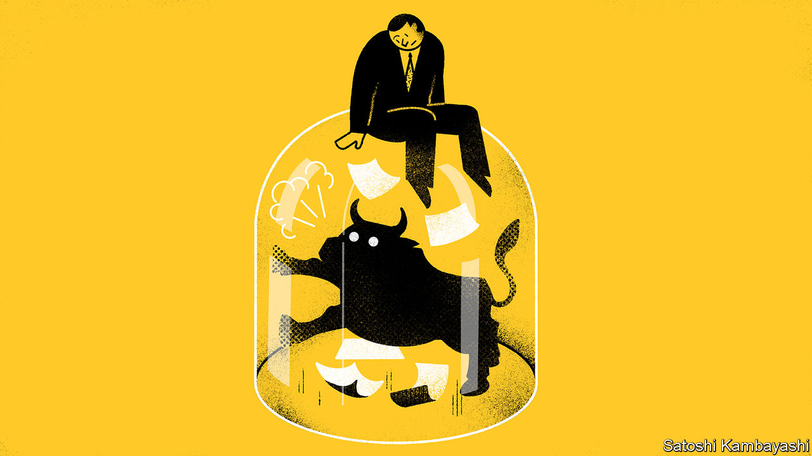

###### Buttonwood

# Why investors are gambling on placid stockmarkets 

##### What looks like a safe bet carries a hidden danger 

 

> Aug 17th 2023 

Sod’s law, the axiom that if something can go wrong then it will, is about as British as it gets. But traders around the world have their own version: that markets will move in whatever direction causes the most pain to the most people. This year, they have been vindicated by a soaring stockmarket that few saw coming, in which the biggest winners have been the shares that were already eye-wateringly expensive to begin with. In April fund managers told Bank of America’s monthly survey that “long big tech” was the most faddish trade going, making it an obvious one for the professionals to avoid. Over the next few months shares in the biggest big tech firms duly left the rest of the market in the dust.

Other than simply pay up and pray for the run to keep going, what is a value-conscious investor to do? The pluckiest option—calling the market’s bluff and betting on a crash—has left many of the hedge funds that tried it running for cover. In June and July, say Goldman Sachs’s brokers, such funds abandoned their positions at the fastest pace in years. Those looking on may not thrill at the prospect of recreating their experience. But if you don’t think stocks can rise much more yet can’t stomach the risk of shorting them, logic dictates a third option. You can try to profit from them not moving much at all.

A growing number of investors are doing just this—or, in industry jargon, selling volatility. The trade-du-jour is the “buy-write” exchange-traded fund (etf), a formerly obscure category that is now hoovering up capital. Since the start of 2023, buy-write etfs have seen their assets balloon by 60%, to nearly $60bn.

In practice, such investors are buying baskets of stocks while selling (or “writing”) call options on them. These are contracts that give the buyer the right (though not the obligation) to buy the stocks for a set price (or “strike price”) in the future. Usually the strike price is set “at the money”, or at whatever level the stocks are trading when the option is written. If they then rise in price, the buyer will exercise the option to purchase them at the below-market value. Conversely, if they fall, the buyer will let the option expire unused, not wanting to pay above-market value for the stocks.

The original investor, who sold the call option and bought stocks, is betting that share prices stay precisely where they were. That way, they get to pocket the option price (“premium”) without having to sell the stocks for less than they are worth. If prices instead increase, the option seller still keeps the premium, but must forgo all the share-price growth and sell the stocks for their original value. If they fall, the investor takes the hit as the option will not be exercised, meaning they will keep the shares and their losses. This is at least cushioned by the premium they received in the first place.

To those marketing them, buy-write etfs are more than just a punt on placidity. Global X, a firm that offers 12 such funds, lists their primary goal as “current income”. Viewed in this light they might appear like a dream come true, because regularly selling options can generate a chunky income stream. One of the more popular vehicles is the Global X Nasdaq 100 Covered Call etf, with assets worth $8.2bn. Averaged over the year to June, each month it has collected option premiums worth 3% of assets and made distributions worth 1% to investors. Even in a world of rising interest rates, that is not to be sniffed at. Ten-year Treasuries, by comparison, yield 4.2% a year.

Readers who do not believe in free lunches may sense a rather large catch coming. Yet it is not the familiar one applying to bets against market turbulence, which is that years of steady profits can be followed by a sudden, unexpected shock and a total wipeout. A buy-write etf may well fall in value, but in this respect it is no riskier than a corresponding “vanilla” fund that just owns the underlying stocks.

The real hitch is that while such etfs offer equity-like potential losses, their profits can never exceed the monthly income from selling options. Those profits thus resemble the fixed-income stream generated by a bond. They also up-end the logic for buying stocks in the first place: that a higher risk of losses, compared with bonds, is worth the shot at wild, uncapped returns. The nightmare scenario is that stocks go on a blistering bull run that buy-write investors miss out on, followed by a plunge that hurts them almost as much as everyone else. This year has already had the bull run. If Sod’s law continues to hold, buy-writers should watch out.■


