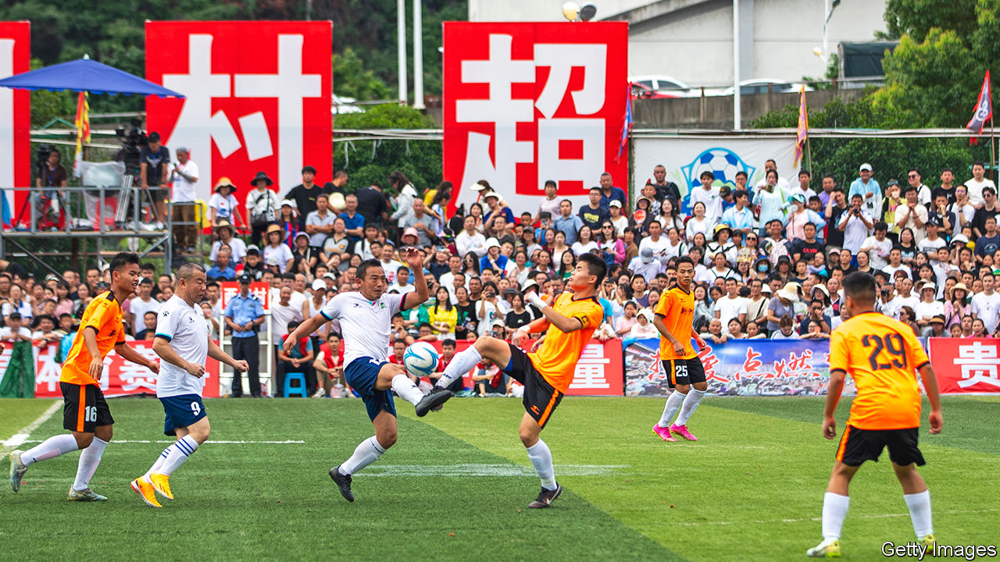

###### Score one for the countryside

# How an amateur football league in China took off 

##### Can the host keep up the momentum? 

 

> Aug 24th 2023 

Rongjiang County, tucked away in the rainy hills of south-west China, has little going for it at first glance. The grey tiles covering houses in the county seat give it a rather drab feel. The area was one of the last in China to be declared free of extreme poverty. Locals often have to find work elsewhere, travelling to distant factories and construction sites. In 2019 a video went viral of three young children in Rongjiang begging their migrant-worker parents to stay with them.

Yet this summer it was Chinese from far-off cities who flocked to Rongjiang. They came to watch an amateur football league involving 20 of the county’s villages. It started in May and quickly became a phenomenon. Weekend matches between teams made up of butchers and farmers drew crowds of nearly 50,000, straining the local stadium. Millions more watched on Weibo, a Twitter-like platform, and Douyin, the Chinese version of TikTok.

The league’s group stage finished in mid-July. When your correspondent visited to watch the semi-finals of the knockout stage on July 28th, every hotel in town was fully booked. Some fans camped out by a river, their tents and rice-cookers sheltered by a rough concrete bridge.

There are many reasons behind the popularity of the Rongjiang league, which is men only. Start with the state of professional football. Despite decades of investment by China’s leader and chief fan, Xi Jinping, the country’s players are not very good. The men’s national team, made up of players from China’s top league, ranks 78th in the world (the women rank 14th). It has only qualified for the World Cup once, in 2002, when it failed to score a single goal. Lately China’s football association, which oversees the sport, has been dogged by allegations of corruption. 

The Rongjiang league, by contrast, has an authentic, even wholesome feel. Football in the county dates back to the 1940s, when it was introduced by university students who were fleeing China’s cities during the invasion by Japan. Today the games are free to watch and feel enjoyably low pressure. Players brush off their missed shots with grins. After a penalty shoot-out in the semi-finals, fans swarmed the pitch waving China’s national flag. The winners of this year’s tournament, from a village in Chejiang township, walked away with a cow. The two runners-up won three pigs and three goats, respectively.

The league’s cultural diversity is another draw. The players come from several minority ethnic groups, of which the biggest are the Dong and the Miao. During breaks in the matches, villagers in traditional silver headdresses often dance for the crowd. Others play , a musical instrument with multiple bamboo pipes. The performances are well received by locals and visiting Han Chinese, who make up more than 90% of China’s population. Some of the latter are patronising, though. “The more backward people are, the more enthusiastic they are too,” says one. China’s minorities are often presented by official media as fun-loving curiosities.

A kick for business

To the delight of officials at all levels, the league appears to have stimulated the local economy. During the Dragon Boat festival in June tourism spending shot up, much of it coming from football fans. Restaurants selling , a kind of soup made from partially digested grass found in a cow’s stomach, have been packed of late. (The grass is extracted early in the digestive process, says a local rather defensively.) Vendors at the hundreds of stalls set up by the local government outside the stadium report a brisk trade. Most sell food or traditional crafts. A man hawking barbecue skewers says he has doubled his income.

Officials are calling Rongjiang a successful case of “rural revitalisation”, which is a pet project of Mr Xi. He wants to boost development in the countryside. Following his lead, state media have raved about Rongjiang. Even China’s foreign embassies boasted about the football matches. In June the central government called for over 100 new sporting events to be set up in rural areas by 2035.

But there are concerns that the success of Rongjiang may be fleeting. Attracting crowds to this part of China is not easy. Before the football league, officials tried to draw tourists by touting sports such as bullfighting and basketball. An effort was made to promote local customs, too. None of these really caught on. 

The city of Zibo, in the northern province of Shandong, provides a cautionary tale. It became a social-media phenomenon when word of its delicious kebabs began making the rounds earlier this year. Tourists flocked to the city, where officials turned arenas into makeshift dining halls. But after a few months of this barbecue craze, interest in Zibo slumped. 

Still, officials think they have found a winning strategy for the countryside. A new football league began this month and will run until October. This one is a little more contrived. It involves nearly 300 amateur teams from all around China. Each is named after a food. On August 13th a team called the Sour Soups from the nearby city of Kaili beat the Bamboo Shoots from the southern province of Guangdong. The stadium in Rongjiang was still packed. ■


