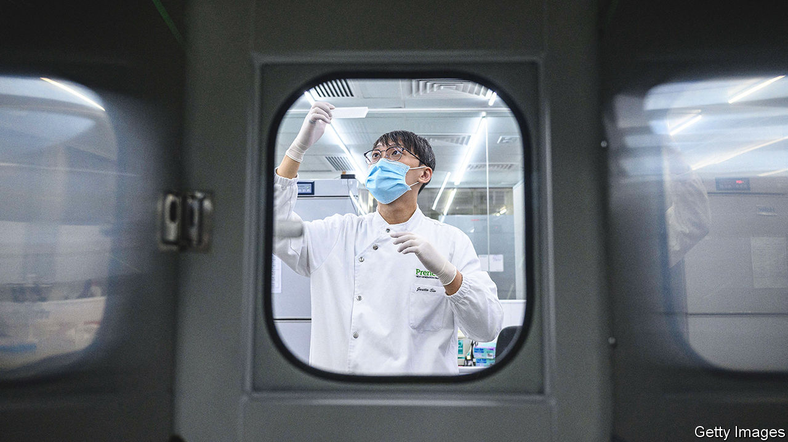

###### Political science

# The clock is ticking on an old deal between America and China 

##### Why Republicans oppose the Science and Technology Co-operation Agreement 

 

> Aug 24th 2023 

America and China established full diplomatic relations on January 1st 1979. By the end of that month they had also signed the Science and Technology Co-operation Agreement (STA). The deal didn’t commit either side to much, but it laid out a shared desire for collaboration in these areas. Its terms call for renewal “by mutual agreement” every five years. For decades that happened with little fuss. Now, though, things are looking shaky. The deadline is August 27th.

China wants to stay in the deal. America is seeking a sixth-month extension so that it can negotiate changes to the pact. President Joe Biden is under pressure from Republicans to ditch the agreement. Some have written letters to Antony Blinken, the secretary of state. In one, ten congressmen claimed that China “has previously leveraged the STA to advance its military objectives and will continue to do so.” America, they added, must “stop fuelling its own destruction”.

Backers of the STA say it has symbolic value, being among the first bilateral agreements signed by the countries after ties were established. And it has produced tangible benefits, too. They say that joint research enabled by the STA has helped prevent spinal birth defects and led to the regular monitoring of influenza strains, which is needed to formulate vaccines each year. They also cite achievements in seismology, agriculture, clean energy and other fields.

The STA does not fund or require any action. Rather, it is an umbrella agreement under which specific collaboration can be negotiated. Since it was signed, almost 100 protocols and annexes have brought American and Chinese scientists together. If any of those cause concern, they can be amended, abrogated or allowed to expire. In recent years, the level of activity occurring under the STA has decreased, partly because of the covid-19 pandemic and partly because of growing mistrust on both sides.

In 1979 America was already a scientific superpower, while China had relatively little expertise to offer. Now, though, China has caught up in many areas, so the potential benefits for America of staying in the STA are only increasing, say its proponents. The Biden administration says it wants to “strengthen” the deal. But it has already placed restrictions on the sale of certain technologies to China, such as advanced semiconductors, and prohibited American investment in some of the country’s high-tech sectors. With elections coming next year, no one in Washington wants to appear soft on China.■


