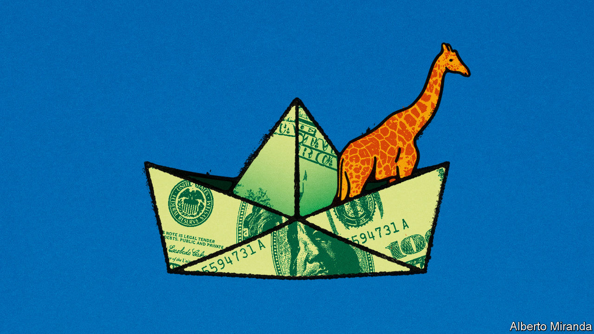

###### Free exchange

# Which animals should a modern-day Noah put in his ark? 

##### An economic interpretation of a biblical tale 

 

> Aug 24th 2023 

“Of fowls after their kind,” the Lord said to Noah, “and of cattle after their kind, of every creeping thing of the Earth after his kind, two of every sort shall come unto thee.” Co-operation from the animal kingdom helped make the biblical patriarch history’s greatest conservationist, saving every land-based animal, including humans, from a wave of divine extinction. 

Unlike Noah, contemporary conservationists face constraints: they cannot save everything. The patriarch was able to fit a breeding pair of each of the 5.6m or so terrestrial species onto his 300 cubits-long ark. If he was forced instead to ration his space, facing the traditional economic problem of scarce resources and unlimited wants, which animals should Noah have prioritised and kept safe from the flood for future generations?

This was the dilemma Martin Weitzman, an economist, posed in a paper published in 1998, and it is one that carries enduring lessons. Weitzman’s goal, beyond biblical interpretation, was to create an economic theory of conservation, calculating a strategy that a rational conservationist could follow to maximise both human welfare and natural biodiversity. He wanted to come up with a way of ranking conservation projects; how to weigh what the Lord called creeping things of the Earth against one another given the limited amount of funding to keep them all alive. 

Animals have two sources of value in Weitzman’s model. The first is the utility they provide humanity: economists now call this “ecosystem services”. They vary from the delight that megafauna provide those visiting a safari park to the more prosaic: pollinators fertilising crops; earthworms keeping the soil healthy. A forthcoming paper by Eyal Frank of the University of Chicago and Anant Sudarshan of the University of Warwick looks at the economic benefits of “keystone species”. They find that the accidental poisoning of vultures in India led to a dramatic increase in human mortality, with more than 100,000 additional deaths in an average year, as the birds no longer devoured waterway-poisoning carrion (see Graphic detail). Despite their poor reputation, vultures might therefore earn a place on a resource-constrained ark.

The second part of the calculation places a direct value on biodiversity. Imagine, now, that you are not Noah trying to save the natural world from a flood, but a scholar trying to save texts from the Library of Alexandria. All the scrolls might be valuable, but many have information on them that is in other libraries. The aim would be to save those with information not recorded elsewhere. Weitzman applies the same logic to animals: biodiversity has both an aesthetic value and an informational one, with content embedded in the genetics of animals. The selection for the ark should try to preserve as much of this information as possible, even if the animals themselves do not do much for human welfare.

That led to what some conservationists might consider a repugnant conclusion: counterintuintively, the best way to preserve biodiversity is for the resource-constrained ark to pick a single species and squeeze in as many as possible. Preventing just one type of animal from going extinct preserves not only what is distinct about that animal, but everything it shares genetically with every other animal as well. Trying to keep two species alive, and failing, means losing everything. The real-world implication of this is that using conservation funds on highly endangered species risks throwing good money after bad. Pandas, for instance, are cute but require a lot of effort to keep alive. Noah might be best to fill the ark with resilient cockroaches instead, ensuring that at least one creature makes it through the flood.

To reach that counterintuitive conclusion, Weitzman assumed that people ought to value biodiversity for its own sake. Some boatbuilders might instead want to focus only on the benefits animals provide to humans. Perhaps a few creatures provide a sufficiently low or even negative value as to be excluded altogether. Stinging wasps are one candidate, but the picnic irritants play a vital role, eating other pests and pollinating flowers. Mosquitoes, humans’ greatest natural killer, responsible for more than half a million deaths a year, are another. Some scientists have suggested releasing genetically modified, sterilised versions of the insects that would get rid of the species altogether; others warn that doing so could have unforeseen consequences by eradicating both a pollinator and a food source for other animals.

Deliberate eradications are occasionally successful. Every week the us Department of Agriculture (usda) and Panamanian government drop sterilised screwworms, a parasitic flesh-eating fly larva that feeds on livestock, out of a plane on the Panama-Colombia border in order to stop the creatures from breeding. This helps maintain a biological barrier that prevents the creature from moving northward, and thus safeguards a programme spanning decades and countries that has got rid of the fly from North America. The usda estimates that the project produces economic benefits worth around $3.1bn a year. 

Be fruitful and multiply

There is reason to be careful, though. Even when valuing animals solely on their benefits to humanity, biodiversity still has something to offer: insurance. Genetic range reduces the vulnerability of any individual part of an ecosystem to pests and diseases, helping avoid catastrophe if a species vital for human survival goes extinct. Were Noah to have filled his ark with cockroaches—or pandas, for that matter—a single virus could have wiped out the lot. 

Weitzmann himself applied such an approach to climate change, formulating his “dismal theorem”, which states that, in the presence of sufficiently big risks with a small chance of great harm, regular cost-benefit analysis is of little use. The same may be true of biodiversity. Deliberate extinctions are irreversible and reduce humanity’s options, so should be used sparingly. Playing at being Noah is one thing, playing at being God quite another. ■


