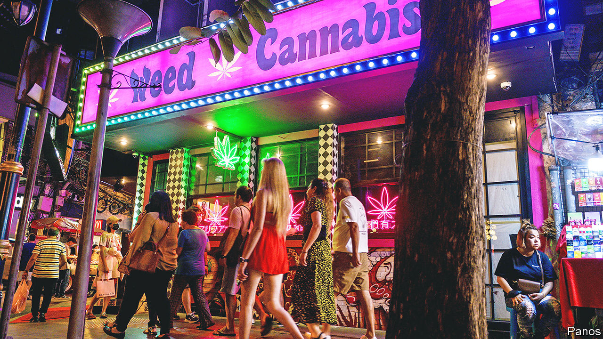

###### Budding growth

# What now for Thailand’s weed industry? 

##### As a new government takes office, regulation is as hazy as a Bangkok café 

 

> Aug 31st 2023 

Visitors to Sukhumvit, Bangkok’s party district, have long been enticed with fake Rolexes and all manner of massages. Over the past year, weed has also been pressed on them. Since June 2022, when Thailand became the first South-East Asian country to decriminalise the drug, stoners in Bangkok have been spoilt for choice. They can eat at cafés offering “happy meals” or buy joints at dispensaries. At Thai Cannabis Club, your correspondent was offered a strain called “gushers” with the promise of flavours of “sour tropical fruits and rich creamy cookies in every toke”. 

Around 12,000 cannabis stores have opened across the country. Over a million people have registered to grow weed, and tourists are flocking to consume it. The industry had annual revenues of $800m by the end of 2022—and is forecast to grow 12-fold by 2030. But will Thai politicians, among whom the issue is contentious, intervene to prevent that? 

Much of the growth is illegal. Cannabis purchases are meant to be for medical use and limited to stuff containing less than 0.2% of high-inducing tetrahydrocannabinol (THC). Yet shops openly advertise and sell more potent products (gushers contain 25% THC). Public-health bodies and religious institutions have warned that people are getting dangerously stoned. Even some in the business are grumbling, in part because many firms are illegally importing cheap weed, driving down prices. A cannabis law that sought to provide more regulatory clarity was stalled in parliament ahead of a general election held in May.

Before the poll, several parties vowed to ban or restrict cannabis use. They included Pheu Thai, a party that had led a war against drugs during a former stint in power, and which on August 22nd cobbled together a governing coalition. Yet it is unclear whether Srettha Thavisin, the new Pheu Thai prime minister, will follow through on that, or much else. His coalition is a mess of competing agendas. The boss of the party that led the movement for cannabis decriminalisation, Anutin Charnvirakul, is Mr Srettha’s deputy prime minister. Thailand’s stoners can probably rest easy. ■

