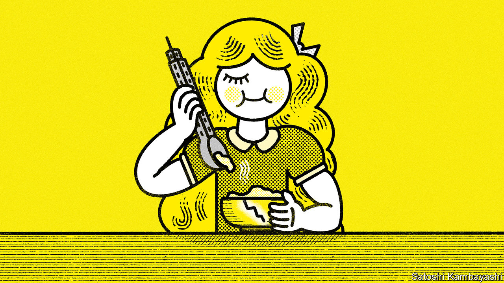

###### Buttonwood

# High bond yields imperil America’s financial stability 

##### Talk of a “Goldilocks” situation belies real danger 

 

> Aug 29th 2023 

Interrogating a fairy tale is not usually the best use of an investor’s time. But there may be an exception. The internal logic of “Goldilocks and the Three Bears”, and the idea that the economy can be “just right” for financial markets, merits some inspection.

Earlier this year, the prospect of a seemingly inevitable American recession—the result of rising interest rates—peppered conversations across the financial world. Now, with inflation falling rapidly,  looking strong and the Federal Reserve at least slowing the pace of interest-rate rises, talk is instead of a “Goldilocks” situation: an economy that is neither too hot (with surging inflation) nor too cold (with unpleasantly high unemployment). As the economic picture has grown brighter, yields on American government bonds have ticked ever higher. The yield on ten-year Treasuries is now 4.2%, up from 3.8% at the beginning of the year. Real yields, adjusted for inflation expectations, are at their highest since 2009.

They are unlikely to fall any time soon. On top of buoyant growth figures—one closely followed estimate suggests that the American economy may be growing at nearly 6%—underlying supply and demand also point upwards. The government ran a deficit of almost 9% of gdp in the year to July, an elevated level that is expected to persist. Meanwhile, the Fed has allowed around $765bn of Treasuries on its balance-sheet to mature without replacement since last summer.

The recent good economic news has less rosy implications for the financial outlook than might be expected. Indeed, various markets are already being squeezed by rising yields in a manner that threatens financial stability. Sky-high bond yields mean considerable financial distress is baked in, even if it is not yet visible. And the threat is growing with every piece of strong economic data. 

Consider commercial property. American office-vacancy rates reached 16.4% in the middle of the year, according to Colliers, an estate agency, above the previous record that was set after the global financial crisis of 2007-09. The combination of firmly entrenched work-from-home habits and rising interest rates has been brutal for owners of office buildings. Capital Economics, a research firm, forecasts an additional 15% decline in prices by the end of next year, with the west coast being struck particularly hard.

The situation faced by commercial-property owners may deteriorate even if the economy further improves. One or two extra percentage points of growth will bring back few tenants. But the resulting increase in interest rates will put pressure on businesses unable to refinance the debt they accumulated at low rates in the covid-19 pandemic. Newmark, a property-services firm, identifies a maturity wall of $626bn in troubled commercial-property debt—where the senior debt of the borrower is worth 80% or more of the value of the property—that will come due between 2023 and 2025. Without a let-up in the bond market, plenty of companies will smash into the wall.

Problems in commercial property could spread. Many American lenders have extended credit to the industry. In early August Moody’s downgraded ten small and mid-sized institutions, and placed several larger ones on watch for downgrades. Banks with under $10bn in assets have exposure to commercial real estate worth 279% of their equity cushions, the rating agency noted, compared with 51% for those with over $250bn.

The problems that felled Silicon Valley Bank, First Republic Bank and Signature Bank in March and April have not gone away, either. Deposits across the industry have barely recovered since their tumble in the spring, rising by 0.02% a week on average over the past four months, compared with 0.13% on average over the past four decades. The allure of money-market funds, where high yields offer investors an alternative to low-interest bank accounts, means the pressure is hardly letting up.

For less leveraged firms, workers and stock investors, the economic porridge seems to be at just the right temperature. Even in the residential property market, which provided the spark for the global financial crisis, owners have largely shrugged off the Fed’s rapid interest-rate increases. But the parts of the American market most vulnerable to rising refinancing costs are faced with an unappetising bowl of cold porridge. A Goldilocks outcome for some is a bearish nightmare for others. If Treasury yields stay high, it could become increasingly hard to keep the two realities separate.■


