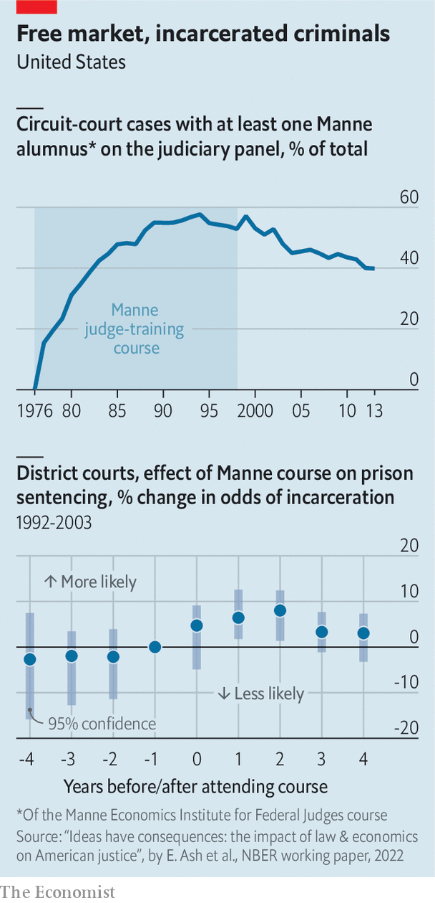

###### Prophets of maximisation

# How Chicago school economists reshaped American justice 

##### The 50th anniversary of a groundbreaking work 

 

> Sep 7th 2023 

In recent years the antitrust division of America’s Department of Justice has gone on a crusade against corporate mergers, filing a record number of complaints in an attempt to stop the biggest businesses from getting even bigger. With few exceptions, these efforts have been thwarted by the courts. That it is so hard to get a judge to intervene in business reflects the work of an institution known more for its free-market influence on economics than the law: the University of Chicago.

Fifty years ago this autumn Richard Posner, a federal judge and Chicago scholar, published his “Economic Analysis of Law”. Now in its 9th edition, the book set off an avalanche of ideas from Chicago school economists, including Gary Becker, Ronald Coase and Milton Friedman, which passed into the folios of America’s judges and lawyers. The “law-and-economics” movement made the courts more reasoned and rigorous. It also changed the verdicts judges handed out. Research has found that those exposed to its ideas are more opposed to regulators and less likely to enforce antitrust laws, and tend to impose prison terms more often and for longer.

Links between economics and the law have long been studied. In “Leviathan” published in 1651, Thomas Hobbes wrote that secure property rights, which are needed for a system of economic exchange, are a legal fiction that emerged only with the modern state. By the late 19th century, legal fields that overlapped with economics, such as matters of taxation, were being analysed by economists. 

With the arrival of the law-and-economics movement, every legal question was suddenly addressed in the context of the incentives of actors and the changes these produced. In “Crime and punishment: an economic approach” (1968), Becker argued that, rather than being a balancing-act between punishment and the opportunity for reform, sentences act mainly as a deterrent: the literal “price of crime”. Harsh sentences, he argued, reduce criminal activity in much the same way as high prices cut demand. With the caveat that a greater chance of arrest is a better deterrent than longer prison sentences, Becker’s theorising has since been borne out by decades of empirical evidence.

Too steep?

In the movement’s early days, “the legal academy paid little attention to our work”, recalls Guido Calabresi, a former dean of Yale Law School and another of the field’s founding fathers. Two things changed this. The first was Mr Posner’s bestselling textbook, in which he wrote that “it may be possible to deduce the basic formal characteristics of law itself from economic theory.” Mr Posner was a jurist, who wrote in a language familiar to other jurists. Yet he was also steeped in the economic insights of the Chicago school. His book successfully thrust the law-and-economics movement into the legal mainstream.

The second factor was a two-week programme called the Manne Economics Institute for Federal Judges, which ran from 1976 until 1998. This was funded by businesses and conservative foundations, and involved an all-expenses-paid stay at a beachside hotel in Miami. It was no holiday, however, even if those who went nicknamed the conference “Pareto in the Palms”. The curriculum was extremely demanding, taught by economists including Friedman and Paul Samuelson, both of whom had won Nobel prizes. 

 


By the early 1990s nearly half the federal judiciary had spent a few weeks in Miami. Those who attended included two future justices on the Supreme Court: Clarence Thomas (an arch conservative) and Ruth Bader Ginsburg (his liberal counterpart). Ginsburg would later surprise colleagues by voting with the conservative majority on antitrust cases, applying the so-called “consumer welfare standard” championed by the Manne programme. This states that a corporate merger is anticompetitive only if it raises the price or reduces the quality of goods or services. Ginsburg wrote that the instruction she received in Miami “was far more intense than the Florida sun”. 

In a paper under review by the , Elliot Ash of eth Zurich, Daniel Chen of Princeton University and Suresh Naidu of Columbia University treat the Manne programme as a natural experiment, comparing the decisions of every alumnus before and after their attendance at the conference. They then use an artificial-intelligence approach called “word embedding” to assess the language in judges’ opinions in more than a million circuit- and district- court cases.

The researchers find that federal judges were more likely to use terms such as “efficiency” and “market”, and less likely to use those such as “discharged” and “revoke”, after time spent in Miami. Manne alumni took what the authors characterised as the “conservative” stance on antitrust and other economic cases 30% more often in the years after attending. They also imposed prison sentences 5% more frequently and of 25% greater length. The effect became stronger still after 2005, when a Supreme Court decision gave federal judges greater discretion over sentencing.

That researchers are turning the unforgiving lens of economic analysis on law and economics itself is a promising trend. The dismal science has come a long way since the heyday of the Chicago school. Thanks in large part to the empiricism of behavioural economics, it is less wedded to abstractions like the perfectly rational actor. This has softened some of the Chicago school’s harsher edges. But it will nevertheless take time for judges to modify their approach. As Mr Ash notes: “The Chicago school economists may all be retired or dead, but Manne alumni continue to be active members of the judiciary.” In courtrooms across America, Mr Posner’s influence will live on for decades to come. ■


