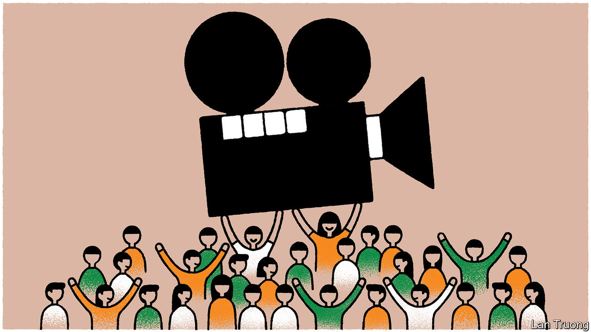

###### Banyan

# How to unite India, Bollywood-style 

##### India’s divided north and south are drawing closer in unlikely ways 

 

> Sep 14th 2023 

A NEW FILM has brought mayhem to India’s cinemas. One of Banyan’s colleagues watched it in the southern city of Chennai and could barely hear the dialogue for all the hooting, whistling and dancing in the aisles. Outside the hall, fans poured milk over giant cut-outs of its lead actor. In Mumbai they arrived with brass bands and banners. Shows start as early as 7.30am and as late as 11.55pm. It is a non-stop party. 

The film in question is “Jawan” (“Soldier”), which came out on September 7th and raked in 2.87bn rupees ($34.6m) on its first weekend, breaking records for India’s highest-grossing opening. Its secret? It marries the financial firepower and appeal of Bollywood, as the Hindi-language film industry based in Mumbai is known, with the storytelling nous and stylised action of the Tamil-language film industry in Chennai. This alchemy has united the moviegoing public.

India’s north and south are divided along economic and political lines: the south is richer and more stable, while much of the north remains poor and ridden with caste and religious conflict. The divisions that elicit the greatest passion revolve around social issues. The five states that make up the south are culturally distinct. Their Dravidian languages are of a different family from the Indo-European ones in the north. Their lingua franca is English, not Hindi. At mealtimes their plates are piled high with rice rather than roti. Vegetarianism is rare. The south has long resisted assimilation by northern rulers. 

Yet the two Indias are finding common ground in subtle ways. Dishes from north India now routinely appear on restaurant menus in the south. Southern weddings, which have their own traditions, increasingly feature ceremonies with Punjabi roots. Northern dress, such as the (a tunic and trousers), is becoming more common. M.S. Dhoni, a northerner and former captain of Indian cricket who now leads Chennai’s team, has been adopted as a local lad. Thanks to growing inter-state migration, it is more common to hear Hindi spoken in the south than even a decade ago. 

Culture flows in the other direction, too. Though south Indian dishes such as dosas have long been popular all over India, speciality restaurants are introducing the north to new things. Lately some of the most successful films have come out of Bangalore, Chennai and Hyderabad, which make movies in Kannada, Tamil and Telugu. A.R. Rahman, India’s most beloved composer, is from Chennai. 

Some of the north-south intermingling results from efforts by the national government of Narendra Modi, the prime minister. It has splurged on infrastructure. That has made it easier for pan-India businesses to emerge and also made it cheaper for people to get around the country. But most of it is organic. 

“Jawan” is a good example. Its lead actor, Shah Rukh Khan (popularly known as SRK), is India’s biggest star and loved across the country. As one film critic pointed out, SRK is a Mumbaikar who was raised in Delhi and owns a cricket team in Kolkata. All that remained was for him to conquer the south. The film’s director, who goes by Atlee, is Chennai’s wunderkind, with five consecutive hits. Much of the cast is from the Tamil industry, and the sensibilities are distinctly southern. It is syncretism at its best—and most commercial.

It is also nakedly political. “Jawan” delves into some of the most urgent issues facing India today, including distressed farmers, inadequate public health care, environmental degradation and crony capitalism. There are references to recent news stories, from oxygen shortages in public hospitals to massive loan waivers given by state banks to influential businessmen. The film’s most famous line, “Before you lay a finger on the son, speak with the father”, alludes to the  of SRK’s own son on trumped-up drug charges two years ago. 

Towards the end of the film, SRK (or, nominally, his character) delivers an impassioned, three-minute monologue directly into the camera, asking citizens to use their votes in upcoming elections to demand better public services from a government that has been in power for a decade. Vote for education, health and jobs, he says, not on the basis of religion, caste or fear. In a country divided not just along lines of north and south but also on religion and politics, this makes the film’s pan-Indian success all the more remarkable. Or as the , a national daily, put it, “One nation, one emotion, one Shah Rukh Khan”.■


