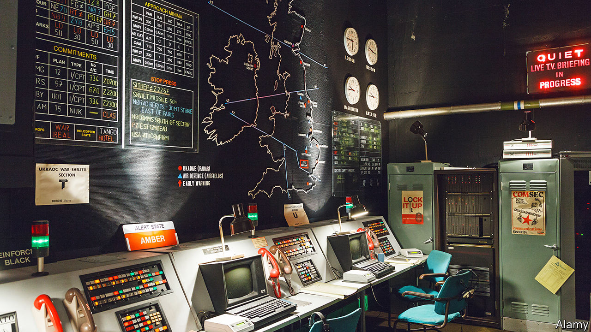

###### Doomsday

# How to get ready for the end of the world 

##### Britain’s latest risk register anticipates the apocalypse in detail 

 

> Sep 13th 2023 

Terrorist attacks on transport score 3. The delicately euphemistic “Nuclear miscalculation” beats that with a stronger “impact” score of 4. By contrast, the “Accidental…release of a hazardous pathogen” and “Assassination of a high-profile public figure” feel barely worth bothering with: each scores a paltry 2. Highest-scoring of all is “Pandemic”, with a splendidly robust 5. Admittedly “Civil Nuclear Accident” scores 5 too. But “Pandemic” also threatens “up to 840,000 deaths”. So it wins. 

To read the British government’s risk register is like sifting through a game of apocalyptic Top Trumps. It lists the many, varied, and sometimes splattery ways in which Britons might be wiped out—then assigns scores to them. As with Top Trumps, some entries are more eye-catching than others: few will suffer sleepless nights over a “major outbreak of African Horse Sickness” (unless you keep mules, in which case: be worried). Others are less ignorable. Few, for example, could read the entry for “Pandemic”, with its talk of tests, waves and hospitalisations, without a dull sense of dread. The apocalypse—once entertainingly abstract—feels considerably less remote than it once did.

Britain’s risk registers were first published in 2008, when they felt less like an essential tool than an eccentric bureaucratic hobby. Since then, Russia has invaded Ukraine; AI has threatened to develop godlike intelligence with Old Testament consequences; and the pandemic has killed 25m people worldwide. Toby Ord, a philosopher at Oxford, puts the odds of humanity suffering some sort of existential catastrophe within the next century at about one in six. The end, if not yet nigh, feels rather nigher than before.

Which means planning for it matters. Britain’s risk register is widely considered to be good—not perfect; but not bad. It is more detailed, more precise and less secretive than before. It has flaws: its methodology is still too opaque; its production a little too cloak-and-dagger. Worse, slow-moving cataclysms (antimicrobial resistance, AI) aren’t on it. And it isn’t clear who is responsible for dealing with each risk. But one of the biggest criticisms is of its presentation. This sounds trivial; it is not. 

Each risk receives two scores for “likelihood” and “impact”—the latter runs from 1 (“minor” ) to 5 (the less reassuring “catastrophic”). These are then plotted on a matrix. But that “catastrophic” category is capacious. The scale is logarithmic, so within a single square are threats that might cause 1,000 deaths and ones that might cause 100,000. This looks foursquare and tidy on the page but is a problem, thinks Martin Rees, the co-founder of the Centre for the Study of Existential Risk in Cambridge and author of “If Science is to Save Us”. To reflect megadisasters fairly the doom-o-meter ought “to have some extra grades” to make people “think sufficiently urgently” about them. Perhaps even a fold-out flap. 

There are other quirks. The advice the register offers to individuals feels faintly feeble; at times almost eccentric. For a “marauding terrorist attack”, it refers to advice that tells people to “run” then “hide”, which, though sensible, is not wholly comforting. It also suggests that to prepare for disaster people might like to stash wind-up radios and bottled water at home, or join “a community group or social club that is active in emergency preparedness”. What those who don’t have a local nuclear fallout club should do for fun is not clear. 

To understand what governments can do when they really want to, go to Brentwood, in Essex. Go past the golf courses and the garden centres and, at the foot of a hill, is a boring-looking bungalow. Step inside and it is surprisingly cool: its walls are thick; its windows blocked off by steel shutters. Go down the steps and cold air creeps around your ankles. You are standing at the start of a 100-odd-metre tunnel leading to the British government’s nuclear bunker. You are standing at the foot of what taking risk really seriously looks like. 

This is the Kelvedon Hatch underground bunker, built in 1952 to house politicians and civil servants in the event of a nuclear attack. Today, its eerie, mazy corridors smell of floor polish and the past. There is a decontamination unit by the door; Geiger counters hang on hooks. In a large communications room, signs on the walls show what the desks below represented: this table was to be the “HOME OFFICE”; that one the “JUDICIARY”; a third the “ARMY”. Upstairs, the sign on a dingy dorm-room door reads “PRIME MINISTER”. An entire country, reduced to corridors.

Kelvedon is an example of doing risk very well indeed. It is also an example of why governments don’t bother with most risks. The bunker is extraordinary—it was also useless. Never needed, it was decommissioned in 1994; now it is a museum. There is a cost to not taking risks seriously; there also is a cost to taking them very seriously. A lose-lose situation that feels dispiriting. Though on the bright side, if a truly terrible unforeseen risk arrives, at least no one will be around to criticise. ■


