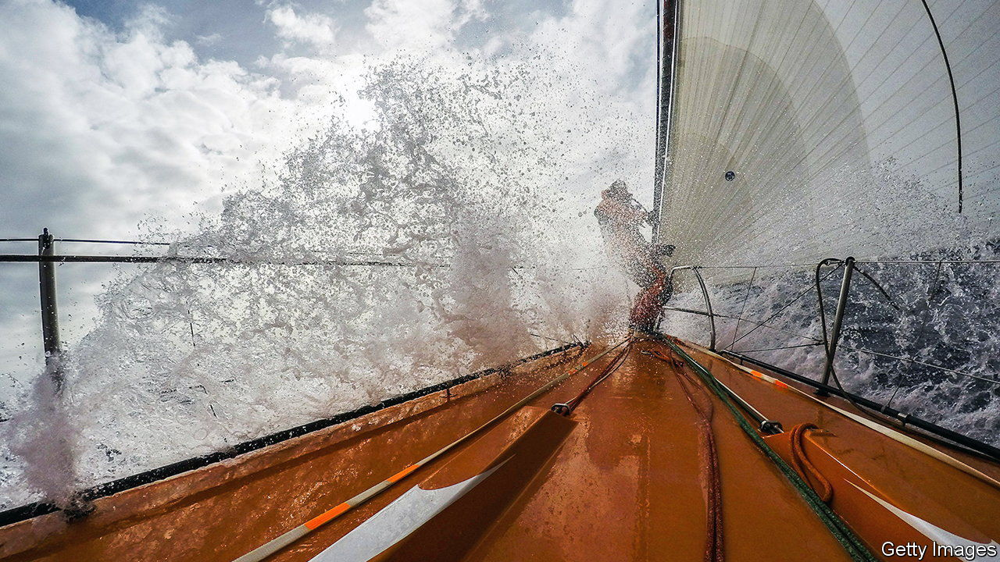

###### Rough waters

# A history of solitary sailing asks why people seek out its danger 

##### “Sailing Alone” is packed with ripping yarns and driven characters 

 

> Sep 14th 2023 

By Richard King

Joshua Slocum, an indefatigable trader, entrepreneur and sailor, born in 1844 on a farm in Nova Scotia, had a patchy record as a ship’s captain. Mutinies had a way of breaking out among his crews—he once shot a man dead—and too many of his ships had ended up grounded or worse. He loathed the look of steamships that by the 1890s had almost entirely replaced sail-powered freighters. What was there for an old sailor “born in the breezes”, who “had studied the sea as perhaps few men have studied it”, to do?

His solution was to restore a rotting hulk given to him by a friend and to become the first person to circumnavigate the world single-handedly. The three-year adventure aboard the 37-foot (11-metre)  would be funded by dispatches he would send to the . The book he went on to write, “Sailing Alone Around the World”, has never been out of print.

In an engaging, beautifully written history of single-handed sailing, Slocum’s influence and example are never far from the horizon. Richard King, the author, is a solo trans-Atlantic sailor himself. He sets out to investigate what it is that possesses an ever-growing number of people to get into a small boat and sail on their own across the world’s seas. 

Mr King examines the experiences and emotions of some 50 lone sailors. Interest in  sailing for its own sake began in the second half of the 19th century, with voyages around the coast of Britain in 1869 (E.E. Middleton), across the Atlantic in 1876 (Alfred “Centennial” Johnson) and from California nearly to Australia in 1882 (Bernard Gilboy).

The answer to the question of why people go on such dangerous journeys varies widely. A yearning for personal validation is often the wind at a solo sailor’s back, but a surprising number of voyagers had little knowledge of boats or the sea before planning (or, in some cases, even beginning) their aquatic adventures. Ann Davison, who became the first woman to circumnavigate the globe in 1952, had been widowed by a sailing accident but was a novice sailor herself. She chose sailing “because it offered freedom, independence, travel and a home into the bargain”.

The “explorer-hippy-poet of the sea”  so identified with the creatures he saw that he felt himself become part of the pelagic world around him. He believed his boat was a living, breathing being. He described the “great cape” as having a “soul as smooth as a child’s, as hard as a criminal’s”. Moitessier was on the brink of securing the fastest time in the Golden Globe race of 1968 when he decided to leave what he increasingly felt was a vulgar competition. He just carried on sailing—one and a half times around the world.

Those who have undertaken solo, around-the-world sailing share similar observations and emotions. Seabirds, particularly busy storm-petrels and lazily gliding albatrosses, are friends, as are playful dolphins and doggedly paddling turtles. Nearly all are frightened of sharks, a sinister presence waiting for the lone sailor to make a mistake. All suffer  (and some, hallucinations). They doze an hour or two while trusting in their self-steering systems, conscious of the possibility of that rogue wave coming crashing down on them, or, even worse, being run down by a huge tanker or container ship oblivious to their tiny presence.

The author relates the story of his own solo North Atlantic passage in 2007, done in an elderly 28-foot sloop. Although not to be compared to the feats of the extraordinary sailors he recounts in this book, his experiences are sufficiently intense for him to empathise deeply with them. Towards the end of his voyage, a container ship almost smashes into him. His self-steering vane somehow gybes his little boat away from disaster. 

Slocum, the early pioneer of solo sailing, was not so lucky. Soon after setting sail from Vineyard Haven, Massachusetts, in November 1909, he and  disappeared. He was almost certainly run down by one of his hated steamships. ■


