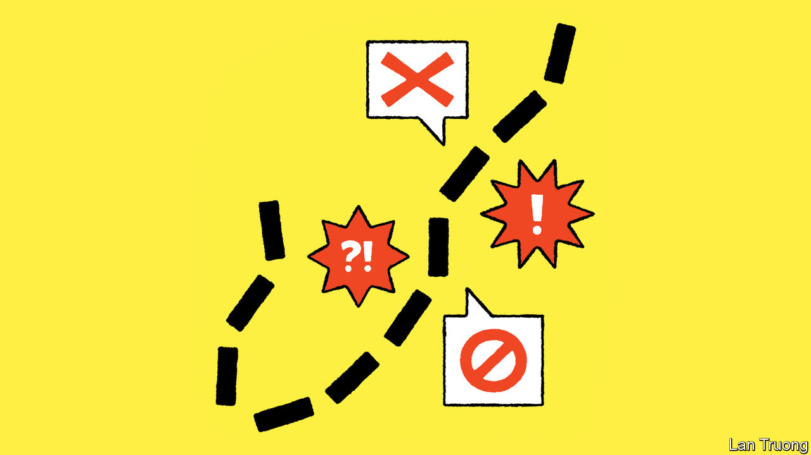

###### Banyan

# China’s claim to the South China Sea gets even odder 

##### Despite its more co-operative tone, China will not stop its bullying in the South China Sea 

 

> Sep 21st 2023 

LATE LAST month the government in Beijing published a “standard map” of China and all its territorial claims. It did a strikingly efficient job of upsetting the neighbours, from India to Japan, but above all those around the South China Sea. Vietnam objected to the map’s inclusion of the Paracel Islands, which China seized from it in 1974. The Philippines protested over the Scarborough Shoal, from which China has barred it by force since 2012, even though it lies well within the Philippines’s 200-nautical-mile exclusive economic zone (EEZ). And the map’s inclusion of the Spratly Islands—a welter of islets, atolls and reefs spread out across a vast swathe of the South China Sea a very long way from China itself—angered those countries and Malaysia, too.

Yet that much was predictable. South-East Asians have long suffered from Chinese expansionism in the South China Sea. China’s notorious “nine-dash line” is both symbol and tool of its extravagant claims: a U-shaped tongue of passive cartographic aggression, it encompasses almost the entire sea. In 2016 an arbitral tribunal at The Hague, in a case brought by the Philippines, ruled among other things that the line had no basis in law. Yet the new standard map even includes an extra dash to the line, placed east of Taiwan. This new, tenth dash has bred the most consternation. Some sense that it opens a new front in China’s grandiose claims. Is that likely?

The concerns are overdone, writes Bill Hayton in , house journal of the ISEAS-Yusof Ishak Institute, a regional research outfit in Singapore. This is not the first time Chinese cartography has included a tenth dash. Besides, Mr Hayton explains, the nature of the U-shaped line, which dates back to the 1940s, has always been vague and subject much of the time to “happenstance and incompetence”. Back then, Chinese mappers were not really clear what lay inside the line, which was intended as merely a schematic outer marker of what might in future be claimed within it. In recent decades, vagueness has suited the Chinese Communist Party as it has asserted (though never officially) absurd “historic rights” over everything inside the line. Maximalist claims, in turn, help China bully neighbours over things like fisheries and hydrocarbons exploration. The basis of the new line, says Mr Hayton, is as nonsensical as was the original. 

In the , an Asia-focused online magazine, Mark Raymond of the University of Oklahoma and David Welch of the University of Waterloo in Ontario go further. The tenth dash seems intended to incorporate Taiwan, which China has long claimed as its own. Yet the dash falls arbitrarily, neither demarcating Taiwan’s territorial waters nor fully including its official EEZ. It therefore does not match any maritime area China formally claims. The authors suggest this and other inconsistencies are tacit acknowledgment that China knows that claiming everything inside its U-shaped line is fanciful. Were it to be up front about this it would cause a backlash at home. That would be to confess to an “intensely nationalistic domestic audience that China does not have the full slate of sovereign rights in the South China Sea that it previously behaved as though it had”.

Since the map’s publication, senior Chinese officials have sought to dampen the controversy over it. They speak of China’s “brotherly ties” with its neighbours and need for co-operation on the troubled sea. Yet, says Jay Batongbacal of the University of the Philippines, to expect good behaviour from China is fanciful. Its powerful coastguard has used military-grade lasers against Philippine counterparts and last month forcibly blocked the resupply of a Philippine military outpost on the Second Thomas Shoal. The shoal is perhaps the sea’s likeliest flashpoint right now. Mr Batongbacal says China might want to provoke an escalation there and then blame it on the Philippines.

The expectation of continued Chinese coercion in the South China Sea is thickening military ties among others wary of it. Defence co-operation between America and the Philippines, a treaty ally, is growing fast. In August the Philippines held joint naval exercises with America, Australia and Japan—a first. This week the ten-nation ASEAN conducted its first-ever combined exercises (admittedly well to the south of the contested parts of the sea). Small steps add up to a big change from even a few years ago, when neighbours were reluctant to do anything to offend. China has only its behaviour, and ludicrous map, to blame.■


