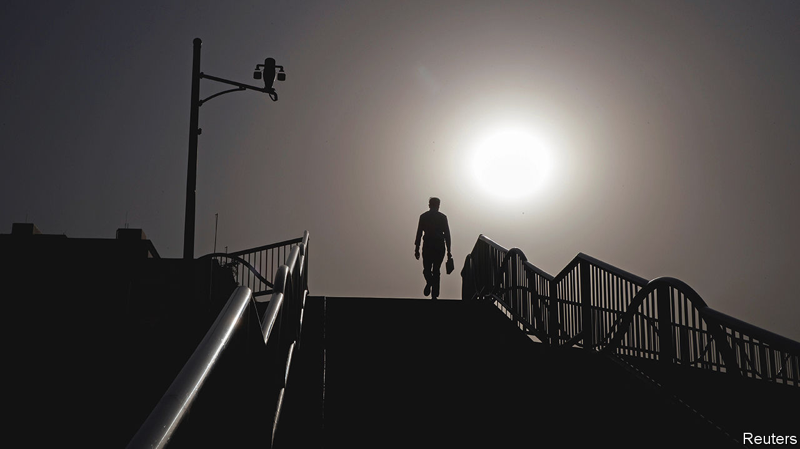

###### Spooked

# China tells its citizens to be on the lookout for spies 

##### They’re everywhere, says the local intelligence agency 

 

> Sep 21st 2023 

A sea-cucumber farm is not an obvious target for spies. So when a group of foreigners turned up at one in north-east China last year, the owner, Mr Zhang, did not think much of it. According to state media, the guests received permission to install seawater-quality monitors. After they left, Mr Zhang noticed that the equipment was not working properly. It also had a mysterious, beeping antenna attached to it. So he called the authorities. They said it was transmitting strategic data on China’s oceans to “hostile powers”. The foreigners were found and arrested.

Stories like this, true or not, serve the purpose of China’s intelligence agency, the Ministry of State Security (MSS). It claims that the kind of espionage discovered by Mr Zhang is rampant—and ordinary Chinese must help to stop it. On August 1st the MSS joined WeChat, a popular messaging app, to implore “all of society” to look out for spies. This followed a comment by William Burns, the CIA director, that America had made progress in rebuilding its spy networks in China a decade after dozens of its sources were killed or disappeared.

The government is doing its part to increase public awareness. It has offered rewards of up to 500,000 yuan ($68,500) for reporting spies. In the city of Zhengzhou, warnings about foreign snoopers have been placed on the back of bus seats. Elsewhere officials are using leaflets, lectures and comic strips to get the message out. In the region of Xinjiang officials produced a short film depicting a spy disguised as an amateur photographer. The spy asks a taxi driver to take him to a military base. The alert driver takes him to the police.

A specific appeal has been directed at young people. The MSS says it wants “the seeds of national security to take root and sprout” in their minds. Local branches of the ministry have joined up with schools to put on classes and exercises. One of these, at Xiamen University earlier this year, saw students play spies and spy-hunters. Middle-schoolers in Shanghai are taught about national security on board a mock aircraft-carrier, while dressed in fatigues. 

But things get tricky when students go abroad. Officials worry they will be lured into spying for foreign powers. The MSS has shared cautionary tales on WeChat. In one, a Chinese student in Italy is said to have been recruited by American spooks over fancy dinners and trips to the opera. Another is said to have got too friendly with an American embassy official in Japan. Both of the students returned to China and sold secrets to the CIA; they have since been caught and punished, says the MSS. 

The ministry’s campaign has gone down well with some members of the public. Netizens have warned government workers not to share too much about their jobs online, in case spies are reading. A video that claims the CIA was behind the recent deaths of several engineers and scientists has over half a million views. 

Others, though, think the government is going too far. Hu Xijin, a well-known nationalist commentator, complained that people are growing increasingly scared to meet foreigners, lest they be reported. On Weibo, a social-media site, some users worried about a return to the days of the Cultural Revolution, a decade of Maoist madness when neighbours, friends and even family members informed on each other. “History is a circle,” said one person. “Tragedies like sons reporting on fathers seem to be getting close again.” 

The increased paranoia will make life even harder for foreigners in China. A photo circulating on social media shows an American teacher in Shanghai explaining to his class that he is not a spy. Your correspondent was recently intercepted by officials while on a reporting trip. A member of the public, the officials explained, had seen a foreigner asking questions. Being a good citizen, they had called it in. ■


