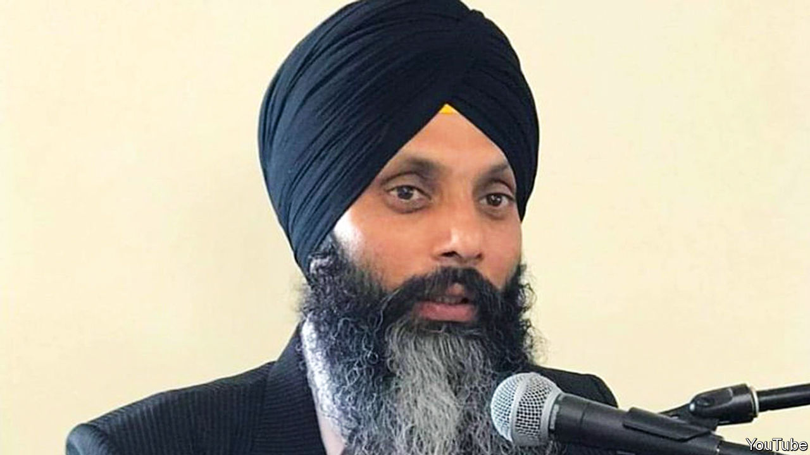

###### Death in Vancouver

# If India ordered a murder in Canada, there must be consequences 

##### Western countries have for too long acquiesced to the Indian government’s abuses 

 

> Sep 20th 2023 

For years, India objected to Western strategists lumping it together with its violent and chaotic neighbour in the phrase “Indo-Pakistan”. Now recognised as a fast-growing giant and a potential bulwark against China, India claims to have been “de-hyphenated”. Yet the  aired this week by Justin Trudeau suggests that diplomatic recalibration may have gone too far. Canada’s prime minister alleges that Indian agents were involved in the murder in Vancouver of a Canadian citizen sympathetic to India’s . India has long been accused of assassinating militants and dissidents in its own region; never previously in the friendly and orderly West. And though India calls the victim, Hardeep Singh Nijjar, a terrorist, and had offered a reward for information leading to his arrest, he had rebuffed Indian allegations linking him to separatist violence. 

India denies everything. But Canada is reported to have shared intelligence about the murder with its allies in the “Five Eyes” pact. None appears to have questioned it. Shortly after Mr Trudeau levelled the charge in Canada’s parliament, America and Britain released cautiously supportive statements, urging India to co-operate with a Canadian probe. The killing, by two unknown gunmen outside a Sikh temple in June, followed a spike in both Sikh separatist activity and at times heavy-handed Indian suppression of it.

The row, which has involved tit-for-tat expulsions of Indian and Canadian diplomats, could escalate. Mr Trudeau faces domestic pressure to reveal evidence of Indian involvement in the killing. A criminal investigation is under way. The Canada-India relationship, already blighted by Indian suspicions of separatist support in the 770,000-strong Sikh diaspora in Canada, has deteriorated. America and its allies will hope the rot stops there. Yet even if it does, they should consider this a wake-up call about the government of Narendra Modi—and their own eagerness to overlook its too-frequent abuses.

On its own turf it has muzzled the press, cowed the courts and persecuted minorities, even though none is a threat to it. The alleged assassination in Canada, too, appears gratuitous as well as wrong. The movement to create an independent Sikh nation (known as Khalistan) led to the killing of tens of thousands of people in India in the 1980s and 1990s, but has since been little more than an idle talking-point in the , even as India’s ability to police it by conventional means at home has improved. 

Making martyrs of separatist leaders is a gift to their beleaguered cause. This might be considered typical of an Indian government that, for all its recent swagger on the world stage, remains dogged by feelings of insecurity. It is a feature of India’s rapid rise. The country is almost invariably weaker than its leaders publicly proclaim, yet stronger than they privately fear—and that mismatch is a recipe for miscalculations of this kind. Mr Modi, a probable shoo-in for re-election next year, should know that confident countries entrust their security to the rule of law.

India’s Western friends cannot count on that, however. Hitherto reluctant to condemn Mr Modi’s excesses, they have maintained a fiction that their partnership with India is based on shared democratic values, not interests. This has laid them open to charges of hypocrisy. It also seems likely, in the light of Mr Nijjar’s demise, to have emboldened Mr Modi. If the investigation confirms Indian involvement in this crime, it is time for a tougher line. Strategic partners do not air all their dirty linen in public, and neither do they murder each other’s citizens. Canada’s allies must join it in making that clear to Mr Modi. ■

