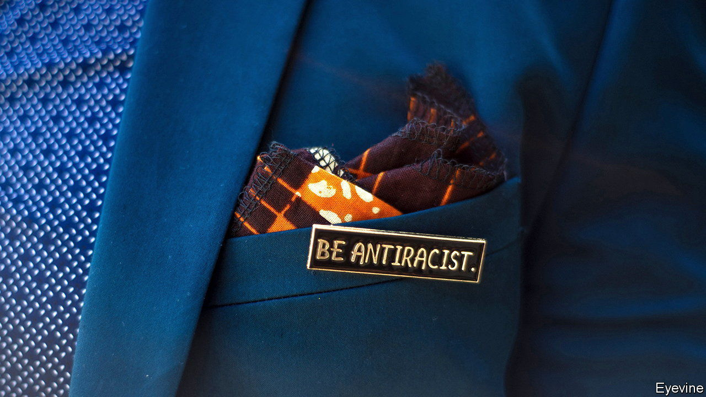

###### Woke and broke

# DEI initiatives have foundered over the past three years in America 

##### Joe Biden’s election sapped energy from the diversity business 

 

> Sep 28th 2023 

Lofty goals are admirable in any organisation; just don’t forget the deliverables. Ibram X. Kendi managed the first part in pledging to “solve seemingly intractable racial problems of our time” when Boston University (BU) hired him in 2020. The scholar-activist—who says that racial disparities result from racist policies, and that a policy is racist if it yields racial disparities—was given the mandate and money to build an academic centre. He promised degree programmes, racial-justice training modules and more. But with a piddling output, despite having raised nearly $55m, his Centre for Antiracist Research has sacked about half its 40-odd staff and said it will scale back. 

“I don’t know where the money is,” said Saida Grundy, a sociology professor at BU who briefly worked for the centre, to the . The university is investigating the centre’s use of grant money and “management culture”. Even those who once supported Mr Kendi’s hiring now see the enterprise as posturing flim-flam on the part of BU. “We marched for change and what did we get? Murals, right? The centre is the equivalent of a mural,” says Phillipe Copeland, a professor of social work at BU who was at the centre for two years. 

The dust-up comes amid a re-evaluation of diversity, equity and inclusion (DEI) initiatives in higher education, which exploded during Donald Trump’s presidency and after George Floyd’s murder in 2020. One push involved hiring more administrators focused on diversity. In 2021 the Heritage Foundation, a conservative think-tank, found that 65 universities representing 16% of four-year students employed 3.4 DEI staff for every 100 tenured faculty. Many also started requiring tenure candidates to .

Since Joe Biden’s election, Democrats have been less focused on racial injustice. Meanwhile, self-styled anti-woke politicians have pushed back. In May Ron DeSantis, Florida’s Republican governor, approved a law barring public universities in the state from funding DEI programmes with government money. Miffed students, he said, should “go to Berkeley”. In June his counterpart in Texas banned public universities there from requiring DEI statements. The public-university systems in Missouri, North Carolina and Wisconsin have taken similar action. “In states where the rollback has happened, there’s been pressure from politicians to confront the excesses of DEI policies,” says John Sailer of the National Association of Scholars, a conservative advocacy group.

Companies are also facing pushback over their DEI initiatives, which range from hiring targets to mentorship schemes for minority employees. Though the Supreme Court’s ban on affirmative action in June applied only to university admissions, conservative lawyers hope their challenges to such policies in the workplace will get a sympathetic hearing too. An outfit founded by Stephen Miller, who previously worked for the Trump administration, has asked the Equal Employment Opportunity Commission to investigate more than a dozen big firms for “policies that punish Americans for being white, Asian or male”. Edward Blum, who brought the affirmative-action case, is suing law firms over their recruitment programmes.

Offering, say, leadership training exclusively to minorities may be riskier after the Supreme Court ruling, but companies should be able to defend themselves if they make those opportunities available to everyone in other contexts, reckons Joan Williams of UC Law San Francisco. And under current law federal contractors—which include many large companies—are actually required to take steps to improve the diversity of their workforce. 

Some firms may pare back DEI programmes to avoid being sued. But for others, playing up DEI efforts is good business—even if it does not actually yield more diversity. A working paper by Edward Watts of Yale and his colleagues found a large and growing number of “diversity washers”: listed firms that make hay of their DEI commitments in financial filings despite not having many diverse employees. They got more money from funds geared towards environmental, social and governance investing.■


