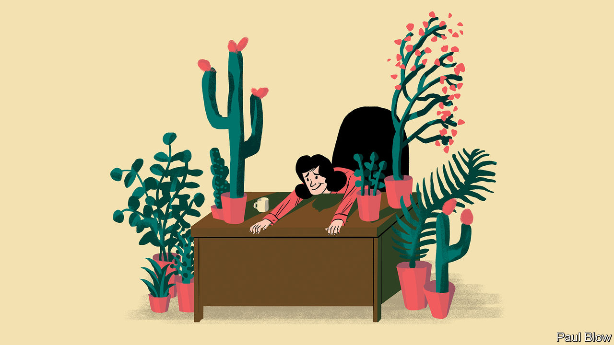

###### Bartleby

# How to make hot-desking work 

##### Cost savings are not the way to go about it 

 

> Oct 5th 2023 

The highest private terrace in Manhattan belongs to an algorithmic-trading company called Hudson River Trading. Its offices, spread across several floors near the top of Three World Trade Centre, are more theme park than workplace: a games room, gym, dining areas, stupefying views, happy hours and drawers unexpectedly stuffed full of sweets to give employees a surprise. You come away wishing you had concentrated more in maths at school. 

You also come away wondering about one of the silver linings of the post-pandemic office for bosses who dislike the idea of home-working. If fewer people are coming in on any one day, at least they don’t need as much space: they can find unassigned desks and the firm can save some money. The trouble is that hot-desking flies in the face of two things, one deeply embedded in the human psyche and the other a direct consequence of the pandemic. 

The first is territoriality. This is a word with negative connotations. It conjures up someone who sees information as something to be hoarded and feedback as an intrusion—the kind of person who buys a padlock for the items they store in the communal fridge. But territoriality is also natural. Just as it is hard not to bridle a little at the unsolicited observations of co-workers, so people like having a space to call their own. 

Personalised territory seems to be correlated with a sense of belonging. A study in the 1970s looked at the longevity of first-year college students who shared rooms. People who lasted the academic year had covered twice as much space above their beds with personal decorations than the dropouts had. In the office, too, workers claim territory with everything from photographs and files to crumbs and crumpled tissues. 

A pre-pandemic study of behaviour among hot-deskers, conducted by Alison Hirst of Anglia Ruskin University in Britain, divided people into “settlers” and “vagrants”. Settlers, who often arrived earlier or were more senior, tried to claim the same desk each day, in order to have a space and a set of neighbours they knew and liked. Vagrants, who tended to be later arrivals, had to waste time searching for a desk. Sitting in a spot normally taken by someone else was fraught with social discomfort. 

Firms can avoid some of this time-wasting by having people book desks—“hotelling”, in the dreadful phrase. And they can avoid stratification by requiring people to clear their spaces each night. Under this model, people do have their own territory but instead of a desk, it is a locker. Think “High School Musical”, but without the music or the highs.

If territoriality is the deep-seated problem with hot-desking, then the more recent one stems from the pandemic. Employers need to think harder about why people should do the commute at all. There is no single answer. The office is the place to do the sort of collaborative work with colleagues that requires physical proximity. It is a way to spread company culture as well as covid. Less intuitively, a survey of American workers in 2022 by Gensler, a firm of architects, found that the most common reason to come in was to focus on work. But the common theme is that the office is no longer the default; it has to be appealing. 

That sits uncomfortably with a cut-price version of hot-desking, in which office footprints shrink and people grab a spot wherever they can. Cohesion suffers if teammates are dispersed randomly through a building; collaboration is harder if there aren’t enough meeting rooms to accommodate demand. The company culture may be absorbed, but only in the sense that everyone feels hard done by. And focused work is easier if you aren’t suddenly plonked next to someone who sounds like Beaker from “The Muppets”. 

For penny-pinchers, the unpalatable conclusion is that hot-desking works best when people have lots of space. In Cisco’s newly refitted offices in Manhattan, for instance, no one has an assigned desk (bosses included) but there are oodles of options and people are encouraged to move about repeatedly during the day. The office is everyone’s territory. 

Back at Hudson River Trading in New York, employees all have their own desks, but also licence to move around as they wish. Space feels abundant: there are roughly as many meeting-room spots on its latest, post-pandemic floor as there are assigned seats. You can use hot-desking to save money or you can use it to create flexibility and a sense of belonging. It is hard to do both. ■


