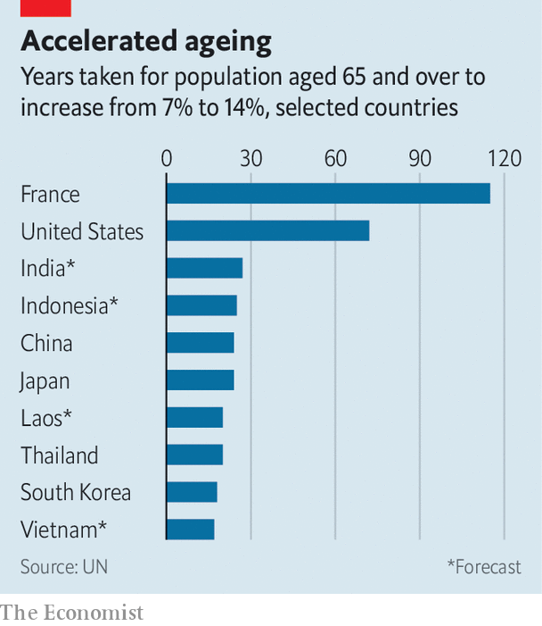

###### Old before their time

# Poor Asian countries face an ageing crisis 

##### Sri Lanka, Thailand, Vietnam and others are getting old before they get rich 

 

> Oct 12th 2023 

In “Ragnarok Online” gamers use characters from Norse mythology to wreak havoc. Septuagenarians are not its target audience, but that does not deter Sunanta Phongcharoen. The 72-year-old Thai woman has reached the game’s highest level. This has eased the burdens of old age, she gushes on Manoottangwai, a social-media site for the elderly. By showcasing such stories, its founders claim to be helping prepare Thailand for a demographic crisis.

To understand how bad the problem is, compare Thailand’s transformation with those of countries better known for their greying populations. Between 2002 and 2021 the share of Thailand’s population aged 65 and above increased from 7% to 14%thresholds that are widely used to define when a society has started “ageing”, and when it has grown “aged”. The same transition took Japan 24 years, America 72 and France 115. And unlike those countries Thailand has grown old before getting rich. Its GDP per person in 2021 was $7,000. When Japan’s population was similarly aged, in 1994, its income level in constant dollars was nearly five times higher

 


Thailand’s troubles underline a regional trend of enormous economic and social significance. The Vietnamese are about half as rich as Thais. Their society will probably take only about 17 years to move from “ageing” to “aged”. Even in countries where ageing is taking longer, such as Indonesia (26 years) and the Philippines (37 years), it will happen at much lower levels of income than has been the case for others. South-East Asia as a region will be “aged” by 2042. South Asia will hold out for almost another decade—but with big regional disparities. Sri Lanka, where average incomes were about a third below Thailand’s even before its current economic crisis, is projected to become an aged society by 2028. Parts of India, the world’s most populous country, are already old. In the southern state of Kerala, 17% of the population is 60 or older. Asia will account for 70% of the expected increase in senior citizens in poor countries by 2050. 

The speed of Asia’s demographic transition is a product of its development. Industrialisation and changing social norms have reduced fertility rates even as better technology and health care have lengthened people’s lives. Yet compared with the East Asian tigers, which underwent this change in the 20th century, much of emerging Asia is doing so with slower growth. All this will compound the region’s economic problems. Countries that are growing old before they get rich are a threat to Asia’s rise, says Donghyun Park, an economic adviser at the Asian Development Bank (ADB). 

The biggest drag is on labour markets. As countries grow older, workforces shrink. In Thailand the working-age population is expected to fall by a fifth by 2055. And ageing creates particular problems for developing countries because they have big sectors, such as agriculture, that are especially vulnerable to it. As growth draws workers to cities, their parents are left tending fields. That is hard for old bodies. A study published in  in 2023 found ageing in rural China cut agricultural output by 5% in 2019.

There are social costs, too. The biggest involves pensioners falling into poverty—a challenge the rich world struggles with. In poorer countries, workers are often unable to save adequately or at all. Even if they can cobble together a retirement kitty, poor financial literacy and underdeveloped financial markets limit what they can do with it. State-pension coverage, though improving, is still patchy. In South and South-East Asia less than 40% of the elderly population gets a pension, according to the International Labour Organisation. In Cambodia and Pakistan, the share is less than 10%. And the pensions that are on offer are meagre. India’s national pension for the poor provides a measly Rs200 ($2.40) a month.

Health care is another worry. Developing-country health-care systems are already overburdened. Geriatric care tends to be rudimentary, as is provision for non-communicable diseases, such as hypertension and diabetes, that ail the elderly.

Families are the traditional source of elderly care. Elders are venerated in Asian cultures and joint-family households are common. Just 11% of Asians aged above 60 live on their own compared with 27% of Americans and Europeans, according to Pew Research Centre, an American pollster. Asian societies expect children to care for their parents. In some countries this filial responsibility is written into law: Bangladeshis and Indians can be imprisoned for neglecting their parents. 

But the compact is weakening. Rapid migration to cities is separating parents and offspring. In many countries, increasing female participation in the workforce is depleting women’s capacity to care for elderly relatives. This is a traumatic change. The elderly in poor countries who live alone are more likely to suffer from depression than their counterparts in America, new research suggests.

Old women are worst affected, in part because they outlive men. Average female life expectancy in Asian countries is 75 years, compared with 70 for men. Asian women are also less educated than men, earn less and save less. Data from Vietnam’s last census showed elderly women were less financially independent and suffer more from diseases than old men. Similar inequities exist elsewhere.

Women are also more likely to live alone in old age. Hamsa, Meenakshi and Saraswathi are cases in point. The octogenarian women, who go by their first names, live together in the Bodhimaram home for the elderly run by a non-profit outfit in the town of Tiruvannamalai in south India. All three have outlived their husbands and cannot live with their families. The home’s owner says demand for such services is growing. 

Things are made worse by poor governance. The Bodhimaram old-age home is a charity, and therefore eligible for state support. But its owner says securing this involves too much paperwork for too little reward. Instead she relies on donations. Elderly care, especially for richer Asians, is shifting to the private sector. In many Indian cities, retirement homes are booming. 

Policymakers are failing to plan for their ageing societies, says Eduardo Klien of HelpAge, an NGO working on the problem across Asia. Sonalde Desai, a demographer at the University of Maryland, says Indian officials are too “delighted by the demographic dividend” they are getting from a bulging working-age population to even consider the problem.

Countries further along the demographic transition are starting to act. Ahead of elections in Thailand earlier this year, every big party made some promise to the elderly. Vietnam passed a law on matters relating to the elderly way back in 2009. Yet none of the countries affected has grasped the scale of the problem—and the need to take much bolder steps.

Ushering women into higher-paying jobs (which is desirable in itself) would help. It should also be much easier to work past official retirement ages. Mr Park of the ADB reckons too many countries see the elderly as infirm and unproductive. That needs to change. Countries that are ageing before they get rich need all the help they can get. ■

