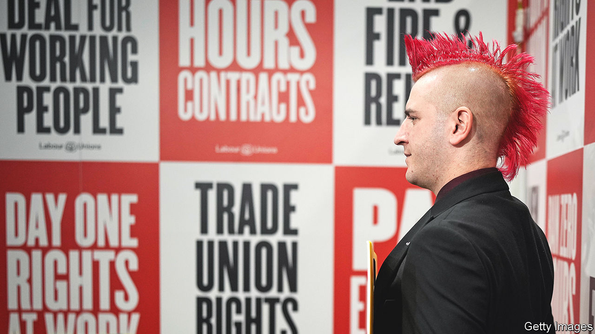

###### Labouring a point

# Even when he glitters, Sir Keir Starmer still struggles to shine 

##### Whether that will matter to British voters remains to be seen 

 

> Oct 10th 2023 

Power, they say, has its own charisma. It hasn’t yet rubbed off on . When Sir Keir gave his speech at the Labour Party conference this week, several things quickly became clear. It was clear that he copes niftily with a glittery stage invasion. It was clear that he loves his family, the NHS, football and probably apple pie. But most of all it was clear that, even covered in glitter, he is still a bit dull. 

What is not yet clear is whether this will matter. In one small sense, it already does—because Labour itself says it should. Labour has set itself up to be the party that supports “oracy”. Oratory, a close cousin, is a dark art but a powerful one. It is the skill that enables a speaker to spin the silken terms, electrify the unforgiving air and turn a mere audience into acolytes. It is particularly important for parliamentary politicians. It was oratory that empowered Nye Bevan, a legendary Labour figure; that helped , Sir Tony Blair, into office; and that enabled Michael Heseltine to, in perhaps the most nauseating phrase in British political history, “find the clitoris of the Conservative Party”.

Quite what Sir Keir is fumbling for is often unclear. “Captain Crasheroonie Snoozefest”, as Boris Johnson once called him, is not a silken-thread spinner. His conference speech was definitely better than usual and had all the right rhetorical bits and bobs—a dash of pathos here, with a nod to his mum; a bit of bathos there with a gag about Arsenal, his favourite football team. But its catchphrases mostly fell flat. “Sticking-plaster politics” will hardly send people to the barricades. The mystifying phrase, “mission government our guide”, will not, even if it had been blessed with a verb, echo down the ages. , it all felt competent, square-jawed, well-constructed—and, in some indefinable way, less than the sum of its parts.

There were early warning-signs that oratorical fireworks would not be Sir Keir’s strong suit. As a young man he co-edited a paper called “Socialist Alternatives” in which he wrote articles rich in sentences such as: “Furthermore the new proposals …for a more centralised union mirror the new realist image of unionism as simply another tier of management.” Other sentences were even more fun than that. 

In truth, none of the conference speeches, despite the rapturous reception given to them by delegates, was particularly dazzling. Most such speeches offer little more than “mood music”, says Sam Leith, a journalist and author of “You Talkin’ To Me? Rhetoric from Aristotle to Obama”. This is partly because mood music sounds nice and costs nothing, but it is also because the “nuts-and-bolts stuff is terrifically boring”. But Sir Keir is a nuts-and-bolts man through and through—the sort of speaker who is less likely to exhort people to fight on the beaches than to explain how modern supply-side economics might make beach-fighting better. He is not, says Mr Leith, “one of nature’s naturally inspiring orators”.

Then again, speaking at conference is a tough gig. “The problem with conference speeches is they have two audiences,” says Matthew Parris, a political journalist and a former MP. “One is the party itself…and the other is the wider public.” And those in the hall are often an odd lot. It has been said that such events are less conferences than conventions, places where people come not to confer but, as with a Star Trek convention, to conform. Tory members turn up dressed like extras from an Evelyn Waugh adaptation, with brogues, bow ties and signet rings. Labour delegates have pink hair, tote bags, tattoos—and an insatiable appetite for earnestness. 

Indeed, to understand conferences best, don’t look in the main hall. Head instead to the fringe events. You would not be surprised to find Tory events on topics such as “Shooting: What Fun” or “It’s the Afternoon—Time for Gin!” Labour fringe events, meanwhile, have actual titles such as “Accelerating the Transition to Decarbonised Transport” and “Why Labour Needs a Feminist International Development Policy.” Sir Keir, in comparison, is thrilling. 

Dullness may not matter. The Tories are trailing Labour by 17 points. And boredom can be an underrated virtue in politics. Clement Attlee, one of Labour’s most successful prime ministers, was hardly a noted wit. According to his obituary in the : “Much of what he did was memorable; very little that he said.” As Walter Bagehot, a former editor of this newspaper, observed (and Liz Truss’s memorably short premiership proved), in government dullness is “a good sign, and not a bad one—in particular, dullness in Parliamentary government is…an indication of its success”. If he does become prime minister, in other words, Sir Keir’s ability as an administrator will matter more than his rhetoric. ■


