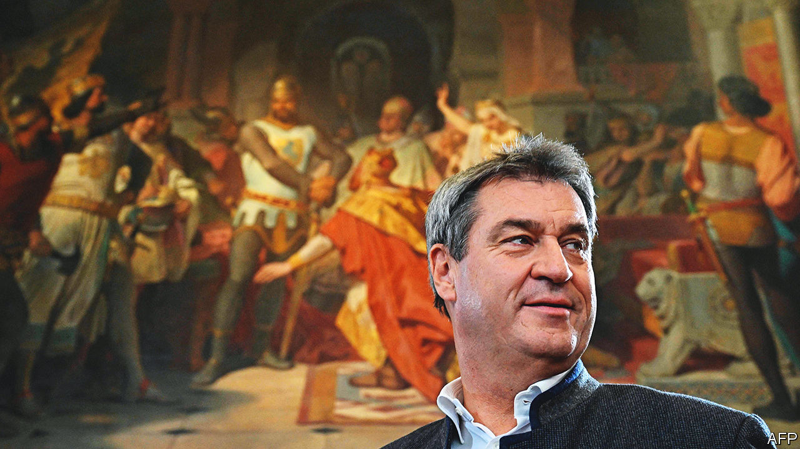

###### German state elections

# A boost for Germany’s right 

##### Bavaria and Hesse re-elect Christian democrats and rebuke the country’s ruling coalition 

 

> Oct 8th 2023 

GERMANS MAY be renowned for obeying rules, but they seem to be resisting the Ampel or traffic light. This cheery nickname for the left-of-centre coalition elected to run the central government two years ago refers to the colours of its three component parties: red for the Social Democrats (SPD), yellow for the Free Democrats (FDP) and, unsurprisingly, green for the Greens. But judging by the elections held in two important states on October 8th, the German public seems less interested in the Ampel’s stop-and-go signals than in turning sharply to the right. 

Together, the central state of Hesse and the southern state of Bavaria—Germany’s biggest by area and its second-biggest by population—account for almost a quarter of the country’s inhabitants. Not surprisingly, their simultaneous elections are being seen as harbingers of broader political trends. These do not look good for Olaf Scholz, the chancellor, or his coalition. In both states all three Ampel parties fared worse than they did five years ago. Indeed the smallest of the three, the liberal-leaning FDP, embarrassingly dropped below the 5% minimum needed to hold any seats in the Landtag, or state assembly, of Bavaria, and barely hung on in Hesse.

The Ampel’s pain was the right wing’s gain. In Hesse the incumbent government was headed by the centre-right Christian Democratic Union (CDU), long Germany’s biggest party. In Bavaria it was headed by the CDU’s regional sister party, the Christian Social Union (CSU), under its leader Markus Söder (pictured). The party has held power there without interruption since 1957. That strength looks undiminished. The CDU won 35% in Hesse and the CSU a solid 37% in Bavaria. The twin parties will undoubtedly lead the next governing coalitions in both states. 

More surprising has been the surge of two farther-right parties. The Alternative for Germany (AfD), shunned by Germany’s political mainstream for its immigrant-bashing rhetoric and extremist tendencies, emerged as the second-strongest party in Hesse, with 18% of the vote. Its tally rose four percentage points in Bavaria too, to 15%. These are unusually strong results, not only because the AfD’s stronghold has been more in eastern than in southern states, but because Hesse and Bavaria are home to large—and relatively integrated—immigrant communities. The rival Free Voters party, a rurally based traditionalist group with little footprint beyond the south, also gained more than four points in Bavaria, reaching 16%. 

This rightward lurch means that, taken together, the right now accounts for two-thirds of the votes in Bavaria and well over half in Hesse, a stark danger signal for the Ampel almost halfway through its term. Ironically, however, this apparent peril makes it more probable that Mr Scholz’s government will complete its term. With his junior partners, the liberal FDP and the Greens, getting pasted at the polls, neither they nor Mr Scholz’s SPD have any interest in bringing the Ampel down.

And though the surge in support for the AfD worries many Germans, the party’s stronger showing may prove hard to translate into greater power. All other parties still reject the idea of coalition deals with the hard right. Cooler analysts note that its gains have been made on specific hot-button issues, most importantly immigration and the Greens’ climate agenda. The election debates were dominated by gleeful mud-throwing, often accompanied by outright untruths, such as charges that the Greens would ban cars and fireplaces. 

Mr Scholz and his coalition have certainly heard the warnings. The Ampel’s rhetoric on immigration has grown notably tougher lately, and the Green party has trimmed back some of its environmental ambitions. Perhaps, in another two years, their colourful lights can lure some of those voters back. ■

