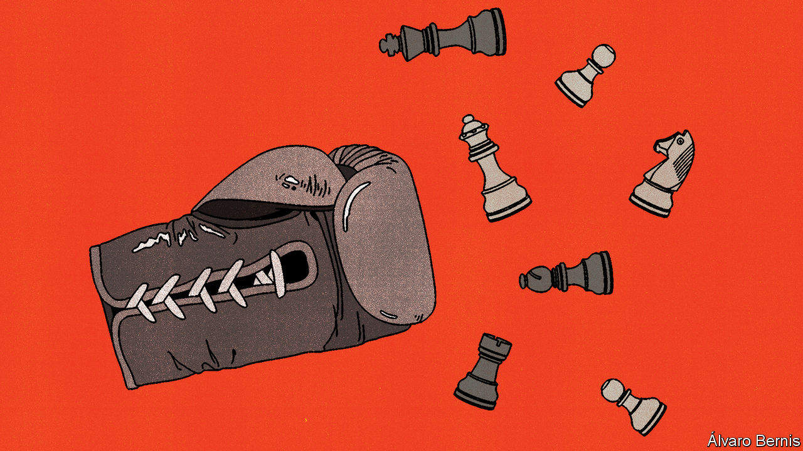

###### Free exchange

# To beat populists, sensible policymakers must up their game 

##### Weak economic growth is dangerous, as a wave of elections next year may show 

 

> Oct 12th 2023 

Politicos, rejoice. When it comes to elections, next year is a big one. In 2024 the Republicans and Democrats will battle it out in America, of course—but there will also be votes of one sort or another in Algeria, India, Mexico, Pakistan, Russia, South Africa, Taiwan, probably Britain, and many more countries besides. All told, as many as 3bn people, in countries producing around a third of global gdp, will have the chance to put an “X” in a box. And in many of these locations, populist politicians are polling well. What would their success mean for the global economy? 

Economists have long suspected that populists do grave damage. Names such as Salvador Allende in Chile and Silvio Berlusconi in Italy are hardly synonymous with economic competence. By contrast, what you might call “sensible” leaders, including, say, Konrad Adenauer in Germany and Bill Clinton in America, are more often associated with strong growth. New research, forthcoming in the , perhaps the discipline’s most prestigious journal, puts hard numbers on the hunch. 

The authors, Manuel Funke and Christoph Trebesch of the Kiel Institute for the World Economy and Moritz Schularick of the University of Bonn, look at over a century of data. They classify administrations as “populist” or “non-populist” (or what you might call sensible), based on whether the administration’s ideology has an “us-versus-them” flavour. This is inevitably an arbitrary exercise. People will disagree over whether this or that administration should really be classified as populist. Yet their methodology is transparent and backed up by other academic research. 

Mr Funke and colleagues then look at how various outcomes, including gdp growth and inflation, differ between the two types of regime. The trick is to identify the counterfactual—how a country under a populist government would have done under a more sensible regime. To do this, the authors create “doppelganger” administrations, using an algorithm to build an economy that tracks that country’s performance pre-populist governance. During Berlusconi’s tenure as prime minister for much of 2001 to 2011, for instance, the authors compare Italy’s economy to a phantom Italy mostly comprised of Cyprus, Luxembourg and Peru. The three countries share characteristics with the world’s eighth-largest economy, including a heavy reliance on international trade. 

Having identified 51 populist presidents and prime ministers from 1900 to 2020, the authors find striking results. For two to three years there is little difference in the path of real gdp between countries under populist and sensible leadership. For a time, it may seem as though it is possible to demonise your opponents and run roughshod over property rights without all that much consequence. Yet a gap eventually appears, perhaps as foreign investors start to look elsewhere. Fifteen years after a populist government has entered office, the authors find that gdp per person is a painful 10% lower than in the sensible counterfactual. Ratios of public debt to gdp are also higher, as is inflation. Populism, the authors firmly establish, is bad for the pocketbook. 

The results are comforting for those who believe in the importance of honourable politicians doing the right thing. But what if sensibles are not what they used to be? Although Mr Funke and his colleagues cannot judge the record of the most recent populist wave, some examples suggest the gap between sensibles and populists may not be as large as it was. Under President Donald Trump, the American economy largely beat expectations. Recep Tayyip Erdogan has stifled free speech in Turkey, but relative to comparable countries, real economic growth has been pretty strong. Under Narendra Modi, India’s economy is roaring ahead: this year its gdp is likely to grow by 6% or so, compared with global growth of around 3%. Under populist leadership, Hungary and Poland are not obviously doing worse than their peers.

Given Mr Trump’s tariffs and Mr Erdogan’s unusual monetary policy, it is unlikely that these countries’ relative success is down to smart policymaking. Instead, their relatively strong performance may reflect the fact that countries with sensible leadership are finding growth harder to attain. In the 1960s Western countries, rebuilding from the second world war and with young populations, could hope to hit annual growth rates of 5% or more. The opportunity cost of poor economic management was therefore high. Today, in part because of older populations, potential growth is lower. As a result, the gap in gdp growth between a competent and an incompetent administration may be smaller. 

Yet sensible politicians are also dropping the ball. In the past they promised voters higher incomes, said how they would deliver them and then implemented the necessary policies. These days, politicians across the oecd club of mostly rich countries pledge half as many pro-growth policies as they did in the 1990s, according to your columnist’s analysis of data from the Manifesto Project, a research project. They also implement fewer: by the 2010s product- and labour-market reforms had practically ground to a halt. Meanwhile, politicians have put enormous blocks in the way of housing construction, helping raise costs and constraining productivity growth. Many focus their attention on pleasing elderly voters through generous pensions and funding for health care. 

Shades of grey

Populists are themselves unlikely to solve any of these problems. But what are the sensibles offering as an alternative? Technocratic, moderate governments need to regain their growth advantage. After all, a belief that maverick politicians will damage the economy is one of the main things standing in the way of more people voting for them. If scepticism about the economic competence of sensible governments deepens, it may seem like less of a risk to vote for a headbanger. Although, over the long sweep of history, economists are right to mock the economic policies of populists, today the sensibles need to get their house in order, too. ■


