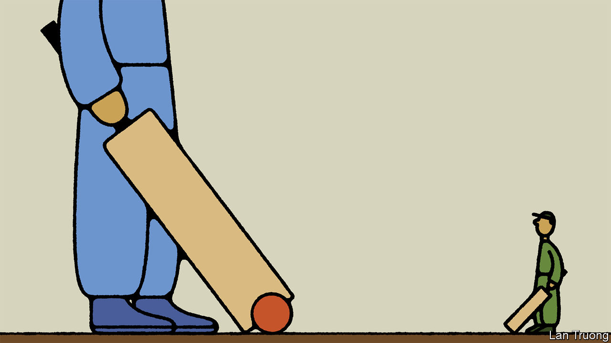

###### Banyan

# India-Pakistan relations are becoming more marginal and worse 

##### In cricket and otherwise, India is leaving its old rivalry behind 

 

> Oct 19th 2023 

In the build-up to India’s World Cup clash with Pakistan in Ahmedabad on October 14th, Indian news anchors spoke of “the greatest rivalry”. For once they were not exaggerating. Cricket contests between the South Asian giants have been their main interaction off the battlefield for three-quarters of a century. Into them each has poured subcontinental volumes of love and hate, nationalist chest-beating, aching for peace, addiction to the fray—and the wholehearted commitment of two great and fascinatingly contrasting cricket cultures. Even for cricket ignoramuses, India-Pakistan bouts are an essential window onto South Asian politics and culture. What, then, to make of the Ahmedabad match, which was attended by Banyan and ended in an easy Indian victory?

Mostly that the rivalry has become extremely lopsided, in cricket as otherwise. India’s win was its eighth on the trot over Pakistan in World Cups. And it was significantly crushing. The contest was held in the recently opened Narendra Modi Cricket Stadium, the cricket world’s biggest, and attended by over 100,000 raucously partisan Indian fans. It was an illustration of the demographic and economic heft powering India’s rise in cricket and beyond. Pakistan’s players, only a couple of whom had visited India before, visibly wilted in the arena. 

This denotes a big change. In the decades after British India’s bloody partition, Pakistan outperformed India off and on the field. Its GDP per head was 50% more than India’s in 1970. Its cricketers, led by dashing fast-bowlers such as Imran Khan, beat India’s much more often than they lost to them. But Indians are now much richer than Pakistanis, and their cricketers among the world’s wealthiest and best, while Pakistan’s are struggling. Three decades of jihadist violence have made foreign sports teams afraid to visit Pakistan, giving it near-pariah status. By banning Pakistanis from its lucrative domestic tournaments, India has compounded the problem. The team trounced in Ahmedabad had no star approaching the stature of Mr Khan (a great cricket captain, though an awful prime minister, who is now in prison).

Pakistan’s relative decline has changed the bilateral relationship. Contemptuous of its neighbour, and now globally minded, India has downgraded it. The days of expanded transport links and people-to-people exchanges, generally for cricket games, are over. Indian diplomats spend more time on Bangladesh than Pakistan—never mind China and America, the great powers India increasingly counts itself among. “No one is thinking about Pakistan,” says an official in Delhi. Save in one regard: India’s fear of Pakistani terrorism.

That most divisive facet of the relationship has become more dominant as others, including economic ties and cultural affinity, have fallen away. This helps explain why polls show Indian public sentiment towards Pakistan growing more hostile, even as the country fades from view. India’s ruling Bharatiya Janata Party, which has risen by peddling fear of Muslims, has encouraged this. Its supporters are the most hostile of all. 

All these changes were evident at the match in Ahmedabad—the sixth India-Pakistan clash your columnist has witnessed on the subcontinent and by far the most depressing. The first encounters were during an uplifting Indian tour of Pakistan in 2004, part of a promising peace process. India’s cricketers and thousands of Indian fans were embraced by Pakistani crowds as long-lost cousins. By contrast, there were no Pakistani fans in Ahmedabad, because India had refused to give them visas. And the Indian fans Banyan spoke with expressed only disdain for their neighbours. Asked what they knew of Pakistanis, three students from Mumbai said only “terrorism”. “Everyone hates them,” a middle-aged man, listening in from the row in front, volunteered. Meanwhile, the crowd screamed abuse at the visiting players. After one, Mohammad Rizwan, was dismissed, jubilant Indians chanted a Hindu victory cry, “Jai Shri Ram”, at him. 

India-Pakistan cricket has been charged in the past. But never has the hostility seemed so unidirectional and detached from geopolitical reality. The security threat to India from Pakistan, though real, is diminished. The potential benefits of co-operation between the world’s most populous country and, soon enough, its third-most populous are growing as environmental and population pressures bite. Yet the prospects of realising them, in cricket and otherwise, have never looked more remote. Pakistan is unable and India unwilling. ■


