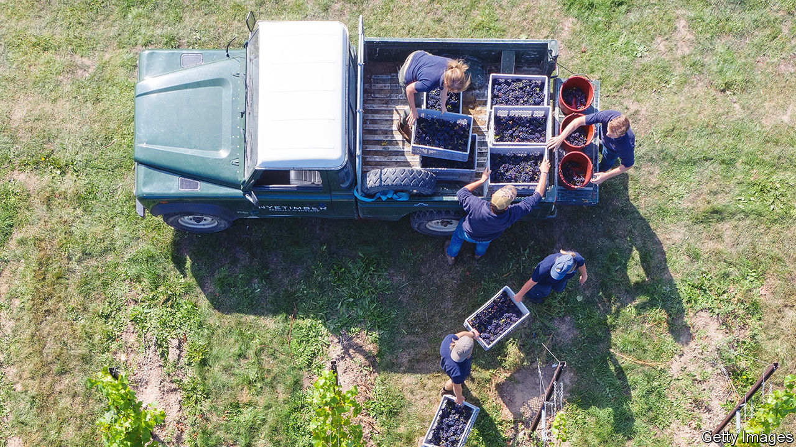

###### Garden of England

# The rise of English viticulture 

##### A land rush for vineyards 

 

> Oct 19th 2023 

Climate change does not offer consolations. But it can produce winners as well as losers. With parts of England and Wales as hot as the Champagne region of France was in the 1980s, the sparkling-wine industry is already bubbling. Longer sunny periods will make it easier for British vintners to make still wines as well as award-winning cuvée blancs. 

A recent study from the University of East Anglia and the London School of Economics finds that climate change is also expanding the area in England and Wales suitable for making wine. Most vineyards now are in south-east England but more land as far north as the east Midlands could come into use. Alistair Nesbitt, the study’s lead author and a consultant at Vinescapes Limited, says that by 2040 higher temperatures may also allow winemakers to grow more disease-resistant varieties of grapes. 

As a result, a mini land rush is under way. According to Strutt &amp; Parker, a consultancy, Britain has over 900 vineyards, up by 80% in the past five years and triple the number 20 years ago. Essex, Sussex and Kent are of most interest to vintners. This summer Jackson Family Wines, an American firm, became the first big maker of still wines to invest in England; it plans to acquire around 26 hectares in the Crouch Valley in Essex. London Clay, a bluish-grey sediment found in high concentrations in the county, is ideal for bold reds.

Nick Watson of Strutt &amp; Parker says that in the past year inquiries about buying established vineyards have tripled and that prices have increased by £1,000 ($1,200) per acre, or £2,500 per hectare. Land suitable for viticulture now sells for £40,000-50,000 per hectare (roughly £15,000-20,000 more than basic farmland).

Such prices pale next to those in famed wine regions abroad: in Bordeaux land can fetch over £1.6m a hectare. The disparity has little to do with the quality of the soil and much to do with a region’s reputation: “Sussex” doesn’t yet have the same ring as “Bourgogne”. But Ned Awty, the interim CEO of WineGB, a trade body, says that as the climate warms he expects still-wine production to rise. He thinks in a decade or so, it will be warm enough in Britain to ripen Merlot. 

Other aspects of climate change are less welcome for winemakers. A year of heavy rain or severe drought could destroy entire crops. Still wine is at especial risk. John Atkinson, chief winemaker at Danbury Ridge vineyards in Essex, says that unlike sparkling wines, which provide winemakers with some wiggle room to adjust taste by adding sugars, nailing a good bottle of still Pinot Noir all comes down to the soil, the weather and the barrel. “Growing grapes in this country is a bit like playing cricket,” he says, “There are so many ways to be out.”■


