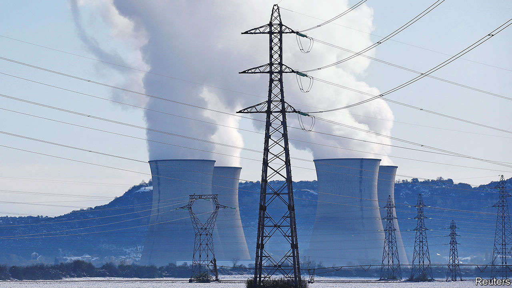

###### High tension

# Paris and Berlin compromise on reform of the electricity market 

##### But the row isn’t over yet 

 

> Oct 19th 2023 

When Emmanuel Macron and Olaf Scholz met for a couple of days of talks along with their top ministers in Hamburg earlier this month, the French president and the German chancellor tried to present a united front. They munched  (fish sandwiches) with their wives and took a tour of Hamburg harbour. The two-day meeting was meant to reset the most important bilateral relationship within the EU, one that had become increasingly troubled owing to a host of acrimonious disagreements on defence, EU budget rules and energy policies.

The visit seemed to go well. The tandem even made progress on perhaps the most tricky dossier, a reform of the EU electricity market that is meant to ease the burden of price spikes for European households and businesses and to bolster Europe’s competitiveness against America and China. Yet behind the scenes France and Germany continued to argue. That went on until the very day of a meeting of EU energy ministers on October 17th. And even though they managed to strike a compromise, there is plenty of bad blood. Paris sees the deal as a French victory; the Germans insist that their views largely prevailed.

The core of the row is over how EU members can subsidise their industries in the face of the hefty increases in energy prices that followed Russia’s invasion of Ukraine. France wants to extend to all its 56 nuclear power plants instruments called “contracts for difference” (CfD). These are guarantees issued by the government that oblige it to stump up for the difference if market prices turn out lower than an agreed “strike price”, but let it pocket the extra if the market price is higher. Berlin wants cfds to be an incentive for investment in renewable energy that should be applied only to new plants. It worries that their use for France’s nuclear fleet will deter investment in renewables.

The compromise struck in the small hours of October 18th says that governments can apply CfDs to investments aimed at “substantially” upgrading existing plants to increase their capacity or to prolong their lifetime. But any revenue gleaned must not distort competition and trade in the internal market. It should therefore go to consumers, and to industry only under tight restrictions. 

“This was absolutely not a German crusade against nuclear energy,” says Sven Giegold, a state secretary at Germany’s economy ministry. Germany’s opposition to the French proposal was simply to ensure a level playing field. By extending CfDs to its entire nuclear fleet, France hoped that a low strike price fixed with eDF, the state-owned electricity firm, would allow the government to pocket the extra revenue from high market prices that it could then pass back to industry. This would give French industry an unfair advantage. 

The compromise will still need to go through the EU parliament. Moreover, lots of the detail is unresolved. The mutual irritation is unlikely to subside in the coming months. “Both countries are increasingly committed to an energy strategy that is viewed by the other as doomed to fail,” writes Shahin Vallée of the German Council on Foreign Relations. France will continue to double down on nuclear energy; Germany instead is betting the country’s energy future on its renewables. ■

