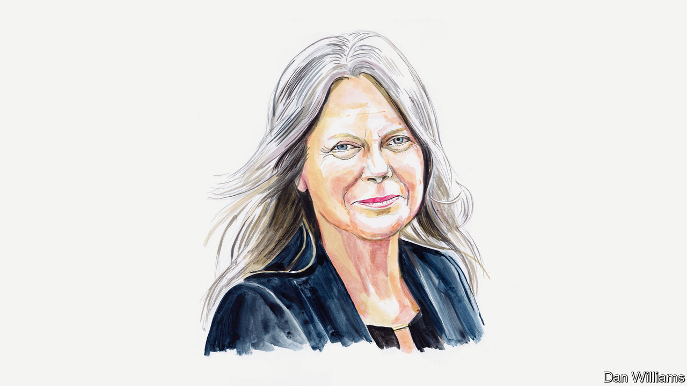

###### On life sciences, motorists, invisible spouses, wealth management, longevity, Nobel prizes, brevity

# Letters to the editor 

##### A selection of correspondence 

 

> Oct 19th 2023 


Unleash the MHRA

The Society of Chemical Industry’s recommendations for the British life-science industry are broadly welcome, and I hope that some of the more sensible ones will be adopted by the government to support the industry’s success in the long run. But nowhere does Sharon Todd, the society’s chief executive, nor the report, mention one of the most critical and, at least historically, globally competitive pieces of infrastructure that Britain has to drive forward innovation (, October 7th). That is Britain’s progressive and responsive Medicines and Healthcare products Regulatory Agency (MHRA).

Right here and now, the biotech industry in Britain is squealing under the significant erosion of this crucial organisation’s capacity to engage with innovators, and in providing essential advice and feedback. This is stifling progress on world-beating medicinal products and services that could transform patients’ lives globally, and support a growing British innovation industry. A startup that can’t get MHRA advice will have an even harder time raising funds, especially in the present constrained environment.

The government would be well advised to act very, very quickly to address this serious risk to Britain’s leading status in this industry which, regardless of Ms Todd’s noble proposals, could be set back by a decade or more.

Simon Goldman


 


Road rage

Rishi Sunak is misguided in his attempt to woo irritated British drivers, you say (“”, October 7th). I am no supporter of the prime minister but I think he has a point. The ultra-low emission zone, which charges certain polluting cars to drive in certain areas, made sense in inner London but the difference is marginal in outer London, and at significant cost to the less well off, who are more likely to own non-compliant vehicles. Low-traffic neighbourhoods, where roads are blocked off or pedestrianised, are popular with residents, but they have aroused significant ire in places like Oxford, where they simply make it difficult to get around.

Driving everywhere at 20mph might save a few lives, but why stop there? Even more lives would be saved by reducing the limit still further, or banishing cars altogether. Some sort of balance would seem wise. And I don’t agree that motorists are coddled. They fork out hugely for government fuel duties and road taxes. Trains, by contrast, are massively subsidised.

Jeremy Hicks


 


‘Er indoors

When it comes to the dominance of invisible spouses, Rebecca, the unseen character in Daphne du Maurier’s novel, pales against Mrs Mainwaring in “Dad’s Army” (, September 23rd). 

Mark Knight


 


Wealth and well-being

The wealth-management industry narrowly defines itself as one of only protecting capital (“”, September 9th). My organisation, which asks people to donate at least 10% of their inheritance to effective causes within the first five years of inheriting, interacts each day with ultra-high-net-wealth families around the world. We’ve observed a rising sentiment of dissatisfaction with wealth managers.

With over $130trn under management it is appalling that there are still gaps in funding to solve climate change, prevent pandemics and much more. Not only do banks not recognise this, they actively fund the problem by keeping dirty industries, like coal, thriving. Clients can easily move their money. If wealth managers don’t change there is always space for new entrants who are part of the solution.

Sid Efromovich

Co-founder and CEO

Generation Pledge


 


Live longer, in poverty

Successive governments and businesses are failing to plan for demographic change. We are not prepared for the aged to live to 100, let alone 120 (, September 30th). Short-term reactive policymaking has contributed to workforce shortages, economic stagnation and a health and care system failing to meet our changing needs.

Future generations may not only be bored—not least if they continue to be pushed out of the employment market soon after they hit 50—they are also likely to spend longer living in poverty and with ill health. Innovations in biotech are one thing, but finding solutions to the financial, health, housing, transport and leisure needs of our ageing society is the challenge we must address first.

David Sinclair

Chief executive

International Longevity Centre


You made no mention of two fictional examples of immortality gone right, Connor and Duncan MacLeod, the Highlanders. Never-ending life is really only appropriate for thrifty Scots who will use their time to deal in antiques, philosophise and occasionally save us mortals from our own mistakes.

Kyle McCoy


 


Reward the bestsellers

It seems the goal of the Nobel prize in literature is to reward authors whose works are not widely read (“”, October 14th). By contrast, the science Nobels are given to scientists whose work have had a great impact in their field. Charles Dickens would have been passed over for a Nobel for someone much more esoteric. Today, a writer like Stephen King, whose work permeates our society in books and also in movies and television, will never be considered for a Nobel even though he has shaped American literature and culture. 

Having your work actually read by the public should not be a disqualification. It would be nice if the Nobel prize-givers did not act like an erudite faculty committee showing off its arcane knowledge and instead took an author’s impact into consideration.

Thad Hall


 


Brevity is the soul of wit

Johnson () reiterated the common advice for effective writing: keep syntax simple, use short and active sentences, with common words, be brisk and clear. Yet writing is not only a tool for communication but an art form that creates possibilities for sophisticated expression. Instead of complex sonnets, Shakespeare might simply have written “‘I love you” and “‘Relationship; need to talk.” The English language and all of its users would be vastly impoverished if he had written so effectively.

Page Nelson


Brevity is important in exams, too. I am reminded of an old Oxford essay question: “Was Hegel a good philosopher? Be brief”. One smug student wrote, simply, “Yes”. 

When the paper came back, the examiner had given it a high mark but scribbled a comment in the margin: “This was a good, brief answer. But a better, briefer answer would have been No.” 

Sam Williams


